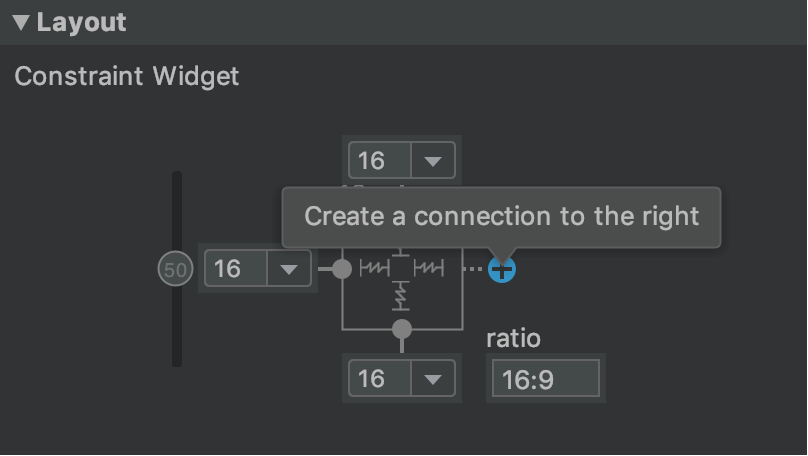
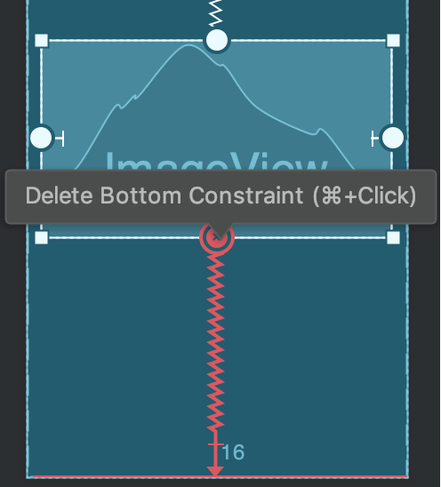
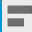
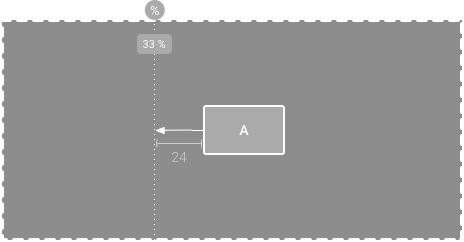
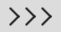
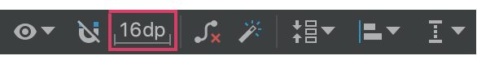

# Interfície d'usuari i navegació 

#Crear IU responsiva amb ConstraintLayout.

[ConstraintLayout](https://developer.android.com/reference/androidx/constraintlayout/widget/ConstraintLayout) et permet crear dissenys grans i complexos amb una jerarquia de vistes plana (sense grups de vistes niades). És similar a [RelativeLayout](https://developer.android.com/reference/android/widget/RelativeLayout) quant a que es presenten totes les vistes d'acord amb les relacions entre les vistes del mateix nivell i el disseny de nivell superior, però és més flexible que RelativeLayout i més fàcil d'usar amb l'editor de disseny d'Android Studio.

Tota la potència de ConstraintLayout està disponible directament des de les eines visuals de l'editor de disseny, ja que la API de disseny i l'editor de disseny es van crear específicament per a funcionar en conjunt. Així, pots crear tot el teu disseny amb ConstraintLayout arrossegant i soltant elements, en lloc d'editar el XML.

En aquesta pàgina, s'inclou una guia per a crear un disseny amb ConstraintLayout en Android Studio 3.0 o versions posteriors. Si desitges obtindre més informació sobre l'editor de disseny, consulta la [guia d'Android Studio sobre Com crear una IU amb l'editor de disseny](https://developer.android.com/studio/write/layout-editor).

Per a veure una sèrie de dissenys que pots crear amb ConstraintLayout, consulta el [projecte d'exemples de Constraint Layout en GitHub](https://github.com/android/views-widgets-samples/tree/master/ConstraintLayoutExamples).

https://www.youtube.com/watch?v=XamMbnzI5vE&feature=youtu.be

## Descripció general de les restriccions

Per a definir la posició d'una vista en ConstraintLayout, has **d'agregar almenys una restricció horitzontal i una vertical**. Cada restricció representa una connexió o alineació amb una altra vista, el disseny de nivell superior o una guia invisible. Cada restricció defineix la posició de la vista al llarg de l'eix vertical o horitzontal, per la qual cosa cada vista ha de tindre un mínim d'una restricció per a cada eix, encara que sovint es necessiten més.

Quan soltes una vista en l'editor de disseny, aquesta roman on la deixes, fins i tot si no té restriccions. Tanmateix, això només serveix per a facilitar l'edició. **Si una vista no té restriccions quan executes el seu disseny en un dispositiu, s'obri en la posició [0,0]** (la cantonada superior esquerra).

En la figura 1, el disseny es veu bé en l'editor, però no hi ha restricció vertical en la vista C. Quan aquest disseny s'obri en un dispositiu, la vista C s'alinea horitzontalment amb les vores esquerre i dret de la vista A, però apareix en la part superior de la pantalla perquè no té restricció vertical.

Figura 1: L'editor mostra la vista C davall de la A, però no té restricció vertical.

Figura 2: La vista C ara té una restricció vertical davall de la vista A 

Si bé l'absència de restriccions no causa errors de compilació, l'editor de disseny mostrarà un error en la barra d'eines. Per a veure els errors i altres advertiments, fes clic en **Show Warnings and Errors** . Per a evitar que falten restriccions, l'editor de disseny pot agregar restriccions automàticament amb les funcions Infer Constraints i Autoconnect.

## Com agregar ConstraintLayout al teu projecte

Per a usar ConstraintLayout en el teu projecte, segueix aquests passos:

- Assegura't de tindre el repositori maven.google.com declarat en l'arxiu build.gradle de nivell de mòdul:

~~~
repositories {
	google()
}
~~~

- Agrega la biblioteca com una dependència en el mateix arxiu build.gradle, com es mostra en el següent exemple. Tingues en compte que l'última versió pot ser diferent de la que es mostra en l'exemple:

~~~
dependencies {
	implementation "androidx.constraintlayout:constraintlayout:2.0.0-rc1"
}
~~~

- En la barra d'eines o notificació de sincronització, fes clic en Sync Project with Gradle Files.

Ja està tot llest per a crear el disseny amb ConstraintLayout.

## Com convertir un disseny

Per a convertir un disseny existent en un de ConstraintLayout, segueix aquests passos:

Obri el disseny existent en Android Studio i fes clic en la pestanya Design, en la part inferior de la finestra de l'editor.
En la finestra Component Tree, fes clic amb el botó dret en el disseny i, després, en Convert layout to ConstraintLayout.

Figura 3: Menú per a convertir un disseny en ConstraintLayout

## Com crear un disseny nou

Per a iniciar un arxiu de disseny amb restriccions nou, segueix aquests passos:

- En la finestra Project, fes clic en la carpeta del mòdul i, després, selecciona File > New > XML > Layout XML.
- Ingressa un nom per a l'arxiu de disseny i "androidx.constraintlayout.widget.ConstraintLayout" en Root Tag.
- Fes clic en Finish.

## Com agregar o llevar una restricció

Per a agregar una restricció, fes el següent:

El costat esquerre d'una vista està restringit al costat esquerre de l'element superior

1. Arrossega una vista des de la finestra Palette fins a l'editor.
Quan agregues una vista en un ConstraintLayout, es mostra un quadre de límit amb controladors de canvi de grandària quadrats en cada cantonada i controladors de restriccions circulars en cada costat.
2. Fes clic en la vista per a seleccionar-la.
3. Realitza alguna de les següents accions:
    - Fes clic en un controlador de restricció i arrossega'l fins a un punt d'ancoratge disponible. Aqueix punt pot ser la vora d'una altra vista, la vora del disseny o una guia. Tingues en compte que, a mesura que arrossegues el controlador de restriccions, l'editor de disseny mostra possibles ancoratges de connexió i superposicions (aquestes últimes en color blau).
    - Fes clic en un dels botons de Create  a connection en la secció Layout de la finestra Attributes, com es mostra en la figura.

Figura: La secció Layout de la finestra Attributes et permet crear connexions.

Quan es crea la restricció, l'editor li atorga un marge predeterminat per a separar les dues vistes.

Quan crees restriccions, recorda les següents **regles**:

- Cada vista ha de tindre almenys **dues restriccions, una horitzontal i una vertical**.
- Pots crear **restriccions només entre un controlador de restricció i un punt d'ancoratge que compartisquen el mateix pla**. Per tant, un pla vertical (els costats esquerre i dret) d'una vista pot limitar-se només a un altre pla vertical; i les línies de base només poden limitar-se a altres línies de base.
- Cada identificador de restricció es pot usar per a una sola restricció, però és possible crear múltiples restriccions (des de diferents vistes) en el mateix punt d'ancoratge.

Per a **esborrar** una restricció, pots optar per alguna de les següents alternatives:

- Fes clic en una restricció per a seleccionar-la i, després, pressiona **Delete**.

- Mantingues pressionat Control (*Command* en macOS) i, després, fes clic en un ancoratge de restricció. Quan la restricció es mostra de color roig, pots fer clic per a esborrar-la, com s'il·lustra en la figura.

Figura: Quan una restricció es mostra de color roig, pots fer clic per a esborrar-la

- En la secció Layout de la finestra Attributes, fes clic en un ancoratge de restricció, com es mostra en la figura.

Figura: Fes clic en un ancoratge de restricció per a esborrar-lo.

Si agregues restriccions oposades en una vista, les línies de restricció es tornen ondulades com un ressort per a indicar les forces oposades, segons es mostra en el vídeo. L'efecte és més visible quan la grandària de la vista es defineix com "Fixed" o "Wrap content", i en aquest cas la vista se centra entre les restriccions. Si en canvi desitges que la vista s'expandisca per a ajustar-se a les restriccions, modifica la manera de grandària a "Match constraints"; finalment, si desitges mantindre la grandària actual, però moure la vista perquè no estiga centrada, ajusta el biaix (sesgo) de restriccions.

Vídeo: Com agregar una restricció oposada a una existent

Pots usar restriccions per a aconseguir diferents tipus de comportament de disseny, com es descriu en les següents seccions.

### Posició superior

Restringeix el costat d'una vista a la vora corresponent del disseny.

En la figura, el costat esquerre de la vista està connectat a la vora esquerra del disseny de nivell superior. Pots definir la distància des de la vora amb marge.

Figura: Restricció horitzontal de l'element superior

### Posició d'ordre

Defineix l'ordre d'aparició de dues vistes, ja siga de manera horitzontal o vertical.

En la figura, la vista B està restringida a mostrar-se sempre a la dreta de A, i C està restringida a aparéixer davall de A. No obstant això, aquestes restriccions no impliquen alineació, per la qual cosa B pot moure's cap amunt i a baix.

Figura: Restricció horitzontal i vertical

### Alineació

Alinea la vora d'una vista amb la mateixa vora d'una altra vista.

En la figura, el costat esquerre de B està alineat amb el costat esquerre de A. Si desitges alinear els centres de les vistes, crea una restricció en tots dos costats.

Pots compensar l'alineació arrossegant la vista des de la restricció cap a dintre. Per exemple, en la figura següent, es mostra la vista B amb 24 dp de desplaçament en l'alineació. El desplaçament està definit pel marge de la vista restringida.

També pots seleccionar totes les vistes que vols alinear i, després, fer clic en Align en la barra d'eines per a seleccionar el tipus d'alineació.

### Alineació de línia de base

Alinea la línia de base de text d'una vista amb la línia de base de text d'una altra.

En la figura, la primera línia de B està alineada amb el text de A.

Per a crear una restricció de línia de base, fes clic amb el botó dret en la vista de text que desitges restringir i, després, fes clic en **Show Baseline**. Després, fes clic en la línia de base de text i arrossega-la fins a una altra línia de base.

### Com aplicar una restricció a una guia

Pots agregar una guia vertical o horitzontal en la qual siga possible restringir les vistes; la guia serà invisible per als usuaris de l'aplicació. Pots col·locar la guia dins del disseny segons les unitats de dp o percentatge, en relació amb la vora del disseny.

Per a crear una guia, fes clic en **Guidelines**  en la barra d'eines i, després, en **Add Vertical Guideline** o **Add Horitzontal Guideline**.

Arrossega la línia puntejada per a canviar la posició i fes clic en el cercle que està en la vora de la guia a fi d'activar o desactivar la manera de mesurament.

### Com aplicar una restricció a una barrera

Com succeeix amb les guies, una barrera és una línia invisible respecte de la qual pots restringir vistes. No obstant això, la barrera no defineix la seua pròpia posició, sinó que es desplaça en funció de la posició de les vistes que conté. Això és útil si desitges restringir una vista a un conjunt de vistes en lloc d'una vista específica.

Per exemple, en la figura es mostra que la vista C està limitada al costat dret d'una barrera. La barrera s'estableix en l'"extrem" (o el costat dret en un disseny d'esquerra a dreta) de la vista A i la vista B. D'aquesta manera, el desplaçament de la barrera depén de si el costat dret de la vista A o la vista B és el que està més a la dreta.

Per a crear una barrera, segueix aquests passos:

1.  Fes clic en **Guidelines**  en la barra d'eines i, després, en **Add Vertical Barrier** o **Add Horitzontal Barrier**.
2. En la finestra **Component Tree**, selecciona les vistes que desitges dins de la barrera i arrossega-les fins al component de barrera.
3. Selecciona la barrera en **Component Tree**, obri la finestra **Attributes**  i, després, configura la **barrierDirection**.

Ara pots crear una restricció des d'una altra vista fins a la barrera.

També pots restringir a la barrera les vistes que estan dins de la barrera. D'aquesta manera, pots assegurar-te que totes les vistes de la barrera sempre estiguen alineades entre si, encara que no sàpies quina de les vistes serà la més llarga o la més alta.

També pots incloure una guia dins d'una barrera a fi de garantir una posició "mínima" de la barrera.

### Com ajustar el biaix (*sesgo*) de restriccions

Quan agregues una restricció a banda i banda d'una vista (i la grandària de la mateixa dimensió és "Fixed" o "Wrap content"), la vista se centra entre les dues restriccions amb un biaix del 50% de manera predeterminada. Per a ajustar el biaix, arrossega el control lliscant en la finestra **Attributes** o arrossega la vista.

En canvi, si vols que la vista s'estire per a ajustar-se a les restriccions, canvia la grandària a "Match constraints".

### Com ajustar la grandària de la vista

Pots usar els controladors de les cantonades per a canviar la grandària d'una vista, però aquesta acció fixa la grandària dins del codi a fi que la vista no canvie de grandària per a diferents continguts o grandàries de pantalla. Si vols seleccionar una manera de grandària diferent, fes clic en una vista i obri la finestra **Attributes**  en el costat dret de l'editor.

Prop de la part superior de la finestra **Attributes**, es troba l'inspector de vistes, que inclou controls per a diversos atributs de disseny, com es mostra en la figura (disponible solo per a vistes en un disseny de restriccions).

Figura 14

Per a canviar la forma en què es calculen l'altura i l'ample, fes clic en els símbols que s'indiquen amb la llegenda 3 en la figura. Els símbols representen la mode de grandària de la següent manera (fes clic en el símbol per a alternar entre les diferents configuracions):

-  **Fixed**: Has de definir una dimensió específica en el quadre de text de baix o canviar la grandària de la vista en l'editor.
-  **Wrap Content**: La vista s'expandeix només el necessari per a ajustar-se al seu contingut.
-  **Match Constraints**: La vista s'expandeix tant com siga possible per a ajustar-se a les restriccions de cada costat (després de restar els marges de la vista). No obstant això, pots modificar aqueix comportament amb els següents atributs i valors (aquests atributs només tenen efecte quan estableixes que l'ample de la vista coincidisca amb les restriccions):
    - **layout_constraintWidth_default**
        - **spread**: Expandeix la vista tant com siga possible per a ajustar-la a les restriccions de cada costat. Aquest és el comportament predeterminat.
        - wrap: Expandeix la vista només el necessari per a ajustar el seu contingut, però permet que siga més xicoteta si les restriccions el requereixen. Per tant, la diferència entre això i usar Wrap Content (a dalt) és que, quan s'estableix l'ample en Wrap Content, sempre ha de coincidir exactament amb l'ample del contingut; d'altra banda, quan s'usa Match Constraints amb layout_constraintWidth_default establit en wrap, també es permet que la vista siga més xicoteta que l'ample del contingut.
    - **layout_constraintWidth_min**: Presa una dimensió en dp per a l'ample mínim de la vista.
    - **layout_constraintWidth_max**: Presa una dimensió en dp per a l'ample màxim de la vista.

No obstant això, si la dimensió determinada té una sola restricció, la vista s'expandeix per a ajustar-se al seu contingut. L'ús d'aquesta manera en l'ample o l'altura també et permet establir una proporció de grandària.

> Nota: No pots usar match_parent per a cap vista en un ConstraintLayout. En canvi, has d'usar "Match Constraints" (0dp).

### Establiment de la grandària com a proporció

Pots establir la grandària de la vista en una proporció, com 16:9, si almenys una de les dimensions de la vista està configurada com "Match Constraints" (0dp). Per a habilitar la proporció, fes clic en **Toggle Aspect Ràtio Constraint** (llegenda 1 en la figura anterior) i, després, ingressa la proporció d'ample:altura en l'entrada que es mostra.

Si tant l'ample com l'altura estan configurats per a ajustar-se a les restriccions, pots fer clic en **Toggle Aspect Ràtio Constraint** a fi de seleccionar quina dimensió es basa en una proporció de l'altra. L'inspector de vistes connecta les vores corresponents amb una línia contínua per a indicar quina vista s'estableix com a proporció.

Per exemple, si estableixes tots dos costats com "Match Constraints", fes clic en **Toggle Aspect Ràtio Constraint** dues vegades per a definir l'ample com a proporció de l'altura. Ara la grandària total depén de l'altura de la vista (que es pot definir de qualsevol forma), com es mostra en la figura.

### Com ajustar els marges de la vista

Per a assegurar-te que totes les vistes estiguen espaiades de manera uniforme, fes clic en Margin  en la barra d'eines a fi de seleccionar el marge predeterminat per a cada vista que agregues al disseny. Qualsevol canvi que realitzes en el marge predeterminat s'aplicarà només a les vistes que agregues a partir d'aqueix moment.

Per a controlar el marge de cada vista en la finestra Attributes, fes clic en el número de la línia que representa cada restricció (en la figura 14, la llegenda 4 mostra que es va establir el marge inferior en 16 dp).

 

Tots els marges que ofereix l'eina són factors de 8 dp, la qual cosa t'ajudarà a alinear les vistes amb les recomanacions de quadrícula quadrada de 8 dp de Material Design.

### Com controlar grups lineals amb una cadena

Una cadena és un grup de vistes que estan vinculades entre si amb restriccions de posició bidireccionals. Dins d'una cadena, es poden distribuir les vistes de manera horitzontal o vertical.

Les cadenes es poden dissenyar d'una de les següents maneres:

1. **Spread**: Les vistes es distribueixen uniformement (després de restar els marges). És el valor predeterminat.
2. **Spread inside**: La primera i l'última vista es fixen a les restriccions de cada extrem de la cadena i la resta es distribueix de manera uniforme.
3. **Weighted**: Quan es defineix la cadena com spread o spread inside, pots configurar una o més vistes com "Match Constraints" (0dp) per a omplir l'espai restant. De manera predeterminada, es distribueix l'espai uniformement entre les vistes configurades com "Match Constraints", però pots assignar una ponderació d'importància a cada vista amb els atributs **layout_constraintHorizontal_weight** i **layout_constraintVertical_weight**. Això funciona de la mateixa manera que layout_weight en un [disseny lineal](https://developer.android.com/guide/topics/ui/layout/linear). Per tant, la vista amb el valor de ponderació més alt obté la major quantitat d'espai; les vistes que tinguen la mateixa ponderació obtindran la mateixa quantitat d'espai.
4. **Packed**: S'agrupen les vistes (una vegada que es resten els marges). Després pots ajustar el biaix de tota la cadena (esquerra/dreta o a dalt/a baix) canviant el biaix de la vista d'extrem de la cadena.

La vista de "extrem" de la cadena (la situada més a l'esquerra en una cadena horitzontal i més amunt en una cadena vertical) defineix l'estil de la cadena en XML. No obstant això, pots seleccionar qualsevol vista en la cadena  i fer clic en el botó de la cadena que apareix davall de la vista per a alternar entre **Spread**, **Spread inside** i **Packed**.

Per a crear una cadena, selecciona totes les vistes que s'inclouran en ella, fes clic amb el botó dret en una de les vistes, selecciona **Chains** i, després, **Center Horizontally** o **Center Vertically**, com es mostra en el vídeo:

A continuació, s'esmenten altres qüestions que has de tindre en compte quan uses cadenes:

- Una vista pot formar part d'una cadena horitzontal i d'una cadena vertical, la qual cosa facilita la creació de dissenys de quadrícula flexibles.
- La cadena funciona correctament només si cada extrem està restringit a un altre objecte en el mateix eix, com es mostra en la figura 14.
- Encara que l'orientació d'una cadena és vertical o horitzontal, quan se l'usa no s'alineen les vistes en aqueixa direcció. Per tant, has d'assegurar-te d'incloure altres restriccions per a aconseguir la posició adequada de cada vista en la cadena, com a restriccions d'alineació.

### Com crear restriccions automàticament

En lloc d'agregar restriccions a cada vista a mesura que les col·loques en el disseny, pots moure cada vista a les posicions que desitges i, després, fer clic en Infer Constraints per a crear restriccions de manera automàtica.

Infer Constraints analitza el disseny a fi de determinar el conjunt de restriccions més efectiu per a totes les vistes. La seua tasca és restringir les vistes a les seues posicions actuals i, al mateix temps, brindar flexibilitat. Possiblement has de realitzar alguns ajustos per a assegurar-te que el disseny responga com ho desitges davant diferents grandàries de pantalla i orientacions.

Autoconnect to parent és una funció separada que també pots habilitar. Si l'habilites, quan agregues vistes secundàries a una superior, aquesta funció crearà automàticament dues o més restriccions per a cada vista a mesura que les agregues al disseny, però només quan siga apropiat restringir la vista al disseny de nivell superior. La connexió automàtica no crea restriccions per a altres vistes del disseny.

La connexió automàtica està inhabilitada de manera predeterminada. Per a habilitar-la, fes clic en Enable Autoconnection to Parent en la barra d'eines de l'editor de disseny.

[back](../..)