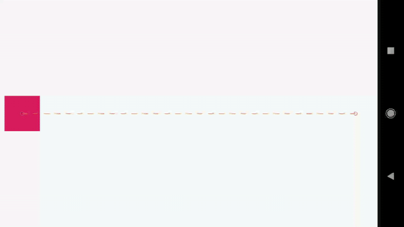

# Interfície d'usuari i navegació 

#Com administrar animacions de moviment i ginys amb MotionLayout

[MotionLayout](https://developer.android.com/reference/androidx/constraintlayout/motion/widget/MotionLayout) MotionLayout és un tipus de disseny que t'ajuda a administrar les animacions de moviment i widgets en la teua app. MotionLayout és una subclasse de ConstraintLayout i es basa en les seues capacitats de disseny enriquit. Com a part de la biblioteca de ConstraintLayout, MotionLayout està disponible com una biblioteca de compatibilitat i és compatible amb versions anteriors a la API nivell 14.

MotionLayout redueix les diferències entre les transicions de disseny i el maneig de moviment complex, la qual cosa ofereix una combinació de característiques entre el marc d'animació de propietats[marc d'animació de propietats](https://developer.android.com/guide/topics/graphics/prop-animation)  , [TransitionManager](https://developer.android.com/training/transitions) TransitionManager i [CoordinatorLayout](https://developer.android.com/reference/androidx/coordinatorlayout/widget/CoordinatorLayout) CoordinatorLayout.

A més de descriure les transicions entre dissenys, MotionLayout també et permet animar qualsevol propietat de disseny. A més, és inherentment compatible amb les transicions que admeten cerques. Això significa que pots mostrar de manera instantània qualsevol punt dins de la transició en funció d'alguna condició, com l'entrada tàctil. MotionLayout també admet fotogrames clau, la qual cosa habilita l'ús de transicions totalment personalitzades per a satisfer les teues necessitats.

MotionLayout és totalment declaratiu, la qual cosa significa que pots descriure qualsevol transició en XML, independentment de la seua complexitat.

> Nota: MotionLayout funciona només amb els seus elements secundaris directes. No admet jerarquies de disseny anidat ni transicions d'activitats.

## Consideracions del disseny

MotionLayout està dissenyat per a moure, canviar la grandària i animar els elements de la IU amb els quals interactuen els usuaris, com a botons i barres de títols. En la teua app, el moviment no ha de ser simplement un efecte especial injustificat. S'ha d'usar per a ajudar els usuaris a comprendre el que fa la teua app. Per a obtindre més informació sobre com dissenyar una app amb moviment, consulta la secció Material Design en Informació sobre el moviment[Informació sobre el moviment](https://material.io/design/motion/understanding-motion.html).

## Començar

Segueix aquests passos per a començar a usar MotionLayout en el teu projecte.

- **Inclou la dependència** *ConstraintLayout*: per a usar MotionLayout en el teu projecte, agrega la dependència ConstraintLayout 2.0 a l'arxiu build.gradle de la teua app. Si uses AndroidX, agrega la següent dependència:

~~~
dependencies {
	implementation 'androidx.constraintlayout:constraintlayout:2.0.0-beta1'
}
~~~

Si no uses AndroidX, agrega la següent dependència de la biblioteca de compatibilitat:

~~~
dependencies {
 implementation 'com.android.support.constraint:constraint-layout:2.0.0-beta1'
}
~~~

- Crea un arxiu `MotionLayout: MotionLayout` és una subclasse de ConstraintLayout, de manera que pots transformar qualsevol ConstraintLayout existent en un MotionLayout si reemplaces el nom de la classe en el teu arxiu de recursos de disseny, com es mostra en els següents exemples:

~~~
<!-- before: ConstraintLayout -->
<androidx.constraintlayout.widget.ConstraintLayout .../>
<!-- after: MotionLayout -->
<androidx.constraintlayout.motion.widget.MotionLayout .../>
~~~

Aquest és un exemple complet d'un arxiu MotionLayout que pots usar per a crear el moviment en la figura anterior:

~~~
<?xml version="1.0" encoding="utf-8"?>
<!-- activity_main.xml -->
<androidx.constraintlayout.motion.giny.MotionLayout
xmlns:android="http://schemas.android.com/apk/res/android"
xmlns:app="http://schemas.android.com/apk/res-auto"
xmlns:tools="http://schemas.android.com/tools"
android:aneu="@+aneu/motionLayout"
android:layout_width="match_parent"
android:layout_height="match_parent"
app:layoutDescription="@xml/scene_01"
tools:showPaths="true">

<View
android:id="@+id/button"
android:layout_width="64dp"
android:layout_height="64dp"
android:background="@color/colorAccent"
android:text="Button" />

</androidx.constraintlayout.motion.widget.MotionLayout>
~~~

- Crea un arxiu MotionScene: en l'exemple de MotionLayout anterior, l'atribut app:layoutDescription fa referència a un MotionScene. MotionScene és un arxiu XML de recursos que conté totes les descripcions de moviments per al disseny corresponent. A fi de mantindre la informació de disseny separada de les descripcions de moviments, cada MotionLayout fa referència a un arxiu MotionScene separat. Tingues en compte que les definicions de MotionScene tenen prioritat sobre qualsevol definició similar de MotionLayout.

El següent és un exemple d'arxiu MotionScene en el qual es descriu el moviment horitzontal bàsic en la figura anterior:

~~~
<?xml version="1.0" encoding="utf-8"?>
<MotionScene xmlns:android="http://schemas.android.com/apk/res/android"
xmlns:motion="http://schemas.android.com/apk/res-auto">

<Transition
motion:constraintSetStart="@+id/start"
motion:constraintSetEnd="@+id/end"
motion:duration="1000">
<OnSwipe
motion:touchAnchorId="@+id/button"
motion:touchAnchorSide="right"
motion:dragDirection="dragRight" />
</Transition>

<ConstraintSet android:id="@+id/start">
<Constraint
android:id="@+id/button"
android:layout_width="64dp"
android:layout_height="64dp"
android:layout_marginStart="8dp"
motion:layout_constraintBottom_toBottomOf="parent"
motion:layout_constraintStart_toStartOf="parent"
motion:layout_constraintTop_toTopOf="parent" />
</ConstraintSet>

<ConstraintSet android:id="@+id/end">
<Constraint
android:id="@+id/button"
android:layout_width="64dp"
android:layout_height="64dp"
android:layout_marginEnd="8dp"
motion:layout_constraintBottom_toBottomOf="parent"
motion:layout_constraintEnd_toEndOf="parent"
motion:layout_constraintTop_toTopOf="parent" />
</ConstraintSet>

</MotionScene>
~~~

Tingues en compte el següent:

- **`<Transition>`** conté la definició bàsica del moviment.
    - **motion:constraintSetStart** i **motion:constraintSetEnd** són referències als extrems del moviment. S'inclou la definició d'aquests extrems en els elements `<ConstraintSet>` més endavant, en l'arxiu MotionScene.
    - **motion:duration** especifica la quantitat de mil·lisegons que tarda a completar-se el moviment.

- **`<OnSwipe>`** et permet controlar el moviment a través del tacte.
    - **motion:touchAnchorId** fa referència a la vista que pots lliscar i arrossegar.
    - **motion:touchAnchorSide** indica que s'arrossega la vista des del costat dret.
    - **motion:dragDirection** fa referència a la direcció de progrés de l'arrossegament. Per exemple, **motion:dragDirection="dragRight"** indica que el progrés augmenta a mesura que arrossegues cap a la dreta.
- <ConstraintSet> és on has de definir les diverses restriccions que descriuen el teu moviment. En aquest exemple, definim un ConstraintSet per a cada extrem del nostre moviment. Aquests extrems estan centrats verticalment (a través d'app:layout_constraintTop_toTopOf="parent" i app:layout_constraintBottom_toBottomOf="parent"). De manera horitzontal, els extrems estan en els límits esquerre i dret de la pantalla.

Per a obtindre una vista més detallada dels diversos elements compatibles amb MotionScene, consulta els exemples de MotionLayout[exemples de MotionLayout](https://developer.android.com/training/constraint-layout/motion-layout-examples).

## Atributs interpolats

Dins d'un arxiu MotionScene, els elements ConstraintSet poden contindre atributs addicionals que s'interpolen durant la transició. A més de la posició i els límits, MotionLayout interpola els següents atributs:

- alpha
- visibility
- elevation
- rotation, rotationX, rotationY
- translationX, translationY, translationZ
- scaleX, scaleY

## Atributs personalitzats

Dins d'un `<Constraint>`, pots usar l'element `<CustomAttribute>` per a especificar una transició per als atributs que no estan simplement relacionats amb la posició o els atributs View.

~~~
<Constraint
android:id="@+id/button" ...>
<CustomAttribute
motion:attributeName="backgroundColor"
motion:customColorValue="#D81B60"/>
</Constraint>
~~~

Un `<CustomAttribute>` conté dos atributs propis:

- **motion:attributeName** és obligatori i ha de coincidir amb un objecte que tinga mètodes get i set. Aquests han de coincidir amb un patró específic. Per exemple, backgroundColor és compatible, ja que la nostra vista té mètodes **getBackgroundColor()** i **setBackgroundColor()** subjacents.
- L'altre atribut que has de proporcionar es basa en la mena de valor. Tria entre els següents tipus admesos:
    - **motion:customColorValue** per als colors
    - **motion:customIntegerValue** per a nombres enters
    - **motion:customFloatValue** per a valors flotants
    - **motion:customStringValue** per a strings
    - **motion:customDimension** per a dimensions
    - **motion:customBoolean** per a valors booleans

Tingues en compte que quan especifiques un atribut personalitzat, has de definir valors d'extrem en els elements `<ConstraintSet>` d'inici i de finalització.

### Exemple: Canviar el color de fons

Basant-nos en el nostre exemple anterior, fem que la vista canvie de color mentre es mou, com es mostra en la figura següent.

Agrega un element **`<CustomAttribute>`** a cada element **ConstraintSet**, com es mostra a continuació:

~~~
<ConstraintSet android:id="@+id/start">
<Constraint
android:id="@+id/button"
android:layout_width="64dp"
android:layout_height="64dp"
android:layout_marginStart="8dp"
motion:layout_constraintBottom_toBottomOf="parent"
motion:layout_constraintStart_toStartOf="parent"
motion:layout_constraintTop_toTopOf="parent">
<CustomAttribute
motion:attributeName="backgroundColor"
motion:customColorValue="#D81B60" />
</Constraint>
</ConstraintSet>

<ConstraintSet android:id="@+id/end">
<Constraint
android:id="@+id/button"
android:layout_width="64dp"
android:layout_height="64dp"
android:layout_marginEnd="8dp"
motion:layout_constraintBottom_toBottomOf="parent"
motion:layout_constraintEnd_toEndOf="parent"
motion:layout_constraintTop_toTopOf="parent">
<CustomAttribute
motion:attributeName="backgroundColor"
motion:customColorValue="#9999FF" />
</Constraint>
</ConstraintSet>
~~~

## Atributs addicionals de MotionLayout

A més dels atributs que es mostren en l'exemple anterior, **MotionLayout** té altres atributs que convé especificar:

- **app:applyMotionScene="boolean"** indica si s'ha d'aplicar l'arxiu MotionScene. El valor predeterminat per a aquest atribut és true.
- **app:showPaths="boolean"** indica si es mostren les rutes de moviment mentre s'executa el moviment. El valor predeterminat per a aquest atribut és false.
- **app:progress="float"** et permet especificar explícitament el progrés de la transició. Pots usar qualsevol valor de punt flotant des de 0 (l'inici de la transició) fins a 1 (el final de la transició).
- **app:currentState="reference"** et permet especificar un ConstraintSet específic.
- **app:motionDebug** et permet mostrar informació addicional de depuració sobre el moviment. Els valors possibles són "XOU_PROGRESS", "XOU_PATH" o "XOU_ALL".

## Recursos addicionals

Per a obtindre més informació sobre MotionLayout, consulta els següents vincles:

[Com usar MotionLayout per a animar apps per a Android (codelab)](https://codelabs.developers.google.com/codelabs/motion-layout) 
[Exemples de MotionLayout](https://developer.android.com/training/constraint-layout/motion-layout-examples) Exemples de MotionLayout
[Mostres de MotionLayout/ConstraintLayout (GitHub)](https://github.com/android/views-widgets-samples/tree/master/ConstraintLayoutExamples) 
[Introducció a MotionLayout (part I)](https://medium.com/google-developers/introduction-to-motionlayout-part-i-29208674b10d)
[Introducció a MotionLayout (part II)](https://medium.com/google-developers/introduction-to-motionlayout-part-ii-a31acc084f59)
[Introducció a MotionLayout (part III)](https://medium.com/google-developers/introduction-to-motionlayout-part-iii-47cd64d51a5)
[Introducció a MotionLayout (part IV)](https://medium.com/google-developers/defining-motion-paths-in-motionlayout-6095b874d37)

## Referencies XML de Motion Layout

MotionLayout usa un arxiu d'ambient en moviment per a definir una seqüència de moviment. Un arxiu d'ambient en moviment és un arxiu XML que especifica tots els aspectes d'una seqüència de moviment. El node <MotionLayout> de l'arxiu de disseny conté un atribut app:layoutDescription que apunta a l'arxiu d'ambient en moviment.

Aquesta referència no és exhaustiva. Proporciona informació sobre els elements més importants de l'arxiu d'ambient en moviment i els seus atributs més utilitzats.

- [**`<MotionScene>`**](https://developer.android.com/training/constraint-layout/motionlayout/ref/motionscene) L'element arrel d'un arxiu d'ambient en moviment.
- [**`<ConstraintSet>`**](https://developer.android.com/training/constraint-layout/motionlayout/ref/constraintset)Especifica les posicions i els atributs de totes les vistes en un punt d'una seqüència de moviment.
- [**`<Constraint>`**](https://developer.android.com/training/constraint-layout/motionlayout/ref/constraint)Especifica la ubicació i els atributs d'un dels elements en una seqüència de moviment.
- [**`<Transition>`**](https://developer.android.com/training/constraint-layout/motionlayout/ref/transition)Especifica els estats d'inici i fi d'una seqüència de moviment, qualsevol estat intermedi desitjat i les interaccions de l'usuari que activen la seqüència.
- [**`<onClick>`**](https://developer.android.com/training/constraint-layout/motionlayout/ref/onclick)Especifica l'acció que s'ha de realitzar quan l'usuari pressiona una vista específica.
- [**`<onSwipe>`**](https://developer.android.com/training/constraint-layout/motionlayout/ref/onswipe)Especifica l'acció que ha de realitzar quan l'usuari llisca el dit sobre el disseny.
- [**`<KeyFrameSet>`**](https://developer.android.com/training/constraint-layout/motionlayout/ref/keyframeset)Especifica la ubicació i els atributs de les vistes en el transcurs de la seqüència de moviment.
- [**`<KeyPosition>`**](https://developer.android.com/training/constraint-layout/motionlayout/ref/keyposition)Especifica la ubicació d'una vista en un moment específic durant la seqüència de moviment.
- [**`<KeyAttribute>`**](https://developer.android.com/training/constraint-layout/motionlayout/ref/keyattribute)Especifica els atributs d'una vista en un moment específic durant la seqüència de moviment.

[back](../..)