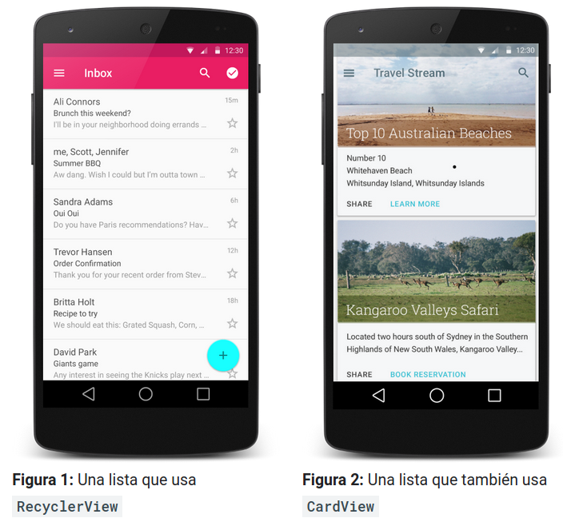

# Interfície d'usuari i navegació 

#Com crear una llista a RecyclerView

Si la teua app ha de mostrar una llista de desplaçament d'elements sobre la base de grans conjunts de dades (o dades que canvien amb freqüència), has d'usar l'objecte RecyclerView.

> Suggeriment: Fes clic en File > New > Fragment > Fragment (List) per a començar amb part de codi de plantilles en Android Studio. Després, simplement agrega el fragment al disseny de la teua activitat.

Si t'agradaria crear una llista amb targetes, com es mostra en la segon figura, usa també el widget de CardView.

Si t'agradaria veure un fragment de codi d'exemple de RecyclerView, consulta [l'app d'exemple de RecyclerView Java](https://github.com/android/views-widgets-samples/tree/master/RecyclerView) 

## Descripció general de RecicledView

El widget RecyclerView és una versió més avançada i flexible de ListView.

En el model de RecyclerView, diversos components diferents treballen junts per a mostrar les teues dades. El contenidor general de la teua interfície d'usuari és un objecte RecyclerView que agregues al teu disseny. L'objecte RecyclerView es completa per si sol amb vista que brinda l'administrador de disseny que proporcions. Pots usar un dels nostres administradors de disseny estàndard (com [LinearLayoutManager](https://developer.android.com/reference/androidx/recyclerview/widget/LinearLayoutManager) o [GridLayoutManager](https://developer.android.com/reference/androidx/gridlayout/widget/GridLayoutManager)), o bé implementar un propi.

Les vistes incloses en la llista estan representades per objectes contenidors de vistes. Aqueixos objectes són instàncies d'una classe que defineixes estenent l'objecte [RecyclerView.ViewHolder](https://developer.android.com/reference/androidx/recyclerview/widget/RecyclerView.ViewHolder). Cada objecte contenidor de vistes és responsable de mostrar un element individual amb una vista. Per exemple, si la teua llista mostra la col·lecció de música, cada objecte contenidor de vistes representa un àlbum individual. L'objecte [RecyclerView](https://developer.android.com/reference/androidx/recyclerview/widget/RecyclerView) crea solament la quantitat d'objectes contenidors de vistes que siguen necessaris per a mostrar la part en pantalla del contingut dinàmic, més alguns addicionals. A mesura que l'usuari es desplaça per la llista, l'objecte RecyclerView pren les vistes fora de pantalla i torna a vincular-les amb les dades que es desplacen en la pantalla.

Un adaptador, que cregues estenent [RecyclerView.Adapter](https://developer.android.com/reference/androidx/recyclerview/widget/RecyclerView.Adapter), administra els objectes contenidors de vistes. L'adaptador crea contenidors de vistes, segons siga necessari, i els vincula amb les seues dades. Per a fer-ho, assigna el contenidor de vistes a una posició i crida al mètode [onBindViewHolder()](https://developer.android.com/reference/androidx/recyclerview/widget/RecyclerView.Adapter#onBindViewHolder(VH,%20int)) de l'adaptador. Aquest mètode usa la posició del contenidor de vistes per a determinar quin hauria de ser el contingut, en funció de la seua posició en la llista.

Aquest model de RecyclerView realitza gran part del treball d'optimització per tu:

- Quan es completa per primera vegada la llista, crea i vincula alguns contenidors de vistes a qualsevol costat de la llista. Per exemple, si la vista mostra les posicions de la llista 0 a 9, l'objecte RecyclerView crea i vincula aquests contenidors de vistes, i és possible que també cree i vincule el contenidor de vistes per a la posició 10. D'aquesta manera, si l'usuari es desplaça per la vista, el següent element estarà llest per a mostrar-se.
- A mesura que l'usuari es desplaça per la vista, l'objecte RecyclerView crea nous contenidors de vistes segons siga necessari. També guarda els contenidors de vistes que es van desplaçar fora de la pantalla perquè puguen tornar a usar-se. Si l'usuari canvia la direcció de desplaçament, es poden recuperar els contenidors de vistes que es van desplaçar fora de la pantalla. D'altra banda, si l'usuari continua el desplaçament en la mateixa direcció, els contenidors de vistes que van eixir de la pantalla per més temps poden tornar a vincular-se amb dades noves. No és necessari crear el contenidor de vistes o augmentar la seua vista; en canvi, l'app simplement actualitza el contingut de la vista perquè coincidisca amb l'element nou amb el qual està vinculada.
Quan canvien els elements que es mostren, podràs notificar a l'adaptador cridant a un mètode [RecyclerView.Adapter.notify…()](https://developer.android.com/reference/androidx/recyclerview/widget/RecyclerView.Adapter#notifyItemChanged(int)) adequat. Després, el codi integrat de l'adaptador torna a vincular els elements afectats.

## Com agregar la biblioteca de compatibilitat

Per a accedir al widget de RecyclerView, és necessari agregar les Biblioteques de compatibilitat v7 al teu projecte de la següent manera:

1. Obri l'arxiu build.gradle del mòdul de la teua app.
2. Agrega la biblioteca de compatibilitat a la secció dependencies.

~~~
dependencies {
    implementation 'com.android.support:recyclerview-v7:28.0.0'
}
~~~

## Com agregar RecyclerView al teu disseny

Ara pots agregar RecyclerView al teu arxiu de disseny. Per exemple, el següent disseny usa RecyclerView com l'única vista per a tot el disseny:

~~~
<?xml version="1.0" encoding="utf-8"?>
<!-- A RecyclerView with some commonly used attributes -->
<android.support.v7.widget.RecyclerView
	android:id="@+id/my_recycler_view"
	android:scrollbars="vertical"
	android:layout_width="match_parent"
	android:layout_height="match_parent"/>
~~~

Després d'agregar un widget de RecyclerView al teu disseny, obtingues un controlador per a l'objecte, connecta'l a un administrador de disseny i adjunta un adaptador perquè es mostren les dades:

~~~
class MyActivity : Activity() {
    private lateinit var recyclerView: RecyclerView
    private lateinit var viewAdapter: RecyclerView.Adapter<>
    private lateinit var viewManager: RecyclerView.LayoutManager

    override fun onCreate(savedInstanceState: Bundle?) {
        super.onCreate(savedInstanceState)
        setContentView(R.layout.my_activity)

        viewManager = LinearLayoutManager(this)
        viewAdapter = MyAdapter(myDataset)

        recyclerView = findViewById<RecyclerView>(R.id.my_recycler_view).apply {
            // use this setting to improve performance if you know that changes
            // in content do not change the layout size of the RecyclerView
            setHasFixedSize(true)

            // use a linear layout manager
            layoutManager = viewManager

            // specify an viewAdapter (see also next example)
            adapter = viewAdapter

        }
    }
    // ...
}
~~~

## Com agregar un adaptador de llistes

Per a ingressar totes les teues dades a la llista, has d'estendre la classe RecyclerView.Adapter. Aquest objecte crea vistes per a elements i reemplaça el contingut d'algunes de les vistes per nous elements de dades quan l'element original ja no està visible.

El codi d'exemple que s'inclou a continuació mostra una implementació simple d'un conjunt de dades que comprén un arranjament de strings que es mostra amb widgets de TextView:

~~~
public class MyAdapter extends RecyclerView.Adapter<MyAdapter.MyViewHolder> {
        private String[] mDataset;

        // Provide a reference to the views for each data item
        // Complex data items may need more than one view per item, and
        // you provide access to all the views for a data item in a view holder
        public static class MyViewHolder extends RecyclerView.ViewHolder {
            // each data item is just a string in this case
            public TextView textView;
            public MyViewHolder(TextView v) {
                super(v);
                textView = v;
            }
        }

        // Provide a suitable constructor (depends on the kind of dataset)
        public MyAdapter(String[] myDataset) {
            mDataset = myDataset;
        }

        // Create new views (invoked by the layout manager)
        @Override
        public MyAdapter.MyViewHolder onCreateViewHolder(ViewGroup parent,
                                                       int viewType) {
            // create a new view
            TextView v = (TextView) LayoutInflater.from(parent.getContext())
                    .inflate(R.layout.my_text_view, parent, false);
            ...
            MyViewHolder vh = new MyViewHolder(v);
            return vh;
        }

        // Replace the contents of a view (invoked by the layout manager)
        @Override
        public void onBindViewHolder(MyViewHolder holder, int position) {
            // - get element from your dataset at this position
            // - replace the contents of the view with that element
            holder.textView.setText(mDataset[position]);

        }

        // Return the size of your dataset (invoked by the layout manager)
        @Override
        public int getItemCount() {
            return mDataset.length;
        }
    }

~~~

L'administrador de disseny crida al mètode [onCreateViewHolder()](https://developer.android.com/reference/androidx/recyclerview/widget/RecyclerView.Adapter#onCreateViewHolder(android.view.ViewGroup,%20int)) de l'adaptador. És necessari que aquest mètode construïsca un objecte [RecyclerView.ViewHolder](https://developer.android.com/reference/androidx/recyclerview/widget/RecyclerView.ViewHolder) i configure la vista que usa per a mostrar el seu contingut. El tipus del contenidor de vistes ha de coincidir amb el tipus declarat en la signatura de la classe Adapter. En general, configuraria la vista augmentant un arxiu de disseny XML. Atés que el contenidor de vistes encara no està assignat a cap dada en particular, el mètode no configura realment el contingut de la vista.

Després, l'administrador de disseny vincula el contenidor de vistes amb les seues dades. Per a fer-ho, crida al mètode [onBindViewHolder()](https://developer.android.com/reference/androidx/recyclerview/widget/RecyclerView.Adapter#onBindViewHolder(VH,%20int)) de l'adaptador i passa la posició del contenidor de vistes en RecyclerView. És necessari que el mètode onBindViewHolder() busque les dades corresponents i els use per a completar el disseny del contenidor de vistes. Per exemple, si RecyclerView mostra una llista de noms, és possible que el mètode trobe el nom adequat en la llista i complete el widget de TextView del contenidor de vistes.

Si és necessari actualitzar la llista, crida a un mètode de notificació en l'objecte RecyclerView.Adapter, per exemple [notifyItemChanged()](https://developer.android.com/reference/androidx/recyclerview/widget/RecyclerView.Adapter#notifyItemChanged(int)). L'administrador de disseny vincula novament qualsevol contenidor de vistes afectat, la qual cosa permet l'actualització de les seues dades.

> Suggeriment: És probable que la classe ListAdapter et resulte útil per a determinar els elements de la llista que han d'actualitzar-se quan aquesta canvie.

## Com personalitzar un objecte RecyclerView

Pots personalitzar els objectes RecyclerView per a satisfer les teues necessitats específiques. Les classes estàndard ofereixen tota la funcionalitat necessària per la majoria dels desenvolupadors; en molts casos, l'única personalització que has de fer és dissenyar la vista per a cada contenidor de vistes i escriure el codi per a actualitzar aqueixes vistes amb les dades corresponents. No obstant això, si la teua app té requisits específics, pots modificar el comportament estàndard de diferents maneres. Les seccions que s'inclouen a continuació descriuen algunes d'altres personalitzacions comunes.

### Com modificar el disseny

L'objecte RecyclerView usa un administrador de disseny per a posicionar els elements individuals en la pantalla i determinar quan tornar a usar les vistes d'elements que ja no veu l'usuari. Per a tornar a usar (o reciclar) una vista, un administrador de disseny pot sol·licitar a l'adaptador que reemplace el contingut de la vista per un element diferent del conjunt de dades. Reciclar la vista d'aquesta manera millora el rendiment evitant que es creuen vistes innecessàries o realitzant cerques de [findViewById()](https://developer.android.com/reference/android/app/Activity#findViewById(int)) amb un alt cost. La Biblioteca de compatibilitat d'Android inclou tres administradors de disseny estàndard, cadascun dels quals ofereix moltes opcions de personalització:

- [**LinearLayoutManager**](https://developer.android.com/reference/androidx/recyclerview/widget/LinearLayoutManager) organitza els elements en una llista unidimensional. Usar un objecte RecyclerView amb LinearLayoutManager ofereix funcions com el disseny ListView anterior.
- [**GridLayoutManager**](https://developer.android.com/reference/androidx/gridlayout/widget/GridLayoutManager) organitza els elements en una quadrícula bidimensional, com els quadrats d'una taula d'escacs. Usar un objecte RecyclerView amb GridLayoutManager ofereix funcions com el disseny GridView anterior.
- [**StaggeredGridLayoutManager**](https://developer.android.com/reference/androidx/recyclerview/widget/StaggeredGridLayoutManager) organitza els elements en una quadrícula bidimensional, en la qual cada columna està lleugerament desplaçada en funció de l'anterior, com les estreles de la bandera Estadounidense.

Si cap d'aquests administradors de disseny s'adequa a les teues necessitats, pots crear un propi estenent la classe abstracta RecyclerView.LayoutManager.

## Com agregar animacions d'elements

Sempre que canvie un element, l'objecte RecyclerView usa un animador per a canviar la seua aparença. Aquest animador és un objecte que estén la classe abstracta [RecyclerView.ItemAnimator](https://developer.android.com/reference/androidx/recyclerview/widget/RecyclerView.ItemAnimator). De manera predeterminada, l'objecte RecyclerView usa [DefaultItemAnimator](https://developer.android.com/reference/androidx/recyclerview/widget/DefaultItemAnimator) per a proporcionar l'animació. Si vols proporcionar animacions personalitzades, pots definir el teu propi objecte animador estenent RecyclerView.ItemAnimator.

## Com habilitar la selecció d'elements de llistes

La biblioteca de [recyclerview-selection](https://developer.android.com/reference/androidx/recyclerview/selection/package-summary) permet als usuaris seleccionar elements en la llista RecyclerView amb entrada tàctil o del mouse. Tu continues tenint el control de la presentació visual d'un element seleccionat. També pots continuar controlant les polítiques que regeixen el comportament de selecció, com els elements que poden seleccionar-se i la quantitat d'aquests.

Per a agregar compatibilitat de selecció a una instància de RecyclerView, segueix els passos que es descriuen a continuació:

1.  Determina el tipus de clau de selecció que usaràs i, després, crea un objecte [ItemKeyProvider](https://developer.android.com/reference/androidx/recyclerview/selection/ItemKeyProvider).
Hi ha tres tipus de claus que pots usar per a identificar elements seleccionats: [Parcelable](https://developer.android.com/reference/android/os/Parcelable) (i totes les subclasses com [Uri](https://developer.android.com/reference/android/net/Uri)), String i Long. Per a obtindre informació detallada sobre els tipus de claus de selecció, consulta [SelectionTracker.Builder](https://developer.android.com/reference/androidx/recyclerview/selection/SelectionTracker.Builder).
2. [Implementa ItemDetailsLookup](https://developer.android.com/reference/androidx/recyclerview/selection/ItemDetailsLookup).
ItemDetailsLookup permet que la biblioteca de selecció accedisca a informació sobre elements RecyclerView als quals s'atorga MotionEvent. Es tracta efectivament d'una fàbrica d'instàncies de ItemDetails que estan recolzades per una instància de RecyclerView.ViewHolder (o s'extrauen d'ella).
3. Actualitza l'element Views de RecyclerView perquè reflectisca si l'usuari el va seleccionar o no.
La biblioteca de selecció no proporciona una decoració visual predeterminada dels elements seleccionats. Has de proporcionar-la quan implementes [onBindViewHolder()](https://developer.android.com/reference/androidx/recyclerview/widget/RecyclerView.Adapter#onBindViewHolder(VH,%20int)). L'enfocament recomanat és el següent:
    - En onBindViewHolder(), crida a [setActivated()](https://developer.android.com/reference/android/view/View#setActivated(boolean)) (no a [setSelected()](https://developer.android.com/reference/android/view/View#setSelected(boolean))) en l'objecte View amb true o false (en funció de si se selecciona l'element).
    - Actualitza l'estil de la vista per a representar l'estat activat. Et recomanem que uses un recurs de llista d'[estats amb colors per a configurar l'estil](https://developer.android.com/guide/topics/resources/color-list-resource) .
4. Usa [ActionMode](https://developer.android.com/reference/androidx/appcompat/view/ActionMode) a fi d'oferir a l'usuari les eines per a dur a terme una acció sobre la selecció.
Registra un objecte [SelectionTracker.SelectionObserver](https://developer.android.com/reference/androidx/recyclerview/selection/SelectionTracker.SelectionObserver) per a rebre una notificació sobre un canvi de selecció. Quan es crea una selecció per primera vegada, obri ActionMode per a representar això davant l'usuari i proporciona accions específiques de la selecció. Per exemple, pots agregar un botó d'eliminació a la barra de ActionMode i connectar la fletxa cap endarrere de la barra per a esborrar la selecció. Quan es buida la selecció (si l'usuari va esborrar la selecció l'última vegada), no oblides finalitzar la manera d'acció.
5. Com realitzar accions secundàries interpretades
Al final de la canalització del processament d'esdeveniments, la biblioteca pot determinar que l'usuari intenta activar un element en pressionar-lo o que intenta arrossegar i soltar un element o conjunt d'elements seleccionats. Registra l'objecte d'escolta corresponent com a reacció a aquestes interpretacions. Per a obtindre més informació, consulta SelectionTracker.Builder.
6. Reuneix tot amb SelectionTracker.Builder
L'exemple que s'inclou a continuació mostra com reunir tot això usant la clau de selecció Long:

~~~
SelectionTracker tracker = new SelectionTracker.Builder<>(
            "my-selection-id",
            recyclerView,
            new StableIdKeyProvider(recyclerView),
            new MyDetailsLookup(recyclerView),
            StorageStrategy.createLongStorage())
            .withOnItemActivatedListener(myItemActivatedListener)
            .build();

~~~

Per a crear una instància de [SelectionTracker](https://developer.android.com/reference/androidx/recyclerview/selection/SelectionTracker), la teua app ha de proporcionar el mateix objecte RecyclerView.Adapter que vas usar per a iniciar RecyclerView en SelectionTracker.Builder. És per això que probablement necessitaràs injectar la instància de SelectionTracker, una vegada creada, en l'objecte RecyclerView.Adapter després de crear RecyclerView.Adapter. En cas contrari, no podràs verificar l'estat seleccionat d'un element amb el mètode onBindViewHolder().
Inclou la selecció en els esdeveniments del cicle de vida de l'activitat.
7. Per a preservar l'estat de selecció entre els esdeveniments del cicle de vida de l'activitat, la teua app ha de cridar als mètodes onSaveInstanceState() i onRestoreInstanceState() del seguiment de selecció dels mètodes onSaveInstanceState() i onRestoreInstanceState() de l'activitat, respectivament. La teua app també ha de proporcionar un ANEU de selecció únic al constructor SelectionTracker.Builder. Aquest ANEU és necessari perquè una activitat o un fragment poden tindre més d'una llista diferent per a seleccionar, i totes han de tindre un estat persistent guardat.

[back](../..)