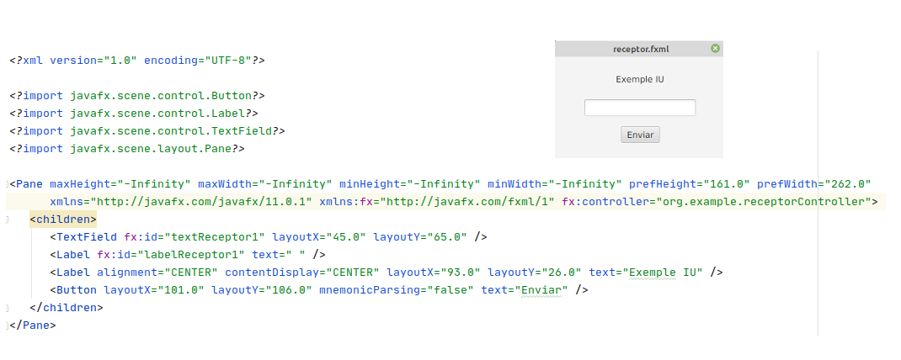
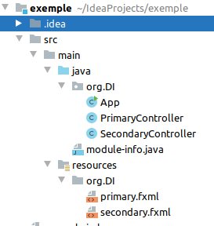
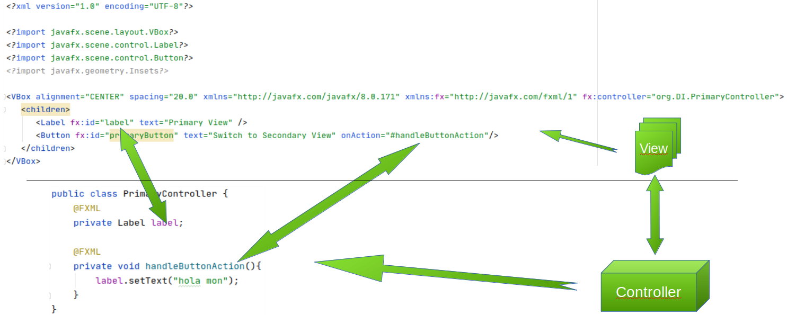

# Java FX - Introducció

El disseny de les interficies en JavaFX es defineix mitjançant un llenguatge basat en XML, el que ens permet tenir separades la part del codi i la representació visual.

  
  La construcció d'aquestes aplicacions utilitza un estil d'arquitectura en les que separa les dades d'una aplicaació, la interficie d'usuari i la llogica de control en tres components diferents. Es el que es coneix com a MVC (Model-Vista-Controlador).
 Aquesta arquitectura es divideix en tres capes diferents:
 - Vista: Descriu **com es mostra la informació**.
 - Model: Descriu les **dades que utilitza**.
 - Controlador: Gestiona les **entrades del usuari** i decideix que fer amb elles. 

  
## Arquitectura MVC
  
  Quan creem un nou projecte en el que li indiquem que volem un archetype fxml, tenim que ens creea un projecte com el seguent:
  
  
  
En ella trobem:
- primary.fxml: serà on es defineixen els components gràfics i la seva disposició.
- primaryController: Serà on es controle la informació de la vista i donem resposta a les possibles interaccions de usuari amb els controladors.

Seguidament es poden observar els elements que acabem d'explicar (la vista i el controlador) d'un exemple molt bàsic.

  
En aquest mòodul anem a centrar-se en la part gràfica de la creació de les aplicacions. Per tal de manipular els fitxers fxml, treballarem en l'aplicaió scene Builder.
[back](../javafx.html)

