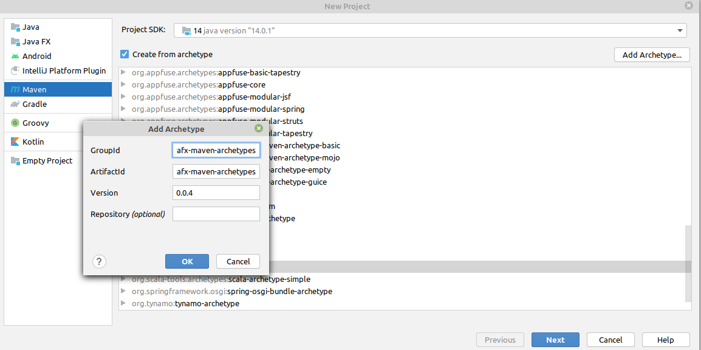

# Java FX & Intellij Idea

En aquesta secció procedim a explicar com crear una aplicació JavaFX en Intellij IDEA. Per el nostre projecte no modular, utilitzarem les eines de Maven per construir-lo i executar-lo.

## Projecte no modular amb Maven

### 1 Crear un projecte Maven

Seleccione `Arxiu -> Nou -> Projecte -> Maven` i active `Create from archetype`. Si l'arquetip JavaFX encara no està instal·lat, seleccione `Add archetype ...` i configure el groupId (`org.openjfx`), el artifactId (`javafx-maven-archetypes`) i la versió (0.0.4), i pressione OK. Arquetip JavaFX

una vegada instal·lat, seleccionem l'artquetip:

Proporcione el groupId, com `org.openjfx`, el artifactId, com `hellofx`.

Seleccione l'arquetip artifactId, entre `javafx-archetype-fxml` o `javafx-archetype-simple`, segons l'ús de FXML o no en el seu projecte.

També pot crear una propietat per a la versió javafx (`javafx-version`) i establir-la en `14`.

### 2. Executar el projecte.

Pot obrir la finestra Projectes de Maven i fer clic en `HelloFX -> Plugins -> compiler -> compiler:compile` per a compilar el projecte, i fer clic en `HelloFX -> Plugins -> javafx -> javafx:run` per a executar el projecte.

#### Editar configuració del run/debug

Per crear una forma més comoda d'executar la nostra aplicacció, accedim a l'opció de configuració de Run/debug . Una vegada dintre afegim una nova configuració.

li modifiquem el nom. 

en la mateixa finestra, li afegim una nova tasca per executar. en la que li indiqiem que execute en linea de comandos javafx:compile. i en la configuració li indiquem javafx:run.

Ara ja ens deixa executar debug/run. 

[back](../javafx.html)
