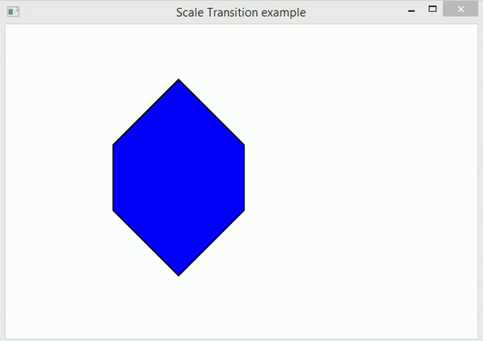
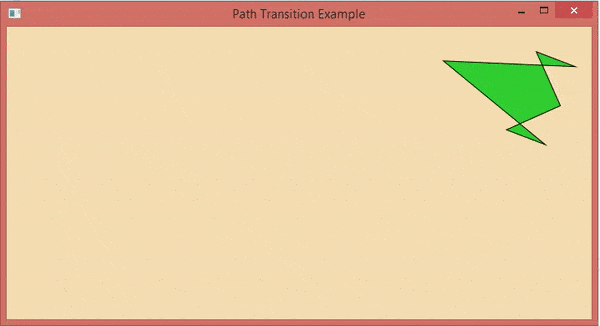

# Java FX - Animacions

En general, l'animació es pot definir com la transició que crea el mite del moviment d'un objecte. És el conjunt de transformacions aplicades a un objecte durant la duració especificada de manera seqüencial perquè l'objecte es puga mostrar com està en moviment.

Això es pot fer mitjançant la visualització ràpida de fotogrames. En JavaFX, el paquet javafx.animation conté totes les classes per a aplicar les animacions en els nodes. Totes les classes d'aquest paquet amplien la classe javafx.animation.Animation.

JavaFX proporciona les classes per a les transicions com RotateTransition, ScaleTransition, TranslateTransition, FadeTransition, FillTransition, StrokeTransition, etc.

## Transicions bàsiques

1. **Rotate Transition**: Gira el node al llarg d'un dels eixos durant la duració especificada.
2. **Scale Transition**: Anima l'escala del node durant la duració especificada.
3. **Translate Transition**: Trasllada el node d'una posició a una altra durant el temps especificat.
4. **Fade Transition**: Anima l'opacitat del node. Continua actualitzant l'opacitat del node durant un període específic per a aconseguir un valor d'opacitat objectiu
5. **Fill Transition**: Anima el color de farciment del node perquè el color de farciment del node fluctue entre els dos valors de color durant la duració especificada.
6. **Stroke Transition**: Anima el color de traç del node de manera que el color del traç del node fluctue entre els dos valors de color durant la duració especificada.
7. **Realitza la llista de transicions** en un node en ordre seqüencial.. 
8. **Parallel Transition**: Realitza la llista de transicions en un node en paral·lel.
9. **Path Transition**: Mou el node al llarg de la ruta especificada durant la duració especificada.

## Passos per a aplicar animacions

1. Crea el node de destí i configure les seues propietats.

~~~
Rectangle rect = new Rectangle(120,100,100,100);
rect.setFill(Color.RED); 
~~~

2. Instància de la classe de transició respectiva

~~~
RotateTransition rotate = new RotateTransition(); 
~~~

3. Estableix les propietats desitjades com a duració, recompte de cicles, etc. per a la transició.

~~~
rotate.setDuration(Duration.millis(1000));
rotate.setAxis(Rotate.Y_Axis);
rotate.setCycleCount(500);
~~~

4. Estableix el node de destí en el qual s'aplicarà la transició. Utilitza el següent mètode per a aquest propòsit.

~~~
rotate.setNode(rect);
~~~

5. Finalment, reproduïsca la transició usant el mètode play().

~~~
rotate.play();
~~~

## Transició de rotació

Aquesta transició s'utilitza per a aplicar la transició de rotació en el node. Gira el node al llarg de qualsevol dels tres eixos durant la duració especificada.

RotateTransition està representat per la classe javafx.animation.RotateTransition. Només necessitem crear una instància d'aquesta classe per a generar un RotateTransition apropiat.

- Propietats

    - **setAxis(Point3D value)**: Aquesta és una propietat de tipus d'objecte de la classe Point3D. Això representa l'eix de transició de rotació. 
    - **setByAngle(double value)**: Aquesta és una propietat de tipus doble. Això representa l'angle en el qual es girarà l'objecte. 
    - **setDuration(Duration value)**: Aquesta és la propietat de tipus d'objecte de la classe Duració. Això representa la duració de la transició de rotació. 
    - **setFromAngle(double value)**: És una propietat de tipus doble. Representa l'angle d'inici de la transició de rotació. 
    - **setNode(Node value)**: És una propietat de tipus d'objecte de la classe Node. Representa el node en el qual s'aplicarà la transició de rotació. 
    - **setToAngle(double value)**: És una propietat de tipus doble. Representa el valor de l'angle de parada per a la transició de rotació.

- Constructors

    - **RotateTransition()**: crea la nova instància de RotateTransition amb els paràmetres predeterminats.
    - **RotateTransition(Duration duration)**: crea la nova instància de RotateTransition amb el valor de duració especificat
    - **RotateTransition(Duration duration, Node node)**: crea la nova instància de RotateTransition amb el valor de duració especificat i el node en el qual s'aplica.

## Transició d'escala

Aquesta transició anima l'escala del node durant la duració especificada pel factor especificat en qualsevol o totes les tres direccions X, Y i Z.

En JavaFX, ScaleTransition està representat per la classe javafx.animation.ScaleTransition. Necessitem crear una instància d'aquesta classe per a generar una transició d'escala adequada.

- Propietats

    - **setByX(double value)**: Aquesta és una propietat de tipus doble. Representa el valor del factor X de parada incrementat. 
    - **setByY(double value)**: Aquesta és una propietat de tipus doble. Representa el valor del factor Y de parada incrementat. 
    - **setByZ(double value)**: Aquesta és una propietat de tipus doble. Representa el valor del factor Z de parada incrementat. 
    - **setDuration(Duration value)**: Aquesta és una propietat de tipus d'objecte de la classe Duració. Representa la duració de la transició d'escala. 
    - **setFromX(double value)**: Aquesta és una propietat de tipus doble. Representa el valor X inicial de ScaleTransition. 
    - **setFromY(double value)**: Aquesta és una propietat de tipus doble. Representa el valor I inicial de ScaleTransition. 
    - **setFromZ(double value)**: Aquesta és una propietat de tipus doble. Representa el valor Z inicial de ScaleTransition. 
    - **setNode(Node node)**: Aquesta és una propietat de tipus d'objecte de la classe Node. Representa sobre el qual s'aplica la transició d'escala. 
    - **setToX(double value)**: Aquesta és una propietat de tipus doble. Representa el valor d'escala X de parada de la transició d'escala.
    - **setToY(double value)**: Aquesta és una propietat de tipus doble. Representa el valor d'escala Y de parada de la transició d'escala.
    - **setToZ(double value)**: Aquesta és una propietat de tipus doble. Representa el valor de l'escala Z de parada de la transició d'escala.

- Constructors

    - **TranslateTransition()**: crea la nova instància de TranslateTransition amb els paràmetres predeterminats.
    - **TranslateTransition(Duration duration)**: crea la nova instància de TranslateTransition amb la duració especificada.
    - **TranslateTransition(Duration duration, Node node)**: crea la nova instància de Translate Transition amb la duració i el node especificats.

## Transició de translació

mou el node d'una posició a una altra durant la duració especificada. La transició es realitza mitjançant l'actualització contínua de les propietats translateX i translateY del node a intervals regulars.

La velocitat de la transició depén del nombre de cicles que tindrà la transició en la duració especificada.

En JavaFX, TranslateTransition està representada per la classe javafx.animation.TranslateTransition. Necessitem crear una instància d'aquesta classe per a aplicar una Transició de traducció adequada en un objecte.

- Propietats

    - **setByX(double value)**: Aquesta és una propietat de tipus doble. Representa el valor de la coordenada X incrementada en el qual es deté la translació. 
    - **setByY(double value)**: Aquesta és una propietat de tipus doble. Representa el valor de la coordenada Y incrementada en el qual es deté la translació.
    - **setByZ(double value)**: Aquesta és una propietat de tipus doble. Representa el valor de la coordenada Z incrementada en el qual es deté la translació. 
    - **setDuration(Duration value)**: Aquesta és una propietat de tipus d'objecte de la classe Duració. Representa la duració de la transició del translació. 
    - **setFromX(double value)**: Aquesta és una propietat de tipus doble. Representa el valor de la coordenada X a partir del qual comença la translació. 
    - **setFromY(double value)**: Aquesta és una propietat de tipus doble. Representa el valor de la coordenada Y a partir del qual comença la translació. Aquesta és una propietat de tipus doble. 
    - **setFromZ(double value)**: Aquesta és una propietat de tipus doble. Representa el valor de la coordenada Z a partir del qual comença la translació. 
    - **setNode(Node node)**: Aquesta és una propietat de tipus d'objecte de la classe Node. Representa el node en el qual s'aplica la transició d'escala. 
    - **setToX(double value)**: Aquesta és una propietat de tipus doble. Representa el valor de la coordenada X de parada de la transició de translació. 
    - **setToY(double value)**: Aquesta és una propietat de tipus doble. Representa el valor de la coordenada Y de parada de la transició de translació. 
    - **setToZ(double value)**: Aquesta és una propietat de tipus doble. Representa el valor de la coordenada Z de parada de la transició d'escala. 
    
- Constructors

    - **TranslateTransition()**: crea la nova instància de TranslateTransition amb els paràmetres predeterminats.
    - **TranslateTransition(Duration duration)**: crea la nova instància de TranslateTransition amb la duració especificada.
    - **TranslateTransition(Duration duration, Node node)**: crea la nova instància de Translate Transition amb la duració i el node especificats.

## Transició d'esvaïment

Anima l'opacitat del node perquè el color de farciment del node es torne opac. Això es pot fer en continuar disminuint l'opacitat del color de farciment durant una duració específica per a aconseguir un valor d'opacitat objectiu.

En JavaFX, la classe javafx.animation.FadeTransition representa FadeTransition. Necessitem crear una instància d'aquesta classe per a crear la transició de fos adequada.

- Propietats

    - **setByValue(double property)**: És una propietat de tipus doble. Representa el valor d'opacitat de parada incrementada de la transició de fos. 
    - **setDuration(Duration duration)**: Aquesta és una propietat de tipus d'objecte de la classe Duració. Representa la duració d'aquesta transició d'esvaïment. 
    - **setFromValue(double value)**: Aquesta és una propietat de tipus doble. Representa l'opacitat inicial per a la transició de fos.
    - **setNode(Node node)**: Aquesta és una propietat de tipus d'objecte de la classe Node. Això representa el node en el qual s'aplicarà la transició.
    - **setToValue(double value)**: Aquesta és una propietat de tipus doble. Això representa el valor de parada de l'opacitat per a la transició de fos.
    
- Constructors

    - **TranslateTransition()**: crea la nova instància de TranslateTransition amb els paràmetres predeterminats.
    - **TranslateTransition(Duration duration)**: crea la nova instància de TranslateTransition amb la duració especificada.
    - **TranslateTransition(Duration duration, Node node)**: crea la nova instància de Translate Transition amb la duració i el node especificats.

## Transició de farciment

Anima el color de farciment del node perquè el color de farciment puga fluctuar entre els dos valors de color durant la duració especificada.

En JavaFX, la classe javafx.animation.FillTransition representa la transició de farciment. Necessitem crear una instància d'aquesta classe per a crear un efecte de transició de farciment apropiat.

- Propietats

    - **setDuration(Duration duration)**: És una propietat de tipus d'objecte de la classe Duració. Representa la duració de la transició de farciment. 
    - **setFromValue(Color value)**: És una propietat de tipus doble. Representa el valor del color inicial per a la transició de farciment. 
    - **setShape(Shape shape)**: És una propietat de tipus d'objecte de la classe Shape. Representa la forma en la qual s'aplica la transició de farciment. 
    - **setToValue(Color value)**: Aquesta és una propietat de tipus doble. Representa el valor del color de parada per a la transició de farciment. 
    
- Constructors

    - **FillTransition()**: crea la instància de FillTransition amb els paràmetres predeterminats.
    - **FillTransition(Duration duration)**: crea la instància de FillTransition amb la duració especificada.
    - **FillTransition(Duration duration, Shape shape)**: crea la instància de FillTransition amb la duració especificada i els valors de color inicial i final.
    - **FillTransition(Duration duration, Shape shape, Color fromValue)**: crea la instància de FillTransition amb la duració especificada i l'objecte de forma sobre el qual s'aplica.
    - **FillTransition(Duration duration, Shape shape, Color fromValue, Color toValue)**: crea la nova instància de FillTransition amb la duració, la forma i els valors de color inicial i final especificats.

## StrokeTransition

Anima el color del traç del node perquè el color del traç puga fluctuar entre els dos valors de color durant la duració especificada.

En JavaFX, la classe javafx.animation.FillTransition representa la transició de farciment. Necessitem crear una instància d'aquesta classe per a crear una Transició de farciment adequada.

-Propietats

    - **setDuration(Duration duration)**: Aquesta és una propietat de tipus d'objecte de la classe Duració. Representa la duració de la transició del traç. 
    - **setFromValue(Color value)**: Aquesta és una propietat de tipus de color. Representa el valor inicial del color per a la transició del traç.
    - **setShape(Shape shape)**: Aquesta és una propietat de tipus d'objecte de la classe Forma. Representa la forma sobre la qual s'aplicarà la transició de traç. 
    - **setToValue(Color value)**: Aquesta és la propietat de tipus de color. Representa el valor objectiu del color per a la transició del traç.

Constructors

    - **StokeTransition()**: crea la nova instància de StrokeTransition amb els paràmetres predeterminats.
    - **StokeTransition(Duration duration)**: crea la nova instància de Stroke Transition amb el valor de duració especificat
    - **StokeTransition(Duration duration, Shape shape)**: crea la nova instància de StrokeTransition amb la duració especificada, el valor inicial del color i el valor objectiu del color.
    - **StokeTransition(Duration duration, Shape shape, Color fromValue)**: crea la nova instància de StrokeTransition amb la duració especificada i la forma a la qual s'aplicarà la transició.
    - **StokeTransition(Duration duration, Shape shape, Color fromValue, Color toValue)**: crea la nova instància de StrokeTransition amb la duració, forma, valor inicial del color i valor objectiu del color especificats.
    
## Transició seqüencial

Aquesta transició s'utilitza per a aplicar la llista d'animacions en un node en ordre seqüencial (una per una). La transició seqüencial és important en el disseny d'un joc que anima les seues entitats en ordre seqüencial.

En JavaFX, la classe javafx.animation.SequentialTransition s'usa per a representar la transició seqüencial. Necessitem passar la llista de múltiples objectes de transició al constructor d'aquesta classe. Aquestes animacions s'aplicaran en el node en ordre seqüencial (en l'ordre en què es passen al constructor).

Propietats

    - **setNode(Node node)**: És una propietat de tipus d'objecte de la classe Node. Representa el node sobre el qual s'aplicarà la transició.

- Constructors

    - **SequentialTransition()**: crea una instància de SequentialTransition amb els paràmetres predeterminats.
    - **SequentialTransition(Animation? children)**: crea una instància de SequentialTransition amb la llista d'animacions.
    - **SequentialTransition(Node node)**: crea una instància de sequentialTransition amb el node especificat en el qual s'aplicarà la transició seqüencial.
    - **SequentialTransition(Node node, Animation? children)**: crea una instància de SequentialTransition amb el node especificat i la llista d'animacions.

## Transició paral·lela

Aquesta transició aplica múltiples animacions en un node en paral·lel. És similar a la transició seqüencial, excepte pel fet que aplica la transició múltiple en un node al mateix temps, mentre que la transició seqüencial aplica la transició múltiple en el node per l'ordre en què les animacions es passen al constructor.

En JavaFX, la classe javafx.animation.ParallelTransition representa la transició paral·lela. Només necessitem passar la llista de transicions al constructor mentre instanciamos aquesta classe.

- Propietats

    - **setNode(Node node)**: Aquesta és la propietat de la mena d'objecte de la classe Node. Representa el node sobre el qual s'aplicarà la transició. 
    
- Constructors

    - **ParallelTransition()**: crea una instància de ParallelTransition amb els paràmetres predeterminats.
    - **ParallelTransition( Animation? children)**: crea una instància de ParallelTransition amb la llista d'animacions.
    - **ParallelTransition(Node node)**: crea una instància de ParallelTransition amb el node especificat en el qual s'aplicarà la transició en paral·lel.
    - **ParallelTransition(Node node, Animation? children)**: crea una instància de ParallelTransition amb el node especificat i la llista d'animacions.

## Pause Transition

Com suggereix el nom, aquesta transició s'usa per a fer una pausa entre les múltiples animacions aplicades en un node en ordre seqüencial. Durant la vida útil d'aquesta transició, el node roman inamovible en la pantalla.

En JavaFX, la classe javafx.animation.PauseTransition representa aquesta transició. Només necessitem crear una instància d'aquesta classe per a crear una transició de pausa adequada.

Propietats

    - **setDuration(Duration duration)**: És un tipus d'objecte de la classe Duració. Representa la vida útil de la transició.

- Constructors

    - **PauseTransition()**: crea la nova instància de PauseTransition amb els paràmetres predeterminats.
    - **PauseTransition(Duration duration)**: crea la nova instància de PauseTransition amb la duració especificada.

## Transició de ruta

Permet que el node s'anime a través d'una ruta específica durant la duració especificada. En JavaFX, la ruta es defineix instanciant la classe javafx.scene.shape.Path.

La traducció al llarg d'aquesta ruta es realitza actualitzant les coordenades x e y del node a intervals regulars. La rotació sols es pot realitzar en el cas que l'orientació estiga configurada com OrientationType.ORTHOGONAL_TO_TANGENT.

En JavaFX, la classe javafx.animation.PathTransition representa la transició de la ruta. Necessitem crear una instància d'aquesta classe per a crear una transició de ruta adequada.

- Propietats

    - **setDuraton(Duration duration)**: Aquesta propietat és un tipus d'objecte de la classe Duració. Això representa la vida útil de la transició.
    - **setNode(Node node)**: Aquest és un objecte de la classe Node. Això representa el node en el qual s'aplicarà la transició.
    - **SetOrientation(PathTransition.OrientationType orientation-type)**: Aquesta és una propietat de tipus d'objecte referenciada per PathTransition.OrientationType. Representa l'orientació vertical del node al llarg del camí. 
    - **setPath(Shape shape)**: Aquesta és una propietat de tipus d'objecte de la classe Shape. Va especificar la forma a través de la qual se sotmet el contorn del camí animat.

- Constructors

    - **PathTransition()**: crea la instància de la transició de ruta amb els paràmetres predeterminats
    - **PathTransition(Duration duration, Shape path)**: crea la instància de transició de ruta amb la duració i ruta especificades
    - **PathTransition(Duration duration, Shape path, Node node)**: crea la instància de PathTransition amb la duració, ruta i node especificats.

[back](../../javafx.html)
