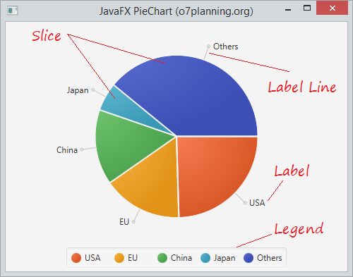
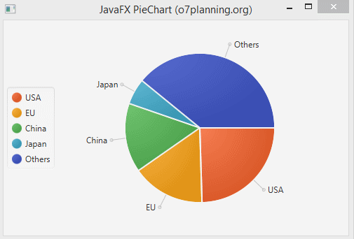
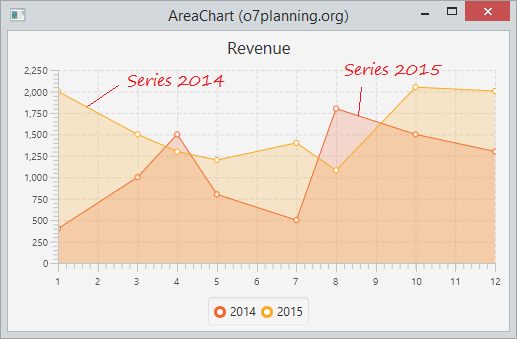
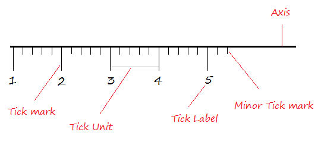
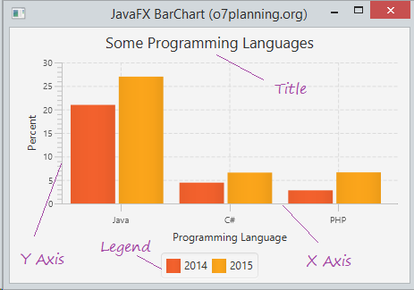
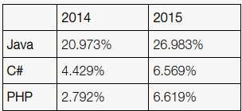
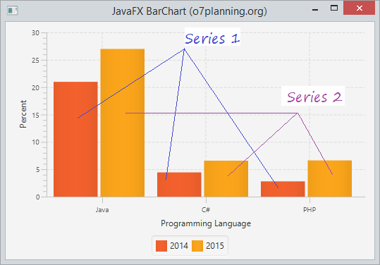

# Java FX - Charts

En general, un gràfic és una representació gràfica de dades. Existeixen diversos tipus de gràfics per a representar dades com el Gràfic de barres, Gràfic circular, Gràfic de línies, Gràfic de dispersió, etc.

JavaFX proporciona suport per a diversos gràfics circulars i gràfics XY. Els gràfics que es representen en un pla XY inclouen AreaChart, BarChart, BubbleChart, LineChart, ScatterChart, StackedAreaChart, StackedBarChart, etc.

Cada gràfic està representat per una classe i tots aquests gràfics pertanyen al paquet javafx.scene.chart. La classe denominada Chart és la classe base de tots els gràfics en JavaFX i el XYChart és la classe base de tots els gràfics que es dibuixen en el pla XY.

## Creació d'un Chart

Per a crear un gràfic, necessitem:

- Definir l'eix del gràfic.
- Instanciar la classe respectiva
- Preparar i passar dades al gràfic.

#### Instanciando la respectiva classe

Per a crear un gràfic, crea una instància de la seua classe respectiva. Per exemple, si desitja crear un gràfic de línies, ha de crear una instància de la classe anomenada Línia de la següent manera:

~~~
LineChart linechart = new LineChart (xAxis, yAxis);
~~~

> Com la majoria de vegades, aço es pot fer també en el Scene Builder.

Com s'observa en el codi anterior, en crear instàncies, ha de passar dos objectes que representen els eixos X i Y del gràfic, respectivament.

#### Definint l'Eix

En general, l'eix dels gràfics es pot representar mitjançant:

- Números com a Població, Edat i
- Categories com a Dies en una setmana, Països.

En JavaFX, un eix és una classe abstracta que representa l'eix X o Y. Té dues subclasses per a definir cada tipus d'eix, que són **CategoryAxis** i **NumberAxis** com es mostra en el següent diagrama:

- **Category Axis**: En crear una instància d'aquesta classe, pot definir (crear) un eix X o Y al llarg del qual cada valor representa una categoria. Pot definir un eix de categoria instanciant aquesta classe com es mostra a continuació:

~~~
CategoryAxis xAxis = new CategoryAxis();
~~~

Per a aquest eix, ha d'establir la llista de categories i etiquetes en l'eix com es mostra a continuació:

~~~
// Establint el llistat de categories.
xAxis.setCategories(FXCollections.<String>observableArrayList
   (Arrays.asList("n ame1", "name2"….)));

//Establint el label dels eixos
xAxis.setLabel("name of the axis ");
~~~

- **NumberAxis**: en crear una instància d'aquesta classe, pot definir (crear) un eix X o Y al llarg del qual cada valor representa un valor numèric. Pot usar qualsevol tipus de Número amb aquest Eix, **Long**, **Double**, **BigDecimal**, etc. Es pot definir un eix numéric instanciant aquesta classe de la següent manera:

~~~
//Defining the axis 
NumberAxis yAxis = new NumberAxis();

//Setting labelto the axis 
yAxis.setLabel("name of the axis");
~~~

#### Pasar les dades a gràfics XY

Tots els gràfics XY estan representats al llarg del planol XY. Per a traçar un conjunt de punts en un gràfic, necessitem especificar una sèrie de coordenades XY.

La classe <X, Y> del paquet javafx.scene.chart és una classe mitjançant la qual pot enviar dades a un gràfic. Aquesta classe conté una llista observable de sèries amb nom. Pot obtindre aquesta llista utilitzant el mètode getData () de la classe XYChart.Sèries com es mostra a continuació:

~~~
ObservableList list = series.getData();
~~~

On, sèries és l'objecte de la classe XYChart.Sèries. Pot agregar dades a aquesta llista utilitzant el mètode add () de la següent manera:

~~~
list.add(new XYChart.Data(x-axis data, y-axis data));
~~~

Aquestes dues línies es poden escriure juntes com es mostra a continuació:

~~~
series.getData().add(new XYChart.Data(x-axis data, y-axis data));
~~~

A continuació es proporciona una descripció de diversos gràfics (classes) proporcionats per JavaFX:

## Pie Chart

Un pie chart (gràfic circular) és una representació de valors com a talls d'un cercle amb diferents colors. Aquestes seccions s'etiqueten i els valors corresponents a cada secció es representen en el gràfic.

Els constructors de la classe són:

- **PieChart()**: crea una instància buida de gràfic circular.
- **PieChart(dades de ObservableList)**: crea una instància de gràfic circular amb dades donades.

A continuació es mostra un gràfic circular que representa les dades del PIB d'alguns paisos en 2015.

Mètodes més utilitzats
- **getData()** retorna les dades del gràfic circular
- **getLabelLineLength()** retorna la longitud de l'etiqueta del gràfic circular
- **getLabelsVisible()** Indica si les etiquetes de tall de pastís es dibuixen o no
- **getStartAngle()** retorna l'angle inicial del gràfic circular
- **isClockwise()** retorna si el gràfic circular està en sentit horari o no
- **setClockwise(boolean v)** estableix l'orientació del gràfic circular en sentit horari si es passa el valor vertader
- **setData(dades de ObservableList)** Estableix el valor de les dades de propietat.
- **setLabelLineLength(doble v)** estableix la longitud de la línia d'etiqueta del gràfic circular.
- **setLabelsVisible(boolean v)** Estableix el valor de la propietat labelsVisible.
- **setStartAngle(doble v)** estableix l'angle d'inici del gràfic circular

En JavaFX, un pie-Chart està representat per una classe anomenada PieChart. Aquesta classe pertany al paquet javafx.scene.chart.

En crear una instància d'aquesta classe, pot crear un node PieChart en JavaFX.

Aquesta classe té 5 propietats que són les següents:

- **clockwise**: Aquest és un operador booleà; En configurar aquest operador com a vertader, els segments de dades en els gràfics circulars s'organitzaran en el sentit de les agulles del rellotge a partir de l'angle d'inici del gràfic circular.
- **data**: representa un objecte ObservableList que conté les dades del gràfic circular.
- **labelLineLength**: un operador sencer que representa la longitud de les línies que connecten les etiquetes i els sectors del gràfic circular.
- **labelsVisible**: aquest és un operador booleà; En establir aquest operador com a vertader, es dibuixaran les etiquetes per als gràfics circulars. Per defecte, aquest operador està configurat per a ser verdader.
- **startAngle**: es tracta d'un operador de tipus doble, que representa l'angle en el qual s'inicia el primer talle circular.

En aquest exemple, per a generar un gràfic circular, prepare un objecte ObservableList com es mostra en el següent bloc de codi:

~~~
//Preparant l'objecte ObservbleList
ObservableList<PieChart.Data> pieChartData = FXCollections.observableArrayList( 
new PieChart.Data("USA", 17947195), 
new PieChart.Data("EU", 11540278), 
new PieChart.Data("China", 10982829),
new PieChart.Data("Japan", 4116242)
new PieChart.Data("Others", 28584442)); 
~~~

Després de preparar l'objecte ObservableList, passe-ho com a argument al constructor de la classe PieChart de la següent forma:

~~~
//Creating a Pie chart 
PieChart pieChart = new PieChart(pieChartData);
~~~

O, usant el mètode anomenat setData () de la classe anomenada PieChart del paquet anomenat javafx.scene.chart.

~~~
pieChart.setData(pieChartData);
~~~

per posar la llegenda a la part esquerra utilitzem:

~~~
pieChart.setLegendSide(Side.LEFT);
~~~

## Area Chart

Els gràfics d'àrea s'utilitzen per a dibuixar gràfics basats en àrees. Traça l'àrea entre la sèrie de punts donada i l'eix. En general, aquest quadre s'usa per a comparar dues quantitats.

La següent data descriu els ingresos mensuals en 2014 i 2015

L'eix X mostra els mesos de l'any, l'eix I representa els seus ingressos.

Per crear la gràfica del exemple:

definim els eixos x i y, així com el area xart.

~~~
NumberAxis xAxis = new NumberAxis(1, 12, 1);
NumberAxis yAxis = new NumberAxis();
AreaChart<Number, Number> areaChart = new AreaChart<Number, Number>(xAxis, yAxis);
areaChart.setTitle("Revenue");
~~~

En aquest exemple anem introduint-li les dades de una en una, no  utilitzem un ObservableList. Es fá igual per al any 2014 que per al 2015.

~~~
// Series data of 2014
XYChart.Series<Number, Number> series2014 = new XYChart.Series<Number, Number>();
 
series2014.setName("2014");
         
series2014.getData().add(new XYChart.Data<Number, Number>(1, 400));
series2014.getData().add(new XYChart.Data<Number, Number>(3, 1000));
series2014.getData().add(new XYChart.Data<Number, Number>(4, 1500));
series2014.getData().add(new XYChart.Data<Number, Number>(5, 800));
series2014.getData().add(new XYChart.Data<Number, Number>(7, 500));
series2014.getData().add(new XYChart.Data<Number, Number>(8, 1800));
series2014.getData().add(new XYChart.Data<Number, Number>(10, 1500));
series2014.getData().add(new XYChart.Data<Number, Number>(12, 1300));
~~~

## Bar Chart

JavaFX BarChart s'utilitza per a dibuixar un gràfic de barres bidimensional amb 2 eixos X e Y. En aquest gràfic, un eix denota un grup d'objectes interessats i l'altre denota dades numèriques.

Per exemple, les dades a continuació descriuen la popularitat d'alguns llenguatges de programació en 2014 i 2015.

Es pot utilitzar BarChart per a dibuixar el quadre que descriu la popularitat dels llenguatges de programació amb les dades esmentades anteriorment. Vegem un exemple il·lustratiu a continuació:

Definim els eixos X i Y.
~~~
CategoryAxis xAxis = new CategoryAxis();
xAxis.setLabel("Programming Language");
 
NumberAxis yAxis = new NumberAxis();
yAxis.setLabel("Percent");
~~~
 
 Creem el Bar Chart.
~~~
// Create a BarChart
BarChart<String, Number> barChart = new BarChart<String, Number>(xAxis, yAxis);
~~~
  
Introduim les dades per la serie 2014:
~~~
// Series 1 - Data of 2014
XYChart.Series<String, Number> dataSeries1 = new XYChart.Series<String, Number>();
dataSeries1.setName("2014");
 
dataSeries1.getData().add(new XYChart.Data<String, Number>("Java", 20.973));
dataSeries1.getData().add(new XYChart.Data<String, Number>("C#", 4.429));
dataSeries1.getData().add(new XYChart.Data<String, Number>("PHP", 2.792));
~~~

Per la serie 2015 s'introduirien igual les dades.

Afegim les series al Bar chart:

~~~
// Add Series to BarChart.
barChart.getData().add(dataSeries1);
barChart.getData().add(dataSeries2);
 
barChart.setTitle("Some Programming Languages");
~~~

[back](../../javafx.html)