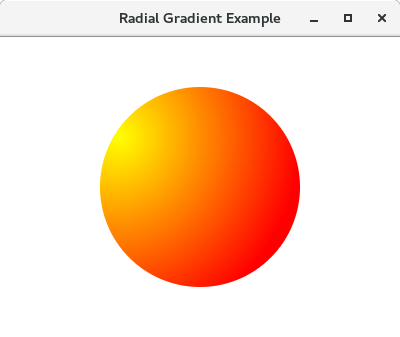

# Java FX - Color

En JavaFX tenim la flexibilitat de crear el nostre propi color usant diversos mètodes i passar-ho com un objecte Paint al mètode setFill(). Analitzem els diversos mètodes per a crear color en JavaFX.

## Color RGB

El sistema de color RGB és el mètode més popular per a crear un color en gràfics. Consta de tres components denominats ROIG → R, VERD → G i BLAU → B. Cada component usa 8 bits, la qual cosa significa que cada component pot tindre un valor sencer de 0 a 22 ^ 8 - 1 = 255.

La pantalla de la computadora pot veure's com una col·lecció de píxels. El conjunt (R, G, B) representa en realitat l'emissió dels seus respectius LED en la pantalla.

Si el valor de ROIG s'estableix en 0, significa que el LED roig està apagat mentre que el valor 255 indica que l'emissió completa del LED és allí. La combinació de (0,0,0) representa el color negre mentre que (255,255,255) representa el color blanc. Els valors mitjans en aqueix rang poden representar diferents colors.

Usant la superposició de RGB, podem representar 255 * 255 * 255 colors diferents. En JavaFX, la classe **javafx.scene.paint.Color** representa colors.

Hi ha un mètode estàtic anomenat **rgb()** de la classe Color. Accepta tres arguments sencers com a roig, verd, blau i un argument doble opcional anomenat alfa. El valor **d'alfa és proporcional a l'opacitat del color**. El valor alfa 0 significa que el color és completament transparent, mentre que el valor 1 significa que el color és completament opac.

## Color Name

En JavaFX, també podem crear el color pel nom del color. La classe javafx.scene.paint.Color conté tots els colors com a propietats de la classe. La propietat Color ha de passar-se, com l'objecte de la classe Paint.

## HSB Color

Juntament amb els diversos mètodes que hem vist fins ara, JavaFX també ens permet crear el color usant HSB que és la combinació de To, Saturació i Lluentor. javafx.scene.paint.Color conté un mètode estàtic **Color.hsb()** que accepta tres nombres enters h, s y b.

## Web Color

La classe javafx.scene.paint.color ens permet crear els colors web usant el mètode Color.web(). Això pot prendre fins a dos paràmetres, dels quals un és el valor hexadecimal del color i l'altre és un argument opcional anomenat canal alfa que representa l'opacitat del color.

~~~
Color.web("# 0000FF") // Color blau amb alfa implícit

Color.web ("# 0000FF", 1) // Color blau amb alfa explícit
~~~
Alpha és un valor de tipus doble que pot contindre valors en el rang de 0.0 a 1.0.

# Gradient

En gràfics per computadora, els colors de degradat (a vegades dits progressió de color) s'utilitzen per a especificar els colors dependents de la posició per a omplir una regió en particular. El valor del color degradat varia amb la posició. Els colors degradats produeixen les transicions de color suaus a la regió en variar el valor del color contínuament amb la posició.

JavaFX ens permet implementar dos tipus de transicions de color de degradat:

- Gradient lineal
- Gradient radial

## Linear Gradient

Per a aplicar patrons de degradat lineal a les formes, necessitem crear una instància de la classe LinearGradient. Aquesta classe conté diversos mètodes d'instància que es descriuen a continuació en la taula.

- Metodes

    - **equals(Object o)**: de tipus boolea Compara dos objectes
    - **getCycleMethod()** Defineix quin mètode de cicle s'ha aplicat a LinearGradient.
    - **getEndX()** de tipus doble: coordenada X del punt final de l'eix de degradat
    - **getEndY()** de tipus doble: coordenada Y del punt final de l'eix de gradient
    - **getStartX()** de tipus doble: Coordenada X del punt d'inici de l'eix de gradient
    - **getStartY()** de tipus doble: Coordenada Y del punt d'inici de l'eix de gradient
    - **getStops()** del tipus List <Stop>: Defineix la forma de distribucions de colors al llarg del degradat
    - **hashCode()** de tipus enter: Retorna el codi hash per a l'objecte de gradient lineal
    - **isOpaque()** de tipus boolea Comprova si la pintura és completament opaca o no.
    - **isProprtional()** de tipus boolea Comprova si les ubicacions inicial i final són proporcionals o no.
    - **toString()** Converteix l'objecte degradat en una cadena.

- Constructors

    - **new LinearGradient(startX, startY, endX, endY, Proportional, CycleMethod, stops)**
    - **(startX, startY)**: representa les coordenades x e y del punt d'inici del color degradat.
    - **(endX, endY)**: representa les coordenades x e y del punt final del color degradat.
    - **Proportional**: aquesta és una propietat de tipus booleà. Si això és cert, el punt inicial i final del color degradat es tornarà proporcional.
    - **CycleMethod**: Això defineix el mètode de cicle aplicat al gradient.
    - **Stops**: defineix la distribució del color al llarg del degradat.

## Radial Gradient

Per a aplicar degradat radial a les formes, necessitem instanciar la classe javafx.scene.paint.RadialGradient. Aquesta classe conté diversos mètodes d'instància descrits a continuació:

- Metodes

    - **equals(Object o)** de tipus boolea: Compara dos objectes
    - **getCenterX()** de tipus double: Coordenada X del cercle que defineix el degradat
    - **getCenterY()** de tipus double: Coordenada Y del cercle que defineix el degradat
    - **getCycleMethod()**: Defineix quin mètode de cicle s'ha aplicat a LinearGradient.
    - **getFocusAngle()** amb tipus Double: Angle en graus entre el centre del degradat i el focus de la posició on s'assigna el primer color
    - **getFocusDistance()** amb tipus Double: Distància entre el centre del degradat i el punt d'enfocament del primer color.
    - **getRadius** amb tipus Double: Radi del gradient
    - **getStops()** amb tipus List <Stop>: Defineix la forma de distribucions de colors al llarg del degradat
    - **hashCode()** amb tipus int: Retorna el codi hash per a l'objecte de gradient lineal
    - **isOpaque()** amb tipus booleà: Comprova si la pintura és completament opaca o no.
    - **isProprtional()** amb tipus booleà: Comprova si les ubicacions inicial i final són proporcionals o no.
    - **toString()** Converteix l'objecte degradat en una cadena (string).

- Constructor

El constructor de la classe accepta alguns paràmetres. 

~~~
RadialGradient(double focusAngle, double focusDistance, double centerX, double centerY, double radius, boolean proportional, CycleMethod cycleMethod, Stops? stops)
~~~

[back](../../javafx.html)