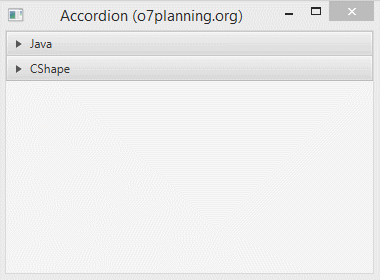
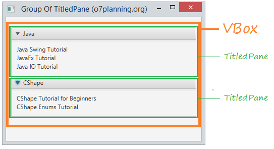
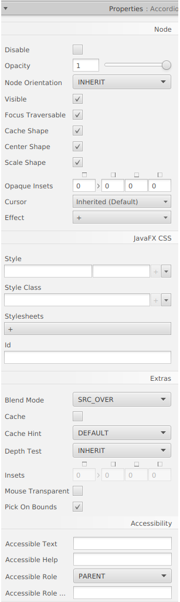
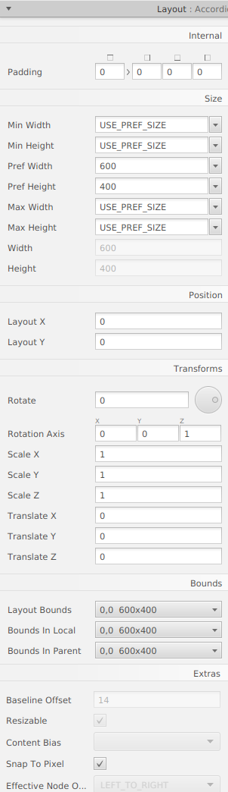

# Java FX - Contenidors

# Acordió

En JavaFX, pot crear un acordió, usant la classe Accordion.

~~~
Accordion root= new Accordion();
root.getPanes().addAll(firstTitledPane,
secondTitledPane);
~~~

De fet, pot crear el component d'interfície que és el mateix que Accordion usant la combinació entre TitledPane i VBox.

La següent imatge mostra un grup de TitledPanes en un VBox.

## Menú Propietats

## Menú Layout

## Menú Code

[back](../../javafx.html)

