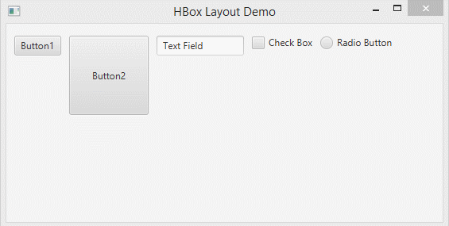
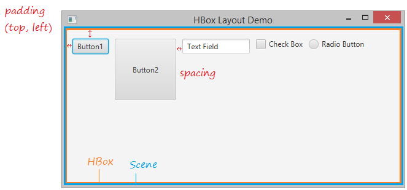
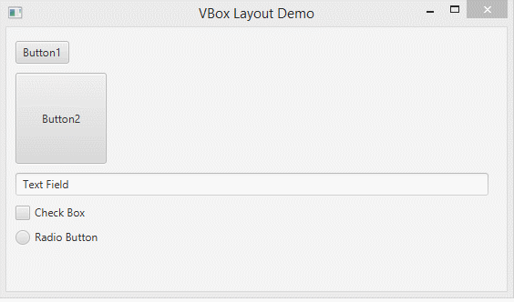
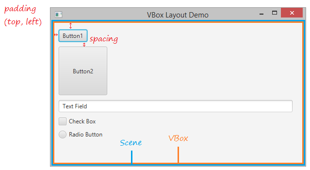
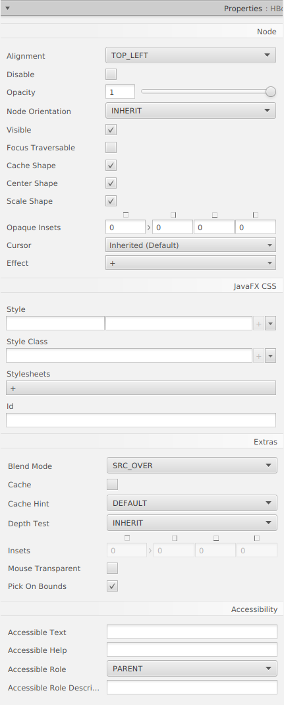
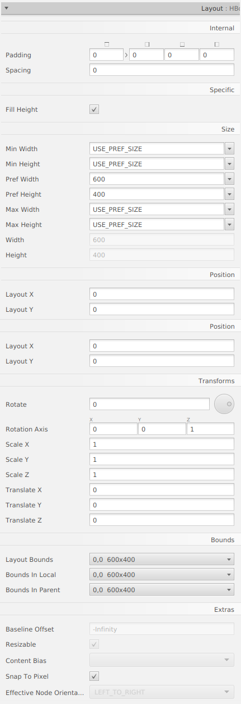

# Java FX - Contenidors

# HBox i VBox

## HBox

El panell de disseny HBox proporciona una manera fàcil d'organitzar una sèrie de nodes en una sola fila.

La propietat de farciment es pot configurar per a administrar la distància entre els nodes i les vores del panell HBox. 

## VBox

El panell de disseny de VBox és similar al panell de disseny de HBox, excepte que els nodes estan disposats en una sola columna.

La propietat de farciment es pot configurar per a administrar la distància entre els nodes i les vores del panell VBox. L'espaiat es pot configurar per a administrar la distància entre els nodes. Els marges es poden configurar per a agregar espai addicional al voltant dels controls individuals.

## Menú Propietats

## Menú Layout

## Menú Code

[back](../../javafx.html)

