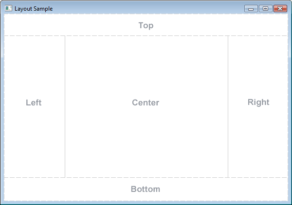
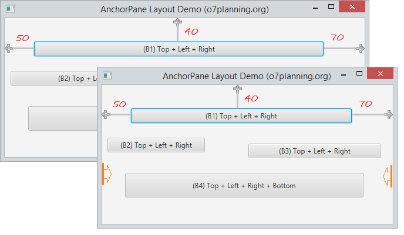
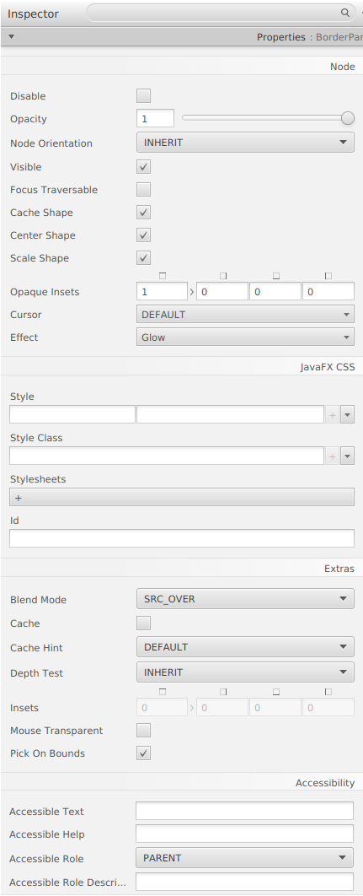

# Java FX - Contenidors

# Anchor Pane

AnchorPane és un contenidor, que és similar a BorderPane. BorderPane es divideix en 5 àrees separades per a col·locar el subcomponente mentre AnchorPane es divideix en 5 àrees per a ancorar. Tinga en compte que 5 àrees de AnchorPane són 5 àrees lògiques però no 5 àrees reals.

El panell de disseny AnchorPane li permet ancorar nodes a la part superior, inferior, costat esquerre, costat dret o centre del panell. A mesura que es canvia la grandària de la finestra, els nodes mantenen la seua posició respecte al seu punt d'ancoratge. Els nodes es poden ancorar a més d'una posició i més d'un node es pot ancorar a la mateixa posició. 

Els subcomponentes poden ancorar-se en 4 costats de AnchorPane:

## Menú Propietats

## Menú Layout

## Menú Code

[back](../../javafx.html)

