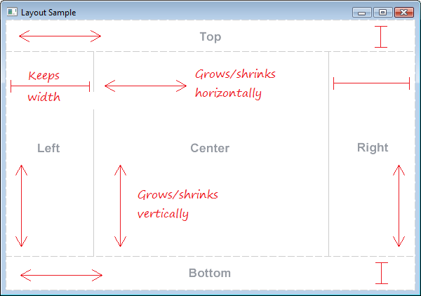
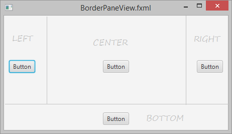
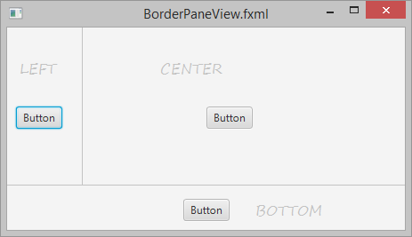
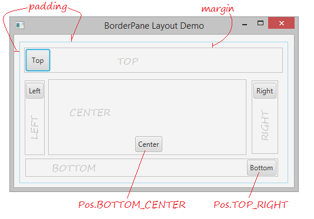
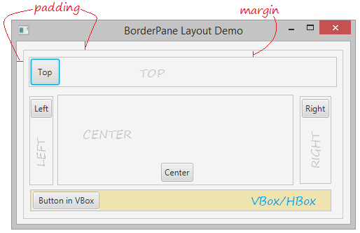

# Java FX - Contenidors

# Border Pane

El  BorderPane proporciona cinc regions en les quals col·locar nodes: dalt, baix, esquerra, dreta i centre, tal i com es mostra en la figura. Les regions poden ser de qualsevol grandària. 

És útil per a **l'aspecte clàssic** d'una **barra d'eines** en la part superior, una **barra d'estat** en la part inferior, un **panell de navegació** a l'esquerra, **informació addicional** a la dreta i una àrea de treball en el centre.

- **Àrea superior / inferior**: pot contraure's / expandir-se horitzontalment i mantindre l'altura sense canvis.
- **Àrea esquerra / dreta**: pot reduir-se / expandir-se verticalment i mantindre la longitud sense canvis.
- **Àrea central**: pot contraure's / expandir-se en totes dues direccions.

Cada àrea pot contindre només un element. Es pot agregar utilitzant els mètodes:
- setTop(Node)
- setRight(Node)
- setBottom(Node)
- setLeft(Node)
- setCenter(Node)

Les característiques d'aquestes àrees anteriors s'il·lustren a continuació:

Si una àrea determinada no conté subcomponentes, l'àrea estarà ocupada per altres àrees.

**Exemple**: Si l'àrea de TOP no té subcomponentes, el seu espai estarà ocupat per altres components:

**Exemple**: Si l'àrea de DALT i DRETA no té subcomponentes, el seu espai estarà ocupat per altres components:

> Nota: Per a JavaFX, els subcomponentes que es troben en una àrea determinada de BorderPane tal vegada no omplin l'espai, per exemple, si Button es troba en una àrea de BorderPane, de manera predeterminada no emplenarà l'àrea.

> Però si VBox o Hbox es troba en una àrea de BorderPane, per defecte omplirà l'àrea.

En cas que es reduisca el la finestra i es faça més xicoteta que l'espai necessari per al contingut de cada regió, les regions poden superposar-se. La superposició està determinada per l'ordre en què s'estableixen les regions. Per exemple, si les regions s'estableixen en l'ordre d'esquerra, a baix i dreta, quan la finestra es fa més xicoteta, la regió inferior se superposa a la regió esquerra i la regió dreta se superposa a la regió inferior. 

En els contenidors, disposem del menú de Propietats, Layout i code. En ells podem modificar algunes de les seves opcions:

## Menú Propietats

## Menú Layout

## Menú Code

[back](../../javafx.html)

