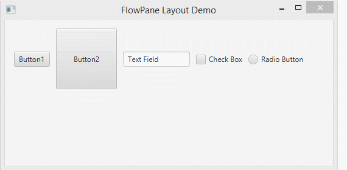
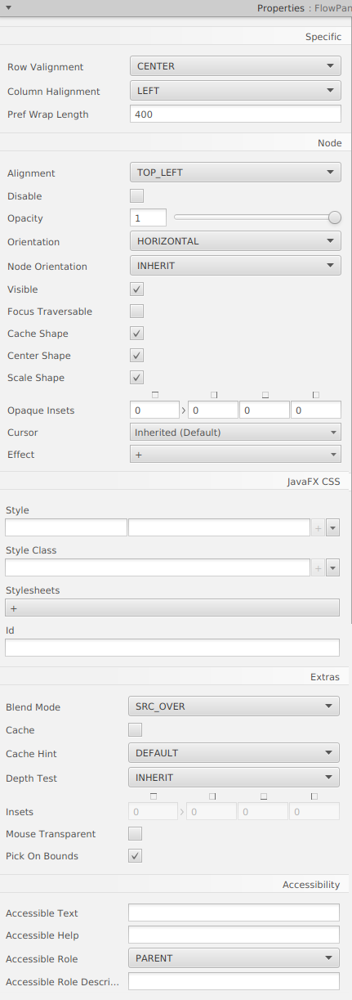

# Java FX - Contenidors

# Flow Pane

FlowPane és un contenidor. Organitza els subcomponentes consecutius en una fila, i automàticament espenta els subcomponentes cap avall a la següent línia si s'ompli la fila actual.

## Menú Propietats

## Menú Layout

## Menú Code

[back](../../javafx.html)

