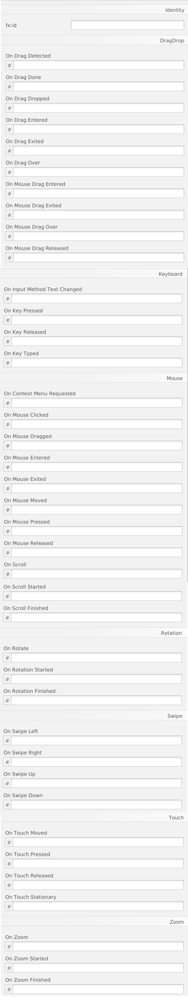

# Java FX - Contenidors

# Grid Pane

GridPane és un contenidor que divideix la seua superfície en una quadrícula, que inclou files i columnes. Un subcomponente pot estar en una cel·la o en una cel·la combinada de les següents cel·les.

És útil per a crear formularis o qualsevol disseny que estiga organitzat en files i columnes. En la imatge anterior es mostra un panell de quadrícula que conté una icona, títol, subtítol, text i un gràfic circular. En aquesta figura, la propietat gridLinesVisible està configurada per a mostrar línies de quadrícula, que mostren les files i columnes i els espais entre les files i columnes. Aquesta propietat és útil per a depurar visualment els seus dissenys de GridPane.

Podem indicar-li que afegeixca una fila o columnea més, clicant damunt del grid pane amb el botó dret.

Exemple de pantalla grid Pane:

## Menú Propietats

## Menú Layout

## Menú Code

[back](../../javafx.html)

