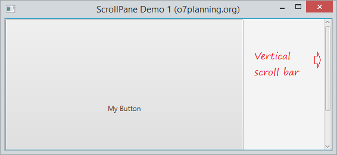
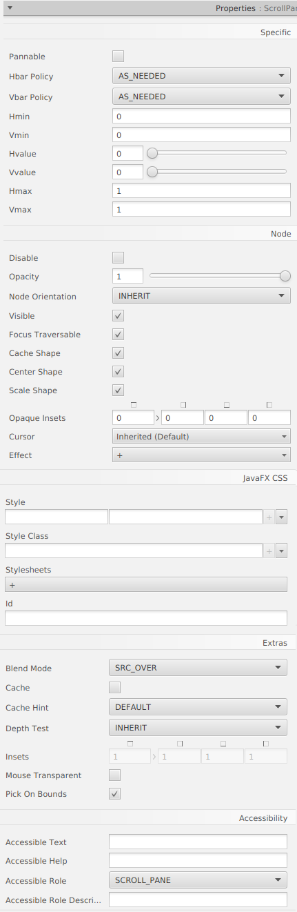
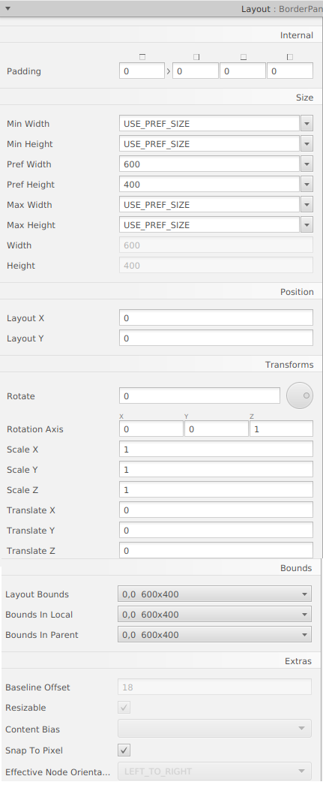
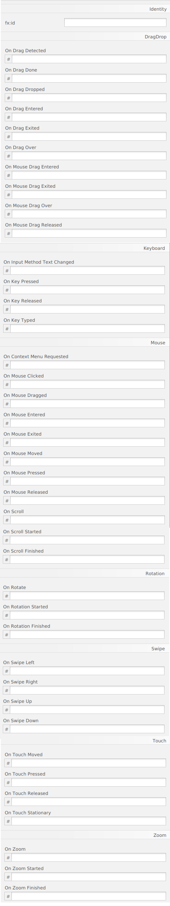

# Java FX - Contenidors

# Scroll Pane

ScrollPane és un component desplaçable que s'utilitza per a mostrar un gran contingut en un espai limitat. Conté barres de desplaçament horitzontal i vertical.

Pot configurar la política de visualització per a la barra de desplaçament:

- NEVER - Never display
- ALWAYS - Always display
- AS_NEEDED - Display if needed.

## Menú Propietats
 

## Menú Layout

## Menú Code

[back](../../javafx.html)

