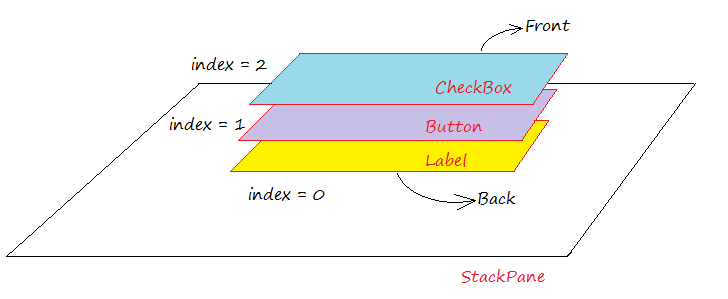

# Java FX - Contenidors

# Stack Pane

StackPane és un contenidor que pot contindre diferents components d'interfície, subcomponentes apilats a uns altres, i en un moment determinat, només pot veure el subcomponente en la part superior de Stack.

Col·loca tots els nodes dins d'una sola pila amb cada nou node agregat en la part superior del node anterior. Aquest model de disseny proporciona una manera fàcil de superposar text en una forma o imatge o superposar formes comunes per a crear una forma complexa. La seguent imatge mostra una icona d'ajuda creat en apilar un signe d'interrogació en la part superior d'un rectangle amb un fons degradat.

Els subcomponentes que s'agreguen més tart se situaran en la part superior de la Pila

Pot col·locar cert subcomponent enfront de Stack mitjançant el mètode anomenat **toFront ()**, o col·locar el subcomponente en la part inferior de Stack mitjançant el mètode anomenat **toBack ()**.

Exemple  d'stack Pane

## Menú Propietats

## Menú Layout

## Menú Code

[back](../../javafx.html)

