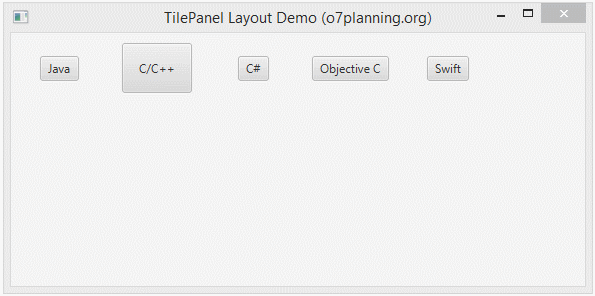
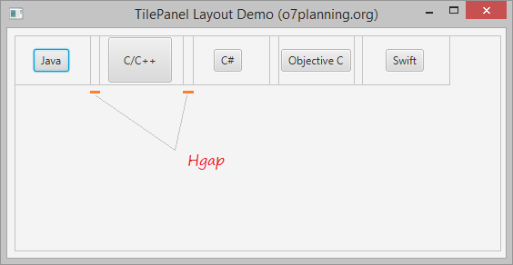
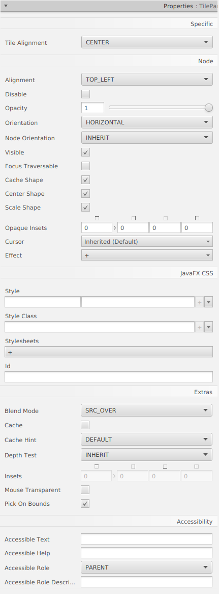

# Java FX - Contenidors

# Tile Pane

TilePane és un contenidor que molt similar a FlowPane. Organitza els subcomponentes consecutius en una fila, i automàticament espenta els subcomponentes cap avall a la següent línia si s'ompli la línia actual. Difereix de FlowPane en què els subcomponentes es troben en la mateixagrandaria de cel·la.

Els subcomponentes es troben en cel·les de quadrícula de la mateixa grandària.

## Menú Propietats

## Menú Layout

## Menú Code

[back](../../javafx.html)

