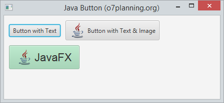

# Controls - Button

Permet als desenvolupadors processar una acció quan un usuari fa clic en un botó. La classe Button és una extensió de la classe Etiquetada. Pot mostrar text, una imatge o tots dos.

Button es un node, per lo que hereda tots els métodes d'utilització d'events de la classe node.

## botó amb imatge:

Es crea igual que un botó normal, pero se li afegeix una imatge.

~~~
ImageView imageView = new ImageView(new Image("icons/icon.png"));
Button button = new Button("Botó amb text i imatge", imageView);
        
//button2.setGraphic(imageView); <- una opció alternativa
~~~
        
## botó i events.

El botó, al igual que altres nodes disposa de diferents métodes amb els quals pot interactuar l'usuari amb ell.Si volem veure els métodes més utilitzats es poden veure en el menú code del scene builder. Per veure-ho amb més detall, fes clic [ací](https://openjfx.io/javadoc/14/javafx.controls/javafx/scene/control/ButtonBase.html)

En el següent exemple, anem a indicar-li que quan detecta que ha fet click en el botó, escriu un text en consola:

~~~
button.setOnAction(actionEvent -> {
            System.out.println("has clicat...");
        });
~~~

## Efectes

Com la clase button s'exten de la classe node, pots aplicar els efectes del paquet javafx.scene.effect per modificar l'apariencia del botó. 

En el següent exemple, quan pasem el ratolí per damunt del botó, li posará una ombra.

~~~
button.setOnMouseEntered(dragEvent -> {
	button.setEffect(shadow);
});
button.setOnMouseExited(mouseEvent -> {
        button.setEffect(null);
});
~~~

[back](../../javafx.html)

