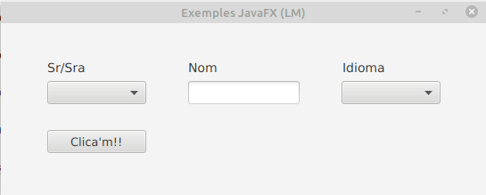

# Choice Box

ChoiceBox és part del paquet JavaFX. Mostra un conjunt d'elements i permet a l'usuari seleccionar una sola opció i mostrarà l'element seleccionat actualment en la part superior. ChoiceBox per defecte no té cap element seleccionat llevat que se seleccione el contrari. 

Els constructors de la classe ChoiceBox són:

- **ChoiceBox ()**: crea un nou ChoiceBox buit.
- **ChoiceBox (elements ObservableList)**: crea un nou ChoiceBox amb el conjunt d'elements donat.

Els mètodes que mes sol utilitzar són:

- **getItems()**: Obté el valor dels elements de propietat.
- **getValue()**: Obté el valor del valor de la propietat.
- **hide()**:  Tanca la llista d'opcions.
- **setItems(ObservableList value)**: Estableix el valor dels elements de propietat.
- **setValue(T value)**: Estableix el valor del valor de la propietat.
- **show()**: Obri la llista d'opcions.

El codi fxml del checkbox seria:

~~~
<ChoiceBox fx:id="choiceBox" layoutX="383.0" layoutY="65.0" prefHeight="26.0" prefWidth="111.0" AnchorPane.rightAnchor="52.0" />
~~~

[back](../../javafx.html)

