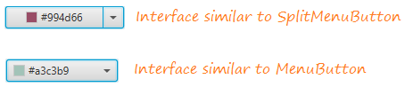
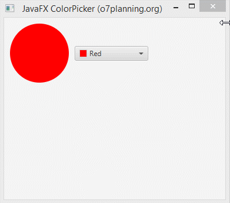
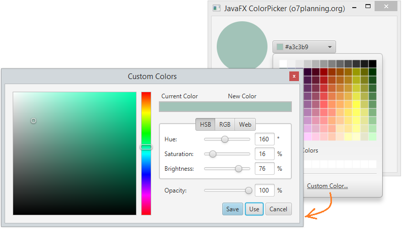
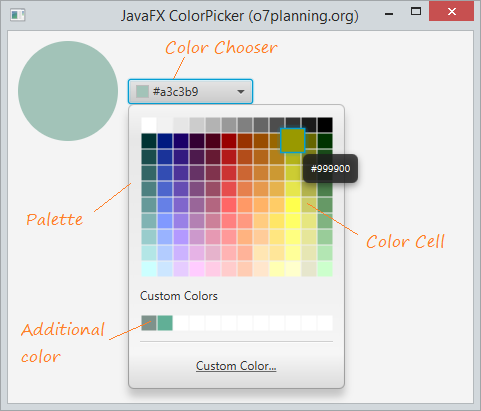
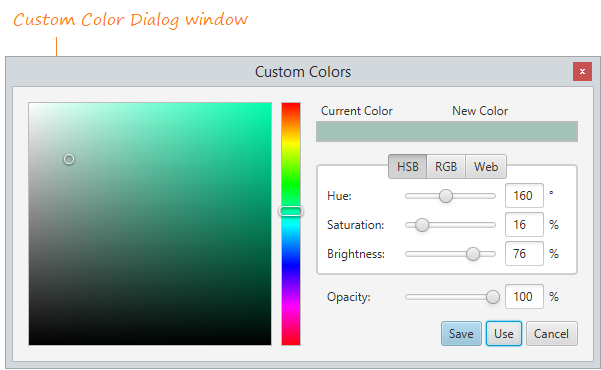

# Color Picker

ColorPicker li permet a l'usuari triar un color d'un conjunt de colors determinat o fer el seu propi color personalitzat. Es pot establir un Color inicial usant la funció setValue() o definint-lo en un constructor. El color seleccionat per l'usuari es pot trobar usant la funció getValue ().

Es genera un esdeveniment d'Acció quan l'usuari selecciona un color del selector de color. Aquest esdeveniment pot manejar-se usant un controlador d'esdeveniments.

L'aparença de ColorPicker es pot controlar de 

Els constructors de la classe són:

- **ColorPicker ()**: crea una instància predeterminada de ColorPicker amb un color seleccionat establit en blanc.
- **ColorPicker (Color c)**: crea una instància de ColorPicker i estableix el color seleccionat per al color donat.

Mètodes d'ús comú:
- **getCustomColors()** Obté la llista de colors personalitzats que l'usuari agrega a la Paleta de colors.
- **setValue(Color c)** estableix el color del selector de color en color c
- **getValue()** retorna un objecte de color que defineix el color seleccionat per l'usuari

 

El color es pot personalitzar:

 

A continuació es poden elegir els components del ColorPicker:

 

Per la personalització del color:

 

fer exemple:
https://o7planning.org/en/11135/javafx-colorpicker-tutorial

[back](../../javafx.html)

