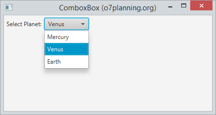

# Java FX - Controls

Anem a fer una descripció general dels controls de la interfície d'usuari JavaFX disponibles a través de la API.

En la següent imatge es mostra els controls d'interfície d'usuari típics que pot trobar en l'aplicació de mostra Ensemble. Prove aquesta aplicació per a avaluar l'àmplia gamma de controls, el seu comportament i els estils disponibles.

## Label

L'etiqueta és un control d'interfície d'usuari, pot mostrar text, icona o tots dos.

### Example:

~~~
Label label = new Label("My Label");
 
FlowPane root = new FlowPane();
root.setPadding(new Insets(10));
root.getChildren().add(label);
~~~

### Label amb icona

L'etiqueta pot mostrar text, icona o tots dos.

### Font, Color, Wrap & Effects

Es pot modificar la font, el color i  el borde del label amb els mètodes:

- setFont

~~~
// Use a constructor of the Font class
label1.setFont(new Font("Arial", 30));
 
// Use the font method of the Font class
label2.setFont(Font.font("Cambria", 32));
~~~

- setTextFill

~~~
// Set font color for the Label.
label1.setTextFill(Color.web("#0076a3"));
~~~

- setWrapText

- Effects

Pot crear alguns efectes simples per a Lable. Per exemple, pot girar l'etiqueta d'acord amb un cert angle. Moga-ho d'acord amb l'eix x. També podem fer que s'acoste, allunye quan moga el mouse sobre la superfície de l'etiqueta.

~~~
// Rotate 45 degrees
label4.setRotate(45);
 
// Translate Y axis 30 pixel
label4.setTranslateY(30);
 
label5.setOnMouseEntered(new EventHandler<MouseEvent>() {
   @Override
   public void handle(MouseEvent e) {
       label5.setScaleX(1.5);
       label5.setScaleY(1.5);
   }
});
 
label5.setOnMouseExited(new EventHandler<MouseEvent>() {
   @Override
   public void handle(MouseEvent e) {
       label5.setScaleX(1);
       label5.setScaleY(1);
   }
});

~~~

## Button

Permet als desenvolupadors processar una acció quan un usuari fa clic en un botó. La classe Button és una extensió de la classe Etiquetada. Pot mostrar text, una imatge o tots dos.

Button es un node, per lo que hereda tots els métodes d'utilització d'events de la classe node.

### botó amb imatge:

Es crea igual que un botó normal, pero se li afegeix una imatge.

~~~
ImageView imageView = new ImageView(new Image("icons/icon.png"));
Button button = new Button("Botó amb text i imatge", imageView);
        
//button2.setGraphic(imageView); <- una opció alternativa
~~~
        
### botó i events.

El botó, al igual que altres nodes disposa de diferents métodes amb els quals pot interactuar l'usuari amb ell.Si volem veure els métodes més utilitzats es poden veure en el menú code del scene builder. Per veure-ho amb més detall, fes clic [ací](https://openjfx.io/javadoc/14/javafx.controls/javafx/scene/control/ButtonBase.html)

En el següent exemple, anem a indicar-li que quan detecta que ha fet click en el botó, escriu un text en consola:

~~~
button.setOnAction(actionEvent -> {
            System.out.println("has clicat...");
        });
~~~

### Efectes

Com la clase button s'exten de la classe node, pots aplicar els efectes del paquet javafx.scene.effect per modificar l'apariencia del botó. 

En el següent exemple, quan pasem el ratolí per damunt del botó, li posará una ombra.

~~~
button.setOnMouseEntered(dragEvent -> {
	button.setEffect(shadow);
});
button.setOnMouseExited(mouseEvent -> {
        button.setEffect(null);
});
~~~

## Radio Button

Ara anem a parlar sobre el control del botó de radi i la classe RadioButton, una implementació especialitzada de la classe ToggleButton.

Un control de radio button pot seleccionar-se o deseleccionarse. En general, els botons d'opció es combinen en un grup on sol es pot seleccionar un botó alhora. Aquest comportament els distingeix dels toggle buttons, ja què tots els botons d'alternança en un grup poden estar en un estat no seleccionat.

També es pot crear al igual que feiem en els botons, un radio button que tinguera text, text i imatge o solament una imatge.

- Afegir Radio Buttons a grups. 

Els botons d'opció s'usen generalment en un grup per a presentar diverses opcions mútuament excloents. L'objecte ToggleGroup proporciona referències a tots els botons de ràdio que estan associats amb ell i els administra perquè només es puga seleccionar un dels botons de ràdio alhora. 

En el següent exemple es crea un grup d'alternança, crea dos button radio, agrega cada botó de ràdio al grup d'alternança i especifica quin botó ha de seleccionar-se quan s'inicia l'aplicació.

~~~
// Group
ToggleGroup group = new ToggleGroup();
 
// Radio 1: Male
RadioButton button1 = new RadioButton("Male");
button1.setToggleGroup(group);
button1.setSelected(true);
 
// Radio 3: Female.
RadioButton button2 = new RadioButton("Female");
button2.setToggleGroup(group);
~~~

### Radio Button en scene Builder.

si estem creant el fitxer fxml en scene builder, afegirem els radioButtons arrosegant-lo en la part del panell que vulgam. seguidament, li indicarem a quin grup pertany. aço ho realitzem en l'opció ToggleGroup que trobem en la pestanya propieties:

Com es veu en la imatge, també podem indicar-li l'element que volem que estiga seleccionat al principi. 

Ara podem veureun exemple d'un grup de Radio buttons, amb el seu codi fxml:

~~~
<VBox prefHeight="182.0" prefWidth="265.0" xmlns="http://javafx.com/javafx/8.0.171" xmlns:fx="http://javafx.com/fxml/1" fx:controller="org.example.controlsJavafx">
    <children>
        <Label prefHeight="16.0" prefWidth="256.0" text="Indica el teu equip:">
            
                
            
        </Label>
        <RadioButton mnemonicParsing="false" selected="true" text="C.D.Alcoiano">
            <VBox.margin>
                <Insets bottom="15.0" left="15.0" right="15.0" top="15.0" />
            </VBox.margin>
            <toggleGroup>
                <ToggleGroup fx:id="group" />
            </toggleGroup>
            <graphic>
                <ImageView fitHeight="41.0" fitWidth="38.0" pickOnBounds="true" preserveRatio="true">
                    <image>
                        <Image url="icons/CD_Alcoyano.png" />
                    </image>
                </ImageView>
            </graphic>
        </RadioButton>
        <RadioButton mnemonicParsing="false" text="F.C.Barcelona" toggleGroup="$group">
            <VBox.margin>
                <Insets bottom="15.0" left="15.0" right="15.0" top="15.0" />
            </VBox.margin>
            <graphic>
                <ImageView fitHeight="26.0" fitWidth="36.0" pickOnBounds="true" preserveRatio="true">
                    <image>
                        <Image url="icons/barsa.jpg" />
                    </image>
                </ImageView>
            </graphic>
        </RadioButton>
        <RadioButton mnemonicParsing="false" text="Rayo Ibense" toggleGroup="$group">
            <VBox.margin>
                <Insets bottom="15.0" left="15.0" right="15.0" top="15.0" />
            </VBox.margin>
            <graphic>
                <ImageView fitHeight="38.0" fitWidth="38.0" pickOnBounds="true" preserveRatio="true">
                    <image>
                        <Image url="icons/rayo.png" />
                    </image>
                </ImageView>
            </graphic>
        </RadioButton>
    </children>
</VBox>
~~~

## ToogleButton

--------------------------------------

## ListView

JavaFX ListView mostra els seus elements vertical o horitzontalment.
La següentimatge mostra un ListView vertical que inclou 3 elements.

Ara mostrem una llista horitzontal:

Fent funcionar un exemple:

## ComboBox

ComboBox és un component de la interfície popular. Permet als usuaris seleccionar una de les opcions. Quan els usuaris fan clic en ell, apareixerà una llista d'opcions perquè els usuaris seleccionen.

Pots crear un ComboBox a partir d'una llista de valors:

~~~
ObservableList <Planet> list = PlanetDAO.getPlanetList ();

comboBox.setItems (llesta);
~~~

També pot agregar elements a un ComboBox disponible.

[back](../../javafx.html)

