# Java FX - Controls

Anem a fer una descripció general dels controls de la interfície d'usuari JavaFX disponibles a través de la API.

En la següent imatge es mostra els controls d'interfície d'usuari típics que pot trobar en l'aplicació de mostra Ensemble. Prove aquesta aplicació per a avaluar l'àmplia gamma de controls, el seu comportament i els estils disponibles.

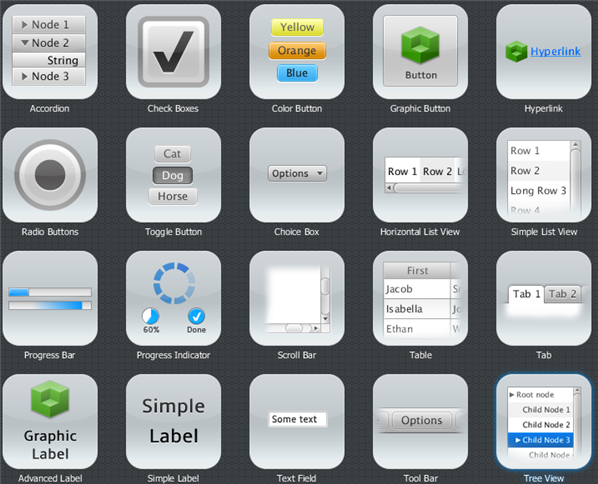

## Label

L'etiqueta és un control d'interfície d'usuari, pot mostrar text, icona o tots dos.

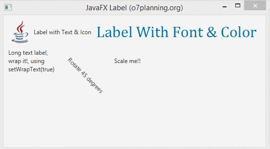

### Example:

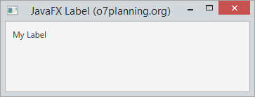

~~~
Label label = new Label("My Label");
 
FlowPane root = new FlowPane();
root.setPadding(new Insets(10));
root.getChildren().add(label);
~~~

### Label amb icona

L'etiqueta pot mostrar text, icona o tots dos.

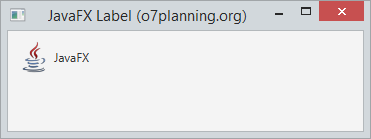

### Font, Color, Wrap & Effects

Es pot modificar la font, el color i  el borde del label amb els mètodes:

- setFont

~~~
// Use a constructor of the Font class
label1.setFont(new Font("Arial", 30));
 
// Use the font method of the Font class
label2.setFont(Font.font("Cambria", 32));
~~~

- setTextFill

~~~
// Set font color for the Label.
label1.setTextFill(Color.web("#0076a3"));
~~~

- setWrapText

- Effects

Pot crear alguns efectes simples per a Lable. Per exemple, pot girar l'etiqueta d'acord amb un cert angle. Moga-ho d'acord amb l'eix x. També podem fer que s'acoste, allunye quan moga el mouse sobre la superfície de l'etiqueta.

~~~
// Rotate 45 degrees
label4.setRotate(45);
 
// Translate Y axis 30 pixel
label4.setTranslateY(30);
 
label5.setOnMouseEntered(new EventHandler<MouseEvent>() {
   @Override
   public void handle(MouseEvent e) {
       label5.setScaleX(1.5);
       label5.setScaleY(1.5);
   }
});
 
label5.setOnMouseExited(new EventHandler<MouseEvent>() {
   @Override
   public void handle(MouseEvent e) {
       label5.setScaleX(1);
       label5.setScaleY(1);
   }
});

~~~

## Button

Permet als desenvolupadors processar una acció quan un usuari fa clic en un botó. La classe Button és una extensió de la classe Etiquetada. Pot mostrar text, una imatge o tots dos.

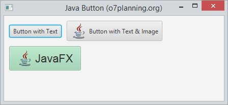

Button es un node, per lo que hereda tots els métodes d'utilització d'events de la classe node.

### botó amb imatge:

Es crea igual que un botó normal, pero se li afegeix una imatge.

~~~
ImageView imageView = new ImageView(new Image("icons/icon.png"));
Button button = new Button("Botó amb text i imatge", imageView);
        
//button2.setGraphic(imageView); <- una opció alternativa
~~~
        
### botó i events.

El botó, al igual que altres nodes disposa de diferents métodes amb els quals pot interactuar l'usuari amb ell.Si volem veure els métodes més utilitzats es poden veure en el menú code del scene builder. Per veure-ho amb més detall, fes clic [ací](https://openjfx.io/javadoc/14/javafx.controls/javafx/scene/control/ButtonBase.html)

En el següent exemple, anem a indicar-li que quan detecta que ha fet click en el botó, escriu un text en consola:

~~~
button.setOnAction(actionEvent -> {
            System.out.println("has clicat...");
        });
~~~

### Efectes

Com la clase button s'exten de la classe node, pots aplicar els efectes del paquet javafx.scene.effect per modificar l'apariencia del botó. 

En el següent exemple, quan pasem el ratolí per damunt del botó, li posará una ombra.

~~~
button.setOnMouseEntered(dragEvent -> {
	button.setEffect(shadow);
});
button.setOnMouseExited(mouseEvent -> {
        button.setEffect(null);
});
~~~

## Radio Button

Ara anem a parlar sobre el control del botó de radi i la classe RadioButton, una implementació especialitzada de la classe ToggleButton.

Un control de radio button pot seleccionar-se o deseleccionarse. En general, els botons d'opció es combinen en un grup on sol es pot seleccionar un botó alhora. Aquest comportament els distingeix dels toggle buttons, ja què tots els botons d'alternança en un grup poden estar en un estat no seleccionat.

També es pot crear al igual que feiem en els botons, un radio button que tinguera text, text i imatge o solament una imatge.

- Afegir Radio Buttons a grups. 

Els botons d'opció s'usen generalment en un grup per a presentar diverses opcions mútuament excloents. L'objecte ToggleGroup proporciona referències a tots els botons de ràdio que estan associats amb ell i els administra perquè només es puga seleccionar un dels botons de ràdio alhora. 

En el següent exemple es crea un grup d'alternança, crea dos button radio, agrega cada botó de ràdio al grup d'alternança i especifica quin botó ha de seleccionar-se quan s'inicia l'aplicació.

~~~
// Group
ToggleGroup group = new ToggleGroup();
 
// Radio 1: Male
RadioButton button1 = new RadioButton("Male");
button1.setToggleGroup(group);
button1.setSelected(true);
 
// Radio 3: Female.
RadioButton button2 = new RadioButton("Female");
button2.setToggleGroup(group);
~~~

### Radio Button en scene Builder.

si estem creant el fitxer fxml en scene builder, afegirem els radioButtons arrosegant-lo en la part del panell que vulgam. seguidament, li indicarem a quin grup pertany. aço ho realitzem en l'opció ToggleGroup que trobem en la pestanya propieties:

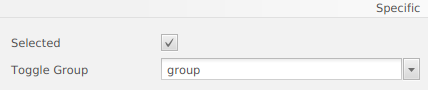

Com es veu en la imatge, també podem indicar-li l'element que volem que estiga seleccionat al principi. 

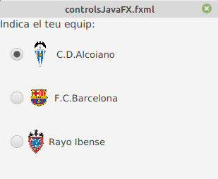

Ara podem veureun exemple d'un grup de Radio buttons, amb el seu codi fxml:

~~~
<VBox prefHeight="182.0" prefWidth="265.0" xmlns="http://javafx.com/javafx/8.0.171" xmlns:fx="http://javafx.com/fxml/1" fx:controller="org.example.controlsJavafx">
    <children>
        <Label prefHeight="16.0" prefWidth="256.0" text="Indica el teu equip:">
            
                
            
        </Label>
        <RadioButton mnemonicParsing="false" selected="true" text="C.D.Alcoiano">
            <VBox.margin>
                <Insets bottom="15.0" left="15.0" right="15.0" top="15.0" />
            </VBox.margin>
            <toggleGroup>
                <ToggleGroup fx:id="group" />
            </toggleGroup>
            <graphic>
                <ImageView fitHeight="41.0" fitWidth="38.0" pickOnBounds="true" preserveRatio="true">
                    <image>
                        <Image url="icons/CD_Alcoyano.png" />
                    </image>
                </ImageView>
            </graphic>
        </RadioButton>
        <RadioButton mnemonicParsing="false" text="F.C.Barcelona" toggleGroup="$group">
            <VBox.margin>
                <Insets bottom="15.0" left="15.0" right="15.0" top="15.0" />
            </VBox.margin>
            <graphic>
                <ImageView fitHeight="26.0" fitWidth="36.0" pickOnBounds="true" preserveRatio="true">
                    <image>
                        <Image url="icons/barsa.jpg" />
                    </image>
                </ImageView>
            </graphic>
        </RadioButton>
        <RadioButton mnemonicParsing="false" text="Rayo Ibense" toggleGroup="$group">
            <VBox.margin>
                <Insets bottom="15.0" left="15.0" right="15.0" top="15.0" />
            </VBox.margin>
            <graphic>
                <ImageView fitHeight="38.0" fitWidth="38.0" pickOnBounds="true" preserveRatio="true">
                    <image>
                        <Image url="icons/rayo.png" />
                    </image>
                </ImageView>
            </graphic>
        </RadioButton>
    </children>
</VBox>
~~~

## ToogleButton

Es poden combinar dos o més botons d'alternança en un grup on sol es pot seleccionar un botó alhora, o on no es requereix selecció. La següent figura mostra una captura de pantalla d'una aplicació que combina tres botons d'alternança en un grup. L'aplicació pinta el rectangle amb un color específic segons el botó d'alternança seleccionat.

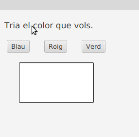

Al igual que en els Radio Button, s'ha de indicar que els toggleButons pertanyen a un Toggle Group.

## Checkbox

Checkbox forma part del paquet JavaFX. És una casella amb una marca quan està seleccionada i buida quan no està seleccionada. Al principi, les caselles de verificació poden semblar similars als radio Button, però existeix la diferència entre elles que les caselles de verificació no es poden combinar en grups d'alternança, la qual cosa significa que no podem seleccionar diverses opcions al mateix temps.

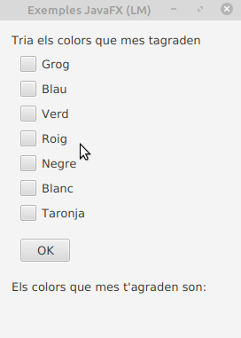

El checBox pot estar en els següents estats:
- **Checked**: quan indeterminat és fals i marcat és vertader
- **Unchecked**: quan indeterminat és fals i marcat és fals
- **Undefined**: quan indeterminat és vertader

Els constructors de la classe són:

1. CheckBox(): crea una casella de verificació amb una cadena buida per a la seua etiqueta.
2. ChecBox(String t): crea una casella de verificació amb el text donat com a etiqueta.

Els mètodes més utilitzats són:

- **isIndeterminate()**: Obté el valor de la propietat indeterminat.
- **isSelected()**: Obté el valor de la propietat selected.
- **selectedProperty()**: Indica si aquesta casella de verificació està marcada.
- **setIndeterminate(boolean v)**: Estableix el valor de la propietat indeterminat.
- **setSelected(boolean v)**: Estableix el valor de la propietat seleccionada.

El codi fxml del checkbox seria:

~~~
<CheckBox fx:id="cbgroc" mnemonicParsing="false" text="Grog">
</CheckBox>
~~~

## Choice Box

ChoiceBox és part del paquet JavaFX. Mostra un conjunt d'elements i permet a l'usuari seleccionar una sola opció i mostrarà l'element seleccionat actualment en la part superior. ChoiceBox per defecte no té cap element seleccionat llevat que se seleccione el contrari. 

Els constructors de la classe ChoiceBox són:

- **ChoiceBox ()**: crea un nou ChoiceBox buit.
- **ChoiceBox (elements ObservableList)**: crea un nou ChoiceBox amb el conjunt d'elements donat.

Els mètodes que mes sol utilitzar són:

- **getItems()**: Obté el valor dels elements de propietat.
- **getValue()**: Obté el valor del valor de la propietat.
- **hide()**:  Tanca la llista d'opcions.
- **setItems(ObservableList value)**: Estableix el valor dels elements de propietat.
- **setValue(T value)**: Estableix el valor del valor de la propietat.
- **show()**: Obri la llista d'opcions.

El codi fxml del checkbox seria:

~~~
<ChoiceBox fx:id="choiceBox" layoutX="383.0" layoutY="65.0" prefHeight="26.0" prefWidth="111.0" AnchorPane.rightAnchor="52.0" />
~~~

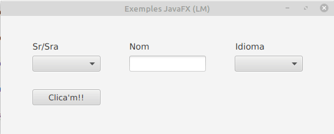

## WebView

JavaFX WebView és un mini navegador otambè anomenat navegador integrat en l'aplicació JavaFX. Aquest navegador es basa en WebKit, que és un motor de navegador de codi font obert que admet CSS, Javascript, DOM i HTML5.
JavaFX WebView li permet fer les següents tasques en les seues aplicacions JavaFX:

- Renderitzar contingut HTML des d'URL locals i remotes
- Obtindre historial web
- Executar comandos de Javascript
- Realitzar crides ascendents des de Javascript a JavaFX
- Administrar finestres emergents web
- Aplicar efectes al navegador incrustat

La implementació actual (JavaFX 2.3) del component WebView admet les següents característiques HTML5:

- Canvas
- Media Playback
- Controls de formulari (excepte `<input type = "color">`)
- Contingut editable
- Manteniment de la història
- Suport per a les etiquetes:
- `<meter>`<meter>
- `<progress>`<progress>.
- Suport per a les etiquetes `
` i `
`.
- DOM
- SVG
- Suport per a noms de domini escrits en idiomes nacionals.

A continuació es mostra una imatge amb l'arquitectura del navegador integrat en JavaFX:

 
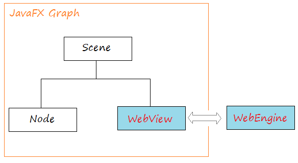

### Web Engine

La classe WebEngine proporciona funcionalitat bàsica de pàgina web. Admet la interacció de l'usuari, com navegar per enllaços i enviar formularis HTML, encara que no interactua directament amb els usuaris. La classe WebEngine maneja una pàgina web alhora. Admet les funcions bàsiques de navegació de carregar contingut HTML i accedir al DOM, així com executar comandos Javascript.

### WebView

WebView s'estén des de la classe Node, embolica un objecte WebEngine i mostra contingut HTML. Pot obtindre l'objecte WebEngine de WebView utilitzant el mètode getEngine ().

~~~
// Create a WebView
WebView browser = new WebView();
 
// Get WebEngine via WebView
WebEngine webEngine = browser.getEngine();
 
// Load page
webEngine.load("http://www.cipfpbatoi.es");
~~~

### Mètodes més utilitzats

**getChildren()**: Obté la llista de fills d'aquest pare.
**getEngine()**: Retorna el motor de la vista web.
**getFontScale()**: Retorna l'escala de font de l'objecte webview.
**getHeight()**: Retorna l'altura d'aquest WebView.
**getMaxHeight()**: Retorna l'altura màxima.
**getMaxWidth()**: Retorna l'ample màxim.
**getMinHeight()**: Estableix l'altura mínima.
**getMinWidth()**: Retorna l'ample mínim.
**getPrefHeight()**: Retorna l'altura preferida.
**getPrefWidth()**: Retorna l'ample preferit.
**getWidth()**: Retorna l'ample d'aquest WebView.
**getZoom()**: Retorna el factor de zoom actual.
**maxHeight(double v)**: Estableix l'altura màxima.
**maxWidth(double v)**: Estableix l'ample màxim.
**minHeight(double v)**: Estableix l'altura mínima.
**minWidth(double v)**: Estableix l'ample mínim.
**prefHeight(double v)**: Estableix l'altura preferida de la vista web.
**prefWidth(double v)**: Estableix l'ample preferit de la vista web.
**setFontScale(double v)**: Estableix l'escala de font de la vista web.
**setMaxHeight(double v)**: Estableix l'altura màxima.
**setMaxWidth(double v)**:  Estableix l'ample màxim.
**setMinHeight(double v)**: Estableix l'altura mínima.
**setMinWidth(double v)**: Estableix l'ample mínim.
**setPrefHeight(double v)**: Estableix l'altura preferida.
**setPrefWidth(double v)**: Estableix l'ample preferit.
**setZoom(double v)**: Estableix el zoom per a la vista web.

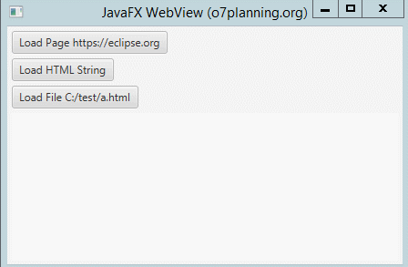

## TableView

La classe TableView s'uitilitza juntament amb TableColumn i TableCell per a mostrar les dades en forma de taula.

### Crear una taula:

Primer s'ha de crear la tabla i dir-li que siga editable.

~~~
TableView table = new TableView();
table.setEditable(true);
~~~

Una vegada creada, ja podem incloure-li les columnes que necessitem.

~~~
TableColumn nomCol = new TableColumn("Nom");
TableColumn cognomCol = new TableColumn("Cognom");
TableColumn direccioCol = new TableColumn("Direcció");
~~~

table.getColumns().addAll(nomCol, cognomCol, direccioCol);

Si en algun moment es vol amagar alguna columna, podem fer-ho:

`aColumn.setVisible(false)`

Com sempre, aquesta tasca es pot realitzar des del Scene Builder.

### Columnes anidades

També es poden crear columnes anidades.

Suposem que en la columna direcció li volem afegir: carrer, població i provincia.

~~~
TableColumn carrerCol = new TableColumn("Carrer");
TableColumn poblacioCol = new TableColumn("Població");
TableColumn provinciaCol = new TableColumn("Provincia");
~~~

i ara ja es poden anidar dintre de la columna superior:

direccioCol.getColumns().addAll(carrerCol, poblacioCol,provinciaCol)

### Afegir dades

El següent codi li mostra com agregar dades a una vista de taula. Cada fila de la taula representa a una persona amb nom i cognom. 

En la lògica de la interfície d'usuari, utilitza una ObservableList per a mantindre el valor d'una vista de taula. Cada element en la ObservableList és un objecte Person.

En el controlador d'esdeveniments de botó, crea una nova Persona amb nom i cognom codificats, després s'agrega a la ObservableList.

~~~
private ObservableList<Person> data_table = FXCollections.observableArrayList(
        new Person("lmanzaneque", "lmanz@gmail.al", "Lluis", "Manzaneque", "true"),
        new Person ......
        );
~~~

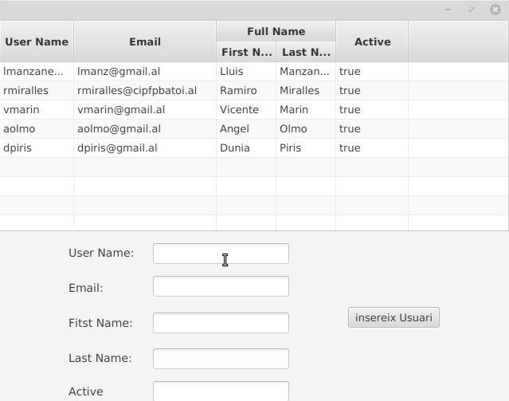

## ListView

JavaFX ListView mostra els seus elements vertical o horitzontalment.
La següentimatge mostra un ListView vertical que inclou 3 elements.

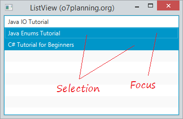

Ara mostrem una llista horitzontal:

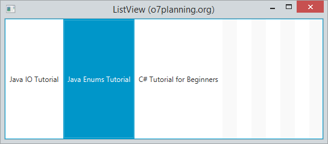

Fent funcionar un exemple:

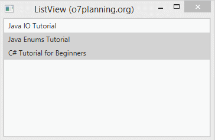

[back](../../javafx.html)

