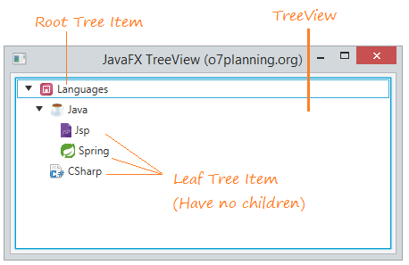
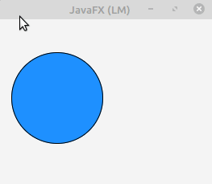
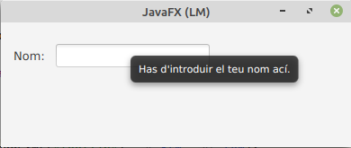
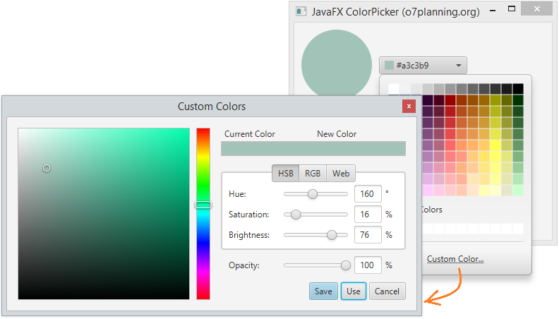
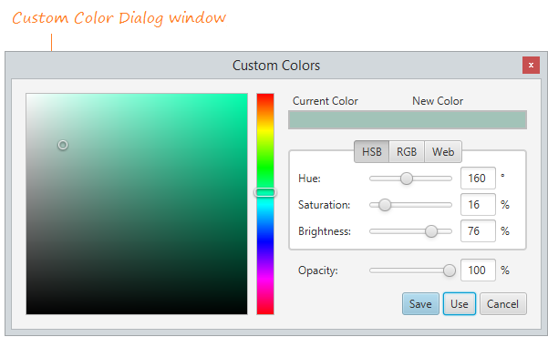
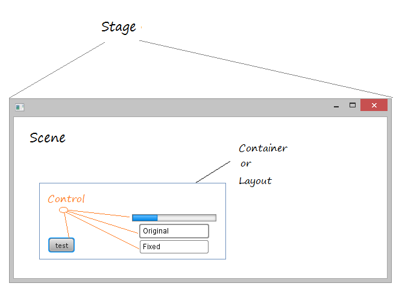

# Java FX - Controls

Anem a fer una descripció general dels controls de la interfície d'usuari JavaFX disponibles a través de la API.

En la següent imatge es mostra els controls d'interfície d'usuari típics que pot trobar en l'aplicació de mostra Ensemble. Prove aquesta aplicació per a avaluar l'àmplia gamma de controls, el seu comportament i els estils disponibles.

## Label

L'etiqueta és un control d'interfície d'usuari, pot mostrar text, icona o tots dos.

### Example:

~~~
Label label = new Label("My Label");
 
FlowPane root = new FlowPane();
root.setPadding(new Insets(10));
root.getChildren().add(label);
~~~

### Label amb icona

L'etiqueta pot mostrar text, icona o tots dos.

### Font, Color, Wrap & Effects

Es pot modificar la font, el color i  el borde del label amb els mètodes:

- setFont

~~~
// Use a constructor of the Font class
label1.setFont(new Font("Arial", 30));
 
// Use the font method of the Font class
label2.setFont(Font.font("Cambria", 32));
~~~

- setTextFill

~~~
// Set font color for the Label.
label1.setTextFill(Color.web("#0076a3"));
~~~

- setWrapText

- Effects

Pot crear alguns efectes simples per a Lable. Per exemple, pot girar l'etiqueta d'acord amb un cert angle. Moga-ho d'acord amb l'eix x. També podem fer que s'acoste, allunye quan moga el mouse sobre la superfície de l'etiqueta.

~~~
// Rotate 45 degrees
label4.setRotate(45);
 
// Translate Y axis 30 pixel
label4.setTranslateY(30);
 
label5.setOnMouseEntered(new EventHandler<MouseEvent>() {
   @Override
   public void handle(MouseEvent e) {
       label5.setScaleX(1.5);
       label5.setScaleY(1.5);
   }
});
 
label5.setOnMouseExited(new EventHandler<MouseEvent>() {
   @Override
   public void handle(MouseEvent e) {
       label5.setScaleX(1);
       label5.setScaleY(1);
   }
});

~~~

## Button

Permet als desenvolupadors processar una acció quan un usuari fa clic en un botó. La classe Button és una extensió de la classe Etiquetada. Pot mostrar text, una imatge o tots dos.

Button es un node, per lo que hereda tots els métodes d'utilització d'events de la classe node.

### botó amb imatge:

Es crea igual que un botó normal, pero se li afegeix una imatge.

~~~
ImageView imageView = new ImageView(new Image("icons/icon.png"));
Button button = new Button("Botó amb text i imatge", imageView);
        
//button2.setGraphic(imageView); <- una opció alternativa
~~~
        
### botó i events.

El botó, al igual que altres nodes disposa de diferents métodes amb els quals pot interactuar l'usuari amb ell.Si volem veure els métodes més utilitzats es poden veure en el menú code del scene builder. Per veure-ho amb més detall, fes clic [ací](https://openjfx.io/javadoc/14/javafx.controls/javafx/scene/control/ButtonBase.html)

En el següent exemple, anem a indicar-li que quan detecta que ha fet click en el botó, escriu un text en consola:

~~~
button.setOnAction(actionEvent -> {
            System.out.println("has clicat...");
        });
~~~

### Efectes

Com la clase button s'exten de la classe node, pots aplicar els efectes del paquet javafx.scene.effect per modificar l'apariencia del botó. 

En el següent exemple, quan pasem el ratolí per damunt del botó, li posará una ombra.

~~~
button.setOnMouseEntered(dragEvent -> {
	button.setEffect(shadow);
});
button.setOnMouseExited(mouseEvent -> {
        button.setEffect(null);
});
~~~

## Radio Button

Ara anem a parlar sobre el control del botó de radi i la classe RadioButton, una implementació especialitzada de la classe ToggleButton.

Un control de radio button pot seleccionar-se o deseleccionarse. En general, els botons d'opció es combinen en un grup on sol es pot seleccionar un botó alhora. Aquest comportament els distingeix dels toggle buttons, ja què tots els botons d'alternança en un grup poden estar en un estat no seleccionat.

També es pot crear al igual que feiem en els botons, un radio button que tinguera text, text i imatge o solament una imatge.

- Afegir Radio Buttons a grups. 

Els botons d'opció s'usen generalment en un grup per a presentar diverses opcions mútuament excloents. L'objecte ToggleGroup proporciona referències a tots els botons de ràdio que estan associats amb ell i els administra perquè només es puga seleccionar un dels botons de ràdio alhora. 

En el següent exemple es crea un grup d'alternança, crea dos button radio, agrega cada botó de ràdio al grup d'alternança i especifica quin botó ha de seleccionar-se quan s'inicia l'aplicació.

~~~
// Group
ToggleGroup group = new ToggleGroup();
 
// Radio 1: Male
RadioButton button1 = new RadioButton("Male");
button1.setToggleGroup(group);
button1.setSelected(true);
 
// Radio 3: Female.
RadioButton button2 = new RadioButton("Female");
button2.setToggleGroup(group);
~~~

### Radio Button en scene Builder.

si estem creant el fitxer fxml en scene builder, afegirem els radioButtons arrosegant-lo en la part del panell que vulgam. seguidament, li indicarem a quin grup pertany. aço ho realitzem en l'opció ToggleGroup que trobem en la pestanya propieties:

Com es veu en la imatge, també podem indicar-li l'element que volem que estiga seleccionat al principi. 

Ara podem veureun exemple d'un grup de Radio buttons, amb el seu codi fxml:

~~~
<VBox prefHeight="182.0" prefWidth="265.0" xmlns="http://javafx.com/javafx/8.0.171" xmlns:fx="http://javafx.com/fxml/1" fx:controller="org.example.controlsJavafx">
    <children>
        <Label prefHeight="16.0" prefWidth="256.0" text="Indica el teu equip:">
            
                
            
        </Label>
        <RadioButton mnemonicParsing="false" selected="true" text="C.D.Alcoiano">
            <VBox.margin>
                <Insets bottom="15.0" left="15.0" right="15.0" top="15.0" />
            </VBox.margin>
            <toggleGroup>
                <ToggleGroup fx:id="group" />
            </toggleGroup>
            <graphic>
                <ImageView fitHeight="41.0" fitWidth="38.0" pickOnBounds="true" preserveRatio="true">
                    <image>
                        <Image url="icons/CD_Alcoyano.png" />
                    </image>
                </ImageView>
            </graphic>
        </RadioButton>
        <RadioButton mnemonicParsing="false" text="F.C.Barcelona" toggleGroup="$group">
            <VBox.margin>
                <Insets bottom="15.0" left="15.0" right="15.0" top="15.0" />
            </VBox.margin>
            <graphic>
                <ImageView fitHeight="26.0" fitWidth="36.0" pickOnBounds="true" preserveRatio="true">
                    <image>
                        <Image url="icons/barsa.jpg" />
                    </image>
                </ImageView>
            </graphic>
        </RadioButton>
        <RadioButton mnemonicParsing="false" text="Rayo Ibense" toggleGroup="$group">
            <VBox.margin>
                <Insets bottom="15.0" left="15.0" right="15.0" top="15.0" />
            </VBox.margin>
            <graphic>
                <ImageView fitHeight="38.0" fitWidth="38.0" pickOnBounds="true" preserveRatio="true">
                    <image>
                        <Image url="icons/rayo.png" />
                    </image>
                </ImageView>
            </graphic>
        </RadioButton>
    </children>
</VBox>
~~~

## ToogleButton

Es poden combinar dos o més botons d'alternança en un grup on sol es pot seleccionar un botó alhora, o on no es requereix selecció. La següent figura mostra una captura de pantalla d'una aplicació que combina tres botons d'alternança en un grup. L'aplicació pinta el rectangle amb un color específic segons el botó d'alternança seleccionat.

Al igual que en els Radio Button, s'ha de indicar que els toggleButons pertanyen a un Toggle Group.

## Checkbox

Checkbox forma part del paquet JavaFX. És una casella amb una marca quan està seleccionada i buida quan no està seleccionada. Al principi, les caselles de verificació poden semblar similars als radio Button, però existeix la diferència entre elles que les caselles de verificació no es poden combinar en grups d'alternança, la qual cosa significa que no podem seleccionar diverses opcions al mateix temps.

El checBox pot estar en els següents estats:
- **Checked**: quan indeterminat és fals i marcat és vertader
- **Unchecked**: quan indeterminat és fals i marcat és fals
- **Undefined**: quan indeterminat és vertader

Els constructors de la classe són:

1. CheckBox(): crea una casella de verificació amb una cadena buida per a la seua etiqueta.
2. ChecBox(String t): crea una casella de verificació amb el text donat com a etiqueta.

Els mètodes més utilitzats són:

- **isIndeterminate()**: Obté el valor de la propietat indeterminat.
- **isSelected()**: Obté el valor de la propietat selected.
- **selectedProperty()**: Indica si aquesta casella de verificació està marcada.
- **setIndeterminate(boolean v)**: Estableix el valor de la propietat indeterminat.
- **setSelected(boolean v)**: Estableix el valor de la propietat seleccionada.

El codi fxml del checkbox seria:

~~~
<CheckBox fx:id="cbgroc" mnemonicParsing="false" text="Grog">
</CheckBox>
~~~

## Choice Box

ChoiceBox és part del paquet JavaFX. Mostra un conjunt d'elements i permet a l'usuari seleccionar una sola opció i mostrarà l'element seleccionat actualment en la part superior. ChoiceBox per defecte no té cap element seleccionat llevat que se seleccione el contrari. 

Els constructors de la classe ChoiceBox són:

- **ChoiceBox ()**: crea un nou ChoiceBox buit.
- **ChoiceBox (elements ObservableList)**: crea un nou ChoiceBox amb el conjunt d'elements donat.

Els mètodes que mes sol utilitzar són:

- **getItems()**: Obté el valor dels elements de propietat.
- **getValue()**: Obté el valor del valor de la propietat.
- **hide()**:  Tanca la llista d'opcions.
- **setItems(ObservableList value)**: Estableix el valor dels elements de propietat.
- **setValue(T value)**: Estableix el valor del valor de la propietat.
- **show()**: Obri la llista d'opcions.

El codi fxml del checkbox seria:

~~~
<ChoiceBox fx:id="choiceBox" layoutX="383.0" layoutY="65.0" prefHeight="26.0" prefWidth="111.0" AnchorPane.rightAnchor="52.0" />
~~~

## WebView

JavaFX WebView és un mini navegador otambè anomenat navegador integrat en l'aplicació JavaFX. Aquest navegador es basa en WebKit, que és un motor de navegador de codi font obert que admet CSS, Javascript, DOM i HTML5.
JavaFX WebView li permet fer les següents tasques en les seues aplicacions JavaFX:

- Renderitzar contingut HTML des d'URL locals i remotes
- Obtindre historial web
- Executar comandos de Javascript
- Realitzar crides ascendents des de Javascript a JavaFX
- Administrar finestres emergents web
- Aplicar efectes al navegador incrustat

La implementació actual (JavaFX 2.3) del component WebView admet les següents característiques HTML5:

- Canvas
- Media Playback
- Controls de formulari (excepte `<input type = "color">`)
- Contingut editable
- Manteniment de la història
- Suport per a les etiquetes:
- `<meter>`<meter>
- `<progress>`<progress>.
- Suport per a les etiquetes `
` i `
`.
- DOM
- SVG
- Suport per a noms de domini escrits en idiomes nacionals.

A continuació es mostra una imatge amb l'arquitectura del navegador integrat en JavaFX:

 

### Web Engine

La classe WebEngine proporciona funcionalitat bàsica de pàgina web. Admet la interacció de l'usuari, com navegar per enllaços i enviar formularis HTML, encara que no interactua directament amb els usuaris. La classe WebEngine maneja una pàgina web alhora. Admet les funcions bàsiques de navegació de carregar contingut HTML i accedir al DOM, així com executar comandos Javascript.

### WebView

WebView s'estén des de la classe Node, embolica un objecte WebEngine i mostra contingut HTML. Pot obtindre l'objecte WebEngine de WebView utilitzant el mètode getEngine ().

~~~
// Create a WebView
WebView browser = new WebView();
 
// Get WebEngine via WebView
WebEngine webEngine = browser.getEngine();
 
// Load page
webEngine.load("http://www.cipfpbatoi.es");
~~~

### Mètodes més utilitzats

**getChildren()**: Obté la llista de fills d'aquest pare.
**getEngine()**: Retorna el motor de la vista web.
**getFontScale()**: Retorna l'escala de font de l'objecte webview.
**getHeight()**: Retorna l'altura d'aquest WebView.
**getMaxHeight()**: Retorna l'altura màxima.
**getMaxWidth()**: Retorna l'ample màxim.
**getMinHeight()**: Estableix l'altura mínima.
**getMinWidth()**: Retorna l'ample mínim.
**getPrefHeight()**: Retorna l'altura preferida.
**getPrefWidth()**: Retorna l'ample preferit.
**getWidth()**: Retorna l'ample d'aquest WebView.
**getZoom()**: Retorna el factor de zoom actual.
**maxHeight(double v)**: Estableix l'altura màxima.
**maxWidth(double v)**: Estableix l'ample màxim.
**minHeight(double v)**: Estableix l'altura mínima.
**minWidth(double v)**: Estableix l'ample mínim.
**prefHeight(double v)**: Estableix l'altura preferida de la vista web.
**prefWidth(double v)**: Estableix l'ample preferit de la vista web.
**setFontScale(double v)**: Estableix l'escala de font de la vista web.
**setMaxHeight(double v)**: Estableix l'altura màxima.
**setMaxWidth(double v)**:  Estableix l'ample màxim.
**setMinHeight(double v)**: Estableix l'altura mínima.
**setMinWidth(double v)**: Estableix l'ample mínim.
**setPrefHeight(double v)**: Estableix l'altura preferida.
**setPrefWidth(double v)**: Estableix l'ample preferit.
**setZoom(double v)**: Estableix el zoom per a la vista web.

## TableView

La classe TableView s'uitilitza juntament amb TableColumn i TableCell per a mostrar les dades en forma de taula.

### Crear una taula:

Primer s'ha de crear la tabla i dir-li que siga editable.

~~~
TableView table = new TableView();
table.setEditable(true);
~~~

Una vegada creada, ja podem incloure-li les columnes que necessitem.

~~~
TableColumn nomCol = new TableColumn("Nom");
TableColumn cognomCol = new TableColumn("Cognom");
TableColumn direccioCol = new TableColumn("Direcció");
~~~

table.getColumns().addAll(nomCol, cognomCol, direccioCol);

Si en algun moment es vol amagar alguna columna, podem fer-ho:

`aColumn.setVisible(false)`

Com sempre, aquesta tasca es pot realitzar des del Scene Builder.

### Columnes anidades

També es poden crear columnes anidades.

Suposem que en la columna direcció li volem afegir: carrer, població i provincia.

~~~
TableColumn carrerCol = new TableColumn("Carrer");
TableColumn poblacioCol = new TableColumn("Població");
TableColumn provinciaCol = new TableColumn("Provincia");
~~~

i ara ja es poden anidar dintre de la columna superior:

direccioCol.getColumns().addAll(carrerCol, poblacioCol,provinciaCol)

### Afegir dades

El següent codi li mostra com agregar dades a una vista de taula. Cada fila de la taula representa a una persona amb nom i cognom. 

En la lògica de la interfície d'usuari, utilitza una ObservableList per a mantindre el valor d'una vista de taula. Cada element en la ObservableList és un objecte Person.

En el controlador d'esdeveniments de botó, crea una nova Persona amb nom i cognom codificats, després s'agrega a la ObservableList.

~~~
private ObservableList<Person> data_table = FXCollections.observableArrayList(
        new Person("lmanzaneque", "lmanz@gmail.al", "Lluis", "Manzaneque", "true"),
        new Person ......
        );
~~~

## ListView

JavaFX ListView mostra els seus elements vertical o horitzontalment.
La següent imatge mostra un ListView vertical que inclou 3 elements.

Ara mostrem una llista horitzontal:

Fent funcionar un exemple:

### Métodes listView

alguns métodes que podem utilitzar amb ListView són els següents:

- **getSelectionModel().setSelectionMode** -> permet indicar si es poden seleccionar varis elements de la llista a la  vegada.
- **setOrientation** -> mostra la llista en forma vertical o horitzontal. Per deffecte es mostra en forma vertical.
- **getSelectionModel().getSelectedIndex()** –> Retorna l'índex dels elements seleccionats
- **getSelectionModel().getSelectedItem()** –> Retorna l'element seleccionat actualment
- **getFocusModel().getFocusedIndex()** – Retorna l'índex de l'element enfocat actualment
- **getFocusModel().getFocusedItem()** –> Retorna l'element que té el focus actualment

### Creació de listView.

En les seguents linees de codi es mostra comes crea un ListView a traves d'un ObservableList.

~~~
ListView<String> list = new ListView<String>();

//definim l'Observable list amb els camps que tindrà la nostra ListView
ObservableList<String> items = FXCollections.observableArrayList("iron Man", "Batman", "Capità America", "Green Lantern");
//afegim tots els items al listView
listView.setItems(items);
~~~

En el exemple que es mostra en la pròxima imatge, fem que aparega en un label l'últim item seleccionat. açó ho fem afegint un listener al mètode selectedItemPropierty:

~~~
listView.getSelectionModel().selectedItemProperty().addListener(new ChangeListener<String>() {
     @Override
      public void changed(ObservableValue<? extends String> observableValue, String s, String t1) {

           labelItem.setText("- "+t1);
      }
});
~~~

També pot donar-se el cas de que vulgam afegir un element dintre de cadascun dels item del listview.

en cas de que en una llista es vulga incloure un combo bóx, deurem de indicar que la llista siga editable, amb `listView.setEditable(true);` i despres dir-li que en cadascun dels items incloga un combobox:
`listView.setCellFactory(ComboBoxListCell.forListView(names));`

## TextField

La classe TextField implementa un control d'interfície d'usuari que accepta i mostra l'entrada de text. Proporciona capacitats per a rebre entrada de text d'un usuari. Juntament amb un altre control d'entrada de text, PasswordField, aquesta classe estén la classe TextInput.

El contructor de la clase són:

- **TextField()**: Crea un TextView buit.
- **TextField(String s)**: Crea un TextField amb un text inicial.

Alguns mètodes útils que ens podem trobar són:

- **setPrefColumnCount(int v)**: Estableix el valor de la propietat prefColumnCount.
- **setOnAction(EventHandler value)**: 	Estableix el valor de la propietat onAction.
- **setAlignment(Pos v)**: Estableix el valor de l'alineació de la propietat.
- **prefColumnCountProperty()**: El nombre preferit de columnes de text
- **onActionProperty()**: El controlador d'accions associat amb aquest camp de text, o nul si no s'assigna cap controlador d'accions.
- **getPrefColumnCount()**: Obté el valor de la propietat prefColumnCount.
- **getOnAction()**: Obté el valor de la propietat onAction.
- **getAlignment()**: Obté el valor de la propietat alineació.
- **getCharacters()**: Retorna la seqüència de caràcters que recolza el contingut del camp de text.
- **setText()**: escriu en el seu interior una cadena
- **getText()**: agafa text que conté.
- **clear()**: esborra el text de TextField.
- **copy()**: transfereix el rang seleccionat actualment en el text al portapapers, deixant la selecció actual.
- **cut()**: transfereix el rang seleccionat actualment en el text al portapapers, eliminant la selecció actual.
- **paste()**: transfereix el contingut del portapapers a aquest text, reemplaçant la selecció actual.

### Password Field

És un camp de text que emmascara els caràcters ingressats (els caràcters ingressats no es mostren a l'usuari). Permet a l'usuari ingressar **una sola línia de text sense format**.

Constructor de la classe PasswordField:

- **PasswordField()**: crea un nou PasswordField

(PasswordField hereta TextField, per la qual cosa tots els mètodes de TextField es poden usar ací. No hi ha mètodes separats per al camp de contrasenya, tots s'hereten del camp de text).

### Text Area

JavaFX TextArea és un component que permet als usuaris ingressar l'escriptura en diverses línies i l'aplicació pot llegir-lo.

## TreeView

La classe TreeView del paquet javafx.scene.control proporciona una vista de les estructures jeràrquiques. En cada arbre, l'objecte més alt de la jerarquia es denomina "arrel". L'arrel conté diversos elements secundaris, que també poden tindre elements secundaris. Un article sense fills es diu "fulla".

Per crear un text Area: 

~~~
// Crea un TextArea
TextArea textArea = new TextArea();
 
// Inserta el text
textArea.setText("Hello");
 
// Obté el text
String text= textArea.getText();
~~~

### Creació TreeView

Quan crea una estructura d'arbre en JavaFX, es necessita crear una instància de la classe TreeView, despres es defineixen diversos objectes TreeItem. Fem que un d'aquestos items de l'arbre siga l'arrel. Agreguem l'arrel a la vista d'arbre i altres elements d'arbre a l'arrel.

Pot acompanyar cada element de l'arbre amb una icona gràfica utilitzant el constructor corresponent de la classe TreeItem o cridant al mètode setGraphic. La grandària recomanada per a les icones és 16x16, però de fet, qualsevol objecte Node es pot establir com a icona i serà completament interactiu.

En primer lloc es crea els nodes:

~~~
TreeItem<String> root = new TreeItem<>("Superherois");
//Si volem que aparega expandit al principi, li posem:
root.setExpanded(true);

~~~

Una vegada s'ha creat el node principal, podem afegir els fills:

~~~
TreeItem<String> avengers = new TreeItem<>("Avengers");

root.getChildren().add(avengers);
~~~

Per poder afegir el root principal al TreeView:

~~~
treeView.setRoot(root);
~~~

 

## TreeTableView

JavaFX li proporciona la classe TreeTableView i s'usa juntament amb TreeItem, TreeTableColumn i TreeTableCell que l'ajuda a mostrar dades a Tabular i en arbre. Vegem la següent il·lustració:

 

Igual que TableView, pot crear columnes anidades. Per a crear un TreeTableView, necessita:

1. Afegir TreeItem a TreeTableView per a formar una estructura d'arbre.
2. definir les columnes de la taula.
3. Definir la manera de mostrar dades en cada cel·la mitjançant el mètode TreeTableColumn.setCellValueFactory.

### Creació de TreeTableView

Es defineixen les TreeTableView i les TreeTabletCol

~~~
@FXML
TreeTableView<Empleat> treeTableView;
@FXML
TreeTableColumn<Empleat,String> empCol, fnameCol, lnameCol, positionCol, genderCol;
@FXML
TreeTableColumn<Empleat,Boolean> singleCol;
~~~

Creem els items i afegim les dades:

~~~
Employee empBoss = new Employee("E00", "Abc@gmail.com", "Boss", "Boss", "Manager", "M", false); 
Employee empSmith = new Employee("E01", "Smith@gmail.com", "Susan", "Smith", "Salesman", "F", true); 
Employee empMcNeil = new Employee("E02", "McNeil@gmail.com", "Anne", "McNeil", "Cleck", "M", false);
 
// Root Item
TreeItem<Employee> itemRoot = new TreeItem<Employee>(empBoss);
TreeItem<Employee> itemSmith = new TreeItem<Employee>(empSmith);
TreeItem<Employee> itemMcNeil = new TreeItem<Employee>(empMcNeil);
 
itemRoot.getChildren().addAll(itemSmith, itemMcNeil);
 
// definim l'item arrel.

treeTableView.setRoot(itemRoot);
~~~

Definim com omplir les dades per cada cel·la:

~~~
empNoCol.setCellValueFactory(new TreeItemPropertyValueFactory<Employee, String>("empNo"));
firstNameCol.setCellValueFactory(new TreeItemPropertyValueFactory<Employee, String>("firstName"));
lastNameCol.setCellValueFactory(new TreeItemPropertyValueFactory<Employee, String>("lastName"));
positionCol.setCellValueFactory(new TreeItemPropertyValueFactory<Employee, String>("position"));
genderCol.setCellValueFactory(new TreeItemPropertyValueFactory<Employee, String>("gender"));
singleCol.setCellValueFactory(new TreeItemPropertyValueFactory<Employee, Boolean>("single"));
~~~

### setCellFactory & setCellValueFactory
- **treeTableColumn.setCellValueFactory**: És el mètode que especifica com mostrar les dades en la cel·la de TreeTableView.

- **treeTableColumn.setCellFactory**: És el mètode que especifica com representar un control mentre l'usuari està editant dades en la cel·la.

## Menú

Anem a explicar com crear menús i barres de menú, agregar elements de menú, agrupar els menús en categories, crear submenús i establir menús contextuals.

Pot usar les següents classes de la API JavaFX per a crear menús en la seua aplicació JavaFX.

Les parts d'un menú són les següents:

Menú Items:

- Menú Item

    

- CheckMenuItem

    

- RadioMenuItem

    

- SeparatorMenuItem

    

### ceacio menu

Anem a explicar com es realitza un menú que conte tots els elements explicats anteriorment. Gran part de l'explicació, es podria fer directament en SceneBuilder:

 

- Creació del MenuBar

 ~~~
        MenuBar menuBar = new MenuBar();
 ~~~
 
- Crear menus
~~~
Menu fileMenu = new Menu("File");
Menu editMenu = new Menu("Edit");
Menu projectMenu = new Menu("Project");
Menu helpMenu = new Menu("Help");
~~~

- Crear MenuItems

~~~
MenuItem newItem = new MenuItem("New");
newItem..setGraphic(new ImageView("icons/new.png"));
newItem.setGraphic(new ImageView(newImage));
 
MenuItem openFileItem = new MenuItem("Open File");
~~~

- Creació del SeparatorMenuItem.

~~~
SeparatorMenuItem separator= new SeparatorMenuItem();
MenuItem exitItem = new MenuItem("Exit");
 
MenuItem copyItem = new MenuItem("Copy");
MenuItem pasteItem = new MenuItem("Paste");
~~~
        
- Crear CheckMenuItem
        
~~~
CheckMenuItem buildItem = new CheckMenuItem("Build Automatically");
Image buildImage = MyImageUtils.getImage("/org/o7planning/javafx/icon/build-16.png");
buildItem.setGraphic(new ImageView("icons/build.png"));
buildItem.setSelected(true);
~~~
 
- RadioMenuItem
~~~
RadioMenuItem updateItem1 = new RadioMenuItem("Auto Update");
RadioMenuItem updateItem2 = new RadioMenuItem("Ask for Update");
        
ToggleGroup group = new ToggleGroup();
updateItem1.setToggleGroup(group);
updateItem2.setToggleGroup(group);
updateItem1.setSelected(true);
~~~ 
        
        
- Afegir menuItems al Menus
~~~
fileMenu.getItems().addAll(newItem, openFileItem,separator, exitItem);
editMenu.getItems().addAll(copyItem, pasteItem);
projectMenu.getItems().add(buildItem);

helpMenu.getItems().addAll(updateItem1,updateItem2);
~~~
 
- Afegir els menus al MenuBar
~~~
menuBar.getMenus().addAll(fileMenu, editMenu, projectMenu, helpMenu);
~~~

## Menú Contextual

ContextMenu es pot associar amb controls com a etiquetes, camps de text, etc. El menú contextual s'activa en fer clic dret sobre els controls associats. Mostra una finestra emergent que conté diversos elements de menú o submenú.

El ContextMenu és bastant similar a un Menú, pot afegir elements amb tipus de MenuItem, CheckMenuItem, RadioMenuItem o SeparatorMenuItem.

Els constructors de la classe són:

- ContextMenu (): crea un nou menú contextual buit.
- ContextMenu (MenuItem ... i): crea un menú contextual que conté els elements del menú.

Mètodes d'ús comú:
- **getItems()**: retorna els elements del menú contextual
- **getOnAction()**: retorna el valor de la propietat OnAction
- **hide()**: oculta el menú contextual
- **setOnAction(EventHandler v)**: estableix el valor de la propietat onAction
- **show(Node a, doble X, doble I)**: mostra el menú contextual en una posició específica de la pantalla

## Creació del menú contextual.

Anem a basarnos en l'exemple que veiem en la imatge. 

 

- Creació de menú Contextual

~~~
contextMenu.getItems().addAll(menuItem1, menuItem2);

// Creem el event d'acció per que canvie el text del label
menuItem1.setOnAction(new EventHandler<ActionEvent>() {
      @Override
       public void handle(ActionEvent actionEvent) {
           labelContext.setText("Has clicat en el Item 1");
       }
});
menuItem2.setOnAction(new EventHandler<ActionEvent>() {
       @Override
       public void handle(ActionEvent actionEvent) {
           labelContext.setText("Has clicat en el Item 2");
       }
});
~~~

- afegim els menus Item 

~~~
contextMenu.getItems().addAll(menuItem1, menuItem2);
~~~

- Quan cliquem el boto dret en el cercle, es desplega el menú contextual:

circle.setOnContextMenuRequested(new EventHandler<ContextMenuEvent>() {
            @Override
            public void handle(ContextMenuEvent contextMenuEvent) {
                contextMenu.show(circle, contextMenuEvent.getScreenX(),contextMenuEvent.getScreenY());
            }
        });

## ImageView

JavaFX li permet treballar amb tots els formats d'imatge populars. Usem la classe javafx.scene.image.Image per a carregar imatges des del disc dur o una font d'imatge de xarxa. Per a mostrar imatges en JavaFX, utilitzem la classe ImageView.

Els constructors de la classe **Image** t'ajuden a carregar dades d'imatge:

~~~
Image(InputStream inputStream)
 
Image(InputStream is, double requestedWidth, double requestedHeight, boolean preserveRatio, boolean smooth)
 
Image(String url)
 
Image(String url, boolean backgroundLoading)
 
Image(String url, double requestedWidth, double requestedHeight, boolean preserveRatio, boolean smooth)
 
Image(String url, double requestedWidth, double requestedHeight, boolean preserveRatio, boolean smooth, boolean backgroundLoading)
~~~

Si volem carregar imatges des de URL:

~~~
String url = "http://somedomain/images/image.png";
 
boolean backgroundLoading = true;
 
// L''imatge està sent carregada en el background
Image image = new Image(url, backgroundLoading);
~~~

Però el més comú es que carregues una imatge en el disc dur.

~~~
// Un fitxer d'imatge en el disc dur.
File file = new File("C:/MyImages/myphoto.jpg");
 
// --> file:/C:/MyImages/myphoto.jpg
String localUrl = file.toURI().toURL().toString();
 
Image image = new Image(localUrl);
~~~

ImageView és un component que l'ajuda a mostrar imatges en JavaFX. També pot aplicar efectes per a mostrar imatges com girar, acostar i allunyar, ...

 

## Menu Button

El botó menuButton quan es pressiona mostra un menú contextual que mostra un conjunt d'elements i l'usuari pot seleccionar qualsevol element. En general, conté diversos elements de menú i l'usuari pot seleccionar com a màxim un element de menú alhora.

Quan els usuaris fan clic en MenuButton, es mostrarà un menú. Els elements del menú poden ser MunuItem, CheckMenuItem, RadioMenuItem o SeparatorMenuItem. I pot manejar esdeveniments quan els usuaris fan clic en els elements

Els constructors de la classe MenuButton són:

- **MenuButton()**: crea un nou botó de menú
- **MenuButton(String t)**: crea un submenú amb un text especificat
- **MenuButton(String t, Node g)**: crea un submenú amb un text especificat
i gràfic
- **MenuButton(String t, Node g, MenuItem ... i)** crea un submenú amb un text, gràfic i elements de menú especificats

Mètodes d'ús comú:

- **getItems()** retorna els elements del botó de menú
- **getPopupSide()** obté el valor de la propietat popupSide
- **hide()** oculta el menú contextual
- **isShowing()** Obté el valor de la propietat que es mostra.
- **setPopupSide(Side v)** Estableix el valor de la propietat popupSide.
- **show()** mostra el menú contextual

Els següents programes il·lustren la classe MenuButton:

Programa per a crear un MenuButton i agregar-li MenuItems: Es crearà un MenuButton amb el nom m i s'afegiran 3 menuitems m1, m2, m3 al menuButton m. La barra de menú es crearà dins d'una escena, que al seu torn s'allotjarà dins d'un escenari. 

 

## Split Menu Button

Un control lliscant és un control en JavaFX que s'utilitza per a mostrar un rang continu o discret d'opcions numèriques vàlides i permet a l'usuari interactuar amb el control. Un control lliscant es representa com una barra vertical o horitzontal amb una perilla que l'usuari pot lliscar per a indicar el valor desitjat. Un control lliscant també pot tindre marques i etiquetes per a indicar els intervals al llarg de la barra.
Les tres variables fonamentals del control lliscant són min, max i value. El valor sempre ha de ser un número dins del rang definit per min i max. min sempre ha de ser menor que max. min per defecte és 0, mentre que max per defecte és 100.

Constructors de la classe:

- **Control lliscant()**: crea una instància de control lliscant predeterminada.
- **Control lliscant(doble mínim, doble màxim, doble valor)**: construeix un control lliscant amb els valors mínims, màxims i actuals del control lliscant especificat.

 

## Slider

Un control lliscant és un control en JavaFX que s'utilitza per a mostrar un rang continu o discret d'opcions numèriques vàlides i permet a l'usuari interactuar amb el control. Un control lliscant es representa com una barra vertical o horitzontal amb una perilla que l'usuari pot lliscar per a indicar el valor desitjat. Un control lliscant també pot tindre marques i etiquetes per a indicar els intervals al llarg de la barra.

 

Les tres variables fonamentals del control lliscant són min, max i value. El valor sempre ha de ser un número dins del rang definit per min i max. min sempre ha de ser menor que max. min per defecte és 0, mentre que max per defecte és 100.

 

Constructors de la classe:

- **Slider()**: crea una instància de control lliscant predeterminada.
- **Slider(doble mínim, doble màxim, doble valor)**: construeix un control lliscant amb els valors mínims, màxims i actuals del control lliscant especificat.

Mètodes d'ús comú:

- **ajustValue(double newValue)**: Ajusta el valor perquè coincidisca amb valor nou.
- **decrement()**: Disminueix el valor per blockIncrement, limitat per max.
- **getBlockIncrement()**: Obté el valor de la propietat blockIncrement.
- **getMax()**: Obté el valor de la propietat max.
- **getMin()**: Obté el valor de la propietat min.
- **getMajorTickUnit(**): Obté el valor de la propietat majorTickUnit.
- **getMinorTickCount()**: Obté el valor de la propietat minorTickCount.
- **getValue()**: Obté el valor del valor de la propietat.
- **increment()**: Incrementa el valor per blockIncrement, limitat per max.
- **setBlockIncrement(double value)**: Estableix el valor de la propietat blockIncrement.
- **setMajorTickUnit(double value)**: Estableix el valor de la propietat majorTickUnit.
- **setMax(double value)**: Estableix el valor de la propietat max.
- **setMin(double value)**: Estableix el valor de la propietat min.
- **setMinorTickCount(int value)**: Estableix el valor de la propietat minorTickCount.
- **setValue(double value)**: Estableix el valor del valor de la propietat.
- **setValueChanging(boolean value)**: Estableix el valor de la propietat valueChanging.
- **setShowTickMarks(boolean value)**: Estableix el valor de la propietat showTickMarks.
- **setShowTickLabels(boolean value)**: Estableix el valor de la propietat showTickLabels.
- **isShowTickLabels()**: Obté el valor de la propietat showTickLabels.
- **isShowTickMarks()**: Obté el valor de la propietat showTickMarks.

 

## Spinner

Els spinners són similars als quadres combinats i les llistes, ja que permeten a l'usuari triar entre una varietat de valors. Igual que els quadres combinats editables, els controls giratoris permeten a l'usuari escriure un valor. A diferència dels quadres combinats, els spinners no tenen una llista desplegable que puga cobrir altres components. Pel fet que els spinners no mostren valors possibles, només el valor actual és visible, sovint s'usen en lloc de quadres combinats o llistes quan el conjunt de valors possibles és extremadament gran.

 

 

Lestrictura del spinner és:

 

A continuació es pot veure un exemple amb l'acces a les dades `spinner.getValue()`del spinner.

 

## Progress Bar & Progress Indicator

### Progress Bar

És una especialització del ProgressIndicator que es representa com una barra horitzontal. La barra de progrés generalment mostra la quantitat de finalització d'una tasca.

Els constructors de la classe ProgressBar són:

- **ProgressBar()**: crea una nova barra de progrés intermèdia.
- **ProgressBar(double p)**: crea una barra de progrés amb un progrés especificat.

Mètodes d'ús comú:

- **isIndeterminate()** Obté el valor de la propietat indeterminat.
- **getProgress()** Obté el valor del progrés de la propietat.
- **setProgress(double v)** Estableix el valor del progrés de la propietat

### Progress Indicator

És un control circular que s'utilitza per a indicar el progrés, ja siga infinit o finit. Sovint s'utilitza amb la API de tasques per a representar el progrés de les tasques en segon pla. En general, mostra la quantitat de finalització d'una tasca.

Constructor de la classe són:

- **ProgressIndicator()**: crea un nou indicador de progrés intermedi.
- **ProgressIndicator(doble p)**: crea un indicador de progrés amb un progrés especificat

Mètodes d'ús comú
- **isIndeterminate()** Obté el valor de la propietat indeterminat.
- **getProgress()** Obté el valor del progrés de la propietat.
- **setProgress(double v)** Estableix el valor del progrés de la propietat

El següent programa il·lustra l'ús de l'indicador de progrés i de progress bar sense temps determinat:

 

A continuació s'observa un Progress Bar i un Progress Indicator per una determinada tasca:

 

## Tooltip

Tooltip s'utilitza per a mostrar informació addicional a l'usuari quan el mouse es troba sobre el component. Tots els components es poden associar amb una informació sobre eines i també es pot associar amb una part de la pantalla.

Constructors de la classe Tooltip:

- **Tooltip()**: crea una informació sobre eines amb una cadena buida per al seu text.
- **Tooltip(String t)**: crea una informació sobre eines amb el text especificat.

Mètodes d'ús comú:
- getFont() Obté el valor de la font de la propietat.
- **getText()**: Obté el valor del text de propietat.
- **getTextAlignment()**: Obté el valor de la propietat textAlignment.
- **install(Node n, Tooltip t)**: Associa la informació sobre eines donada amb el node donat.
- **isActivated()**: Obté el valor de la propietat activada.
- **setFont(Font v)**: Estableix el valor de la font de la propietat.
- **setText(String v)**: Estableix el valor del text de propietat.
- **setTextAlignment(TextAlignment v)**: Estableix el valor de la propietat textAlignment.

per crear un Tooltip sense SceneBuilder:

TextField field_userName= new TextField();
 
Tooltip tooltip_userName=new Tooltip("Enter user name");
 
~~~
// Set tooltip
field_userName.setTooltip(tooltip_userName);
 
// Or using Tooltip.install
Tooltip.install(field_userName, tooltip_userName);
 
// Uninstall tooltip
Tooltip.uninstall(field_userName, tooltip_userName);
~~~

 

## Date Picker

DatePicker permet seleccionar la data del calendari emergent o escriure el text manualment en el camp de text del selector de data.

Els constructors de la classe DatePicker són:

- **DatePicker()**: crea una instància predeterminada de DatePicker amb un valor de data nul establit.
- **DatePicker(LocalDate l)**: crea una instància de DatePicker i estableix el valor en la data donada.

Mètodes d'ús comú:
- **getChronology()**: Obté el valor de la cronologia de la propietat.
- **getEditor()**: retorna l'editor de text del selector de data
- **isShowWeekNumbers()**: retorna si el número de setmana es mostra o no
- **setChronology(Chronology v)**: Estableix el valor de la cronologia de la propietat.
- **setShowWeekNumbers(boolean v)**: estableix el selector de data per a mostrar el número de setmana si el valor vertader es passa com a argument

En el següent exemple es crea un datePicker i se li asigna el dia, mes i any a un label. Per extraure aquestos tres valors utilitzem:

 

~~~
// Per utilitzar botó similar a SplitMenuButton
colorPicker.getStyleClass().add("split-button");
 
// Per utilitzar botó similar a MenuButton
colorPicker.getStyleClass().add("button");
~~~

## Color Picker

ColorPicker li permet a l'usuari triar un color d'un conjunt de colors determinat o fer el seu propi color personalitzat. Es pot establir un Color inicial usant la funció setValue() o definint-lo en un constructor. El color seleccionat per l'usuari es pot trobar usant la funció getValue ().

Es genera un esdeveniment d'Acció quan l'usuari selecciona un color del selector de color. Aquest esdeveniment pot manejar-se usant un controlador d'esdeveniments.

L'aparença de ColorPicker es pot controlar de 

Els constructors de la classe són:

- **ColorPicker ()**: crea una instància predeterminada de ColorPicker amb un color seleccionat establit en blanc.
- **ColorPicker (Color c)**: crea una instància de ColorPicker i estableix el color seleccionat per al color donat.

Mètodes d'ús comú:
- **getCustomColors()** Obté la llista de colors personalitzats que l'usuari agrega a la Paleta de colors.
- **setValue(Color c)** estableix el color del selector de color en color c
- **getValue()** retorna un objecte de color que defineix el color seleccionat per l'usuari

 

El color es pot personalitzar:

 

A continuació es poden elegir els components del ColorPicker:

 

Per la personalització del color:

 

fer exemple:
https://o7planning.org/en/11135/javafx-colorpicker-tutorial

## Obrir una nova finestra

 

Hi ha tres models que pot aplicar a l'escenari a través del mètode stage.initModality (Modelity).

- **Modality.NONE**: Quan obri una nova finestra amb aquest mode, la nova finestra serà independent de la finestra principal. Pot interactuar amb la finestra principal o tancar-la sense afectar la nova finestra.
- **Modality.WINDOW_MODAL**: Quan obri una nova finestra amb aquest mode, bloquejarà la finestra principal. No pot interactuar amb la finestra principal fins que aquesta finestra estiga tancada.
- **Modality.APPLICATION_MODAL**: Quan obri una nova finestra amb aquest mode, bloquejarà qualsevol altra finestra de l'aplicació. No pot interactuar amb cap altra finestra fins que aquesta finestra estiga tancada.

Exemple modality.NONE

~~~
//creem un nou Stage:
Stage newWindow
//li podem introduir nou a la nova finestra
newWindow.setTitle("Second Stage");
//Li afegim la escena dintre del stage.
newWindow.setScene(secondScene);
~~~

 

Example modality.WINDOWS_MODAL

~~~
// li indiquem la modalitat de la finestra
stage.initModality(Modality.WINDOW_MODAL);
// especifiquem el propietari de la finestra  (parent) per la novafinestra
newWindow.initOwner(primaryStage);
~~~

 

[back](../../javafx.html)

