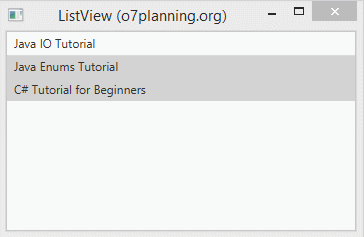
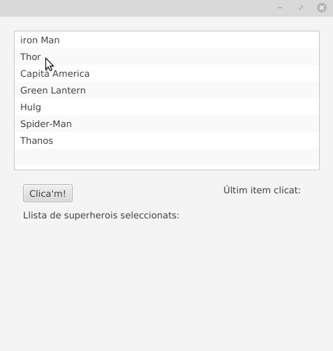

# ListView

JavaFX ListView mostra els seus elements vertical o horitzontalment.
La següent imatge mostra un ListView vertical que inclou 3 elements.

Ara mostrem una llista horitzontal:

Fent funcionar un exemple:

## Métodes listView

alguns métodes que podem utilitzar amb ListView són els següents:

- **getSelectionModel().setSelectionMode** -> permet indicar si es poden seleccionar varis elements de la llista a la  vegada.
- **setOrientation** -> mostra la llista en forma vertical o horitzontal. Per deffecte es mostra en forma vertical.
- **getSelectionModel().getSelectedIndex()** –> Retorna l'índex dels elements seleccionats
- **getSelectionModel().getSelectedItem()** –> Retorna l'element seleccionat actualment
- **getFocusModel().getFocusedIndex()** – Retorna l'índex de l'element enfocat actualment
- **getFocusModel().getFocusedItem()** –> Retorna l'element que té el focus actualment

## Creació de listView.

En les seguents linees de codi es mostra comes crea un ListView a traves d'un ObservableList.

~~~
ListView<String> list = new ListView<String>();

//definim l'Observable list amb els camps que tindrà la nostra ListView
ObservableList<String> items = FXCollections.observableArrayList("iron Man", "Batman", "Capità America", "Green Lantern");
//afegim tots els items al listView
listView.setItems(items);
~~~

En el exemple que es mostra en la pròxima imatge, fem que aparega en un label l'últim item seleccionat. açó ho fem afegint un listener al mètode selectedItemPropierty:

~~~
listView.getSelectionModel().selectedItemProperty().addListener(new ChangeListener<String>() {
     @Override
      public void changed(ObservableValue<? extends String> observableValue, String s, String t1) {

           labelItem.setText("- "+t1);
      }
});
~~~

També pot donar-se el cas de que vulgam afegir un element dintre de cadascun dels item del listview.

en cas de que en una llista es vulga incloure un combo bóx, deurem de indicar que la llista siga editable, amb `listView.setEditable(true);` i despres dir-li que en cadascun dels items incloga un combobox:
`listView.setCellFactory(ComboBoxListCell.forListView(names));`

[back](../../javafx.html)

