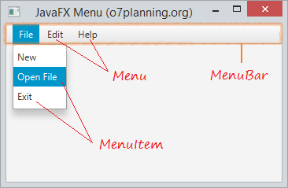
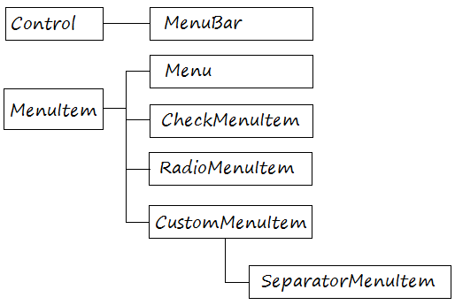
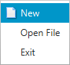
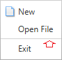
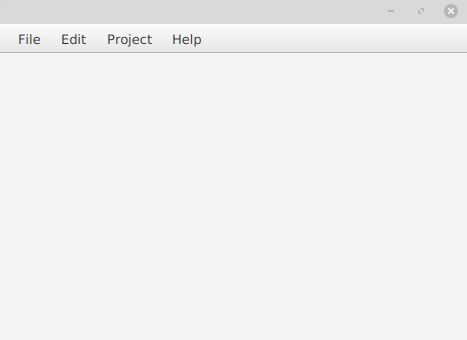
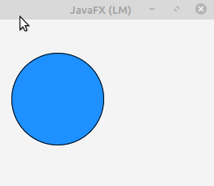

# Menú

Anem a explicar com crear menús i barres de menú, agregar elements de menú, agrupar els menús en categories, crear submenús i establir menús contextuals.

Pot usar les següents classes de la API JavaFX per a crear menús en la seua aplicació JavaFX.

Les parts d'un menú són les següents:

Menú Items:

- Menú Item

    

- CheckMenuItem

    

- RadioMenuItem

    

- SeparatorMenuItem

    

### ceacio menu

Anem a explicar com es realitza un menú que conte tots els elements explicats anteriorment. Gran part de l'explicació, es podria fer directament en SceneBuilder:

 

- Creació del MenuBar

 ~~~
        MenuBar menuBar = new MenuBar();
 ~~~
 
- Crear menus
~~~
Menu fileMenu = new Menu("File");
Menu editMenu = new Menu("Edit");
Menu projectMenu = new Menu("Project");
Menu helpMenu = new Menu("Help");
~~~

- Crear MenuItems

~~~
MenuItem newItem = new MenuItem("New");
newItem..setGraphic(new ImageView("icons/new.png"));
newItem.setGraphic(new ImageView(newImage));
 
MenuItem openFileItem = new MenuItem("Open File");
~~~

- Creació del SeparatorMenuItem.

~~~
SeparatorMenuItem separator= new SeparatorMenuItem();
MenuItem exitItem = new MenuItem("Exit");
 
MenuItem copyItem = new MenuItem("Copy");
MenuItem pasteItem = new MenuItem("Paste");
~~~
        
- Crear CheckMenuItem
        
~~~
CheckMenuItem buildItem = new CheckMenuItem("Build Automatically");
Image buildImage = MyImageUtils.getImage("/org/o7planning/javafx/icon/build-16.png");
buildItem.setGraphic(new ImageView("icons/build.png"));
buildItem.setSelected(true);
~~~
 
- RadioMenuItem

~~~
RadioMenuItem updateItem1 = new RadioMenuItem("Auto Update");
RadioMenuItem updateItem2 = new RadioMenuItem("Ask for Update");
        
ToggleGroup group = new ToggleGroup();
updateItem1.setToggleGroup(group);
updateItem2.setToggleGroup(group);
updateItem1.setSelected(true);
~~~ 
        
        
- Afegir menuItems al Menus

~~~
fileMenu.getItems().addAll(newItem, openFileItem,separator, exitItem);
editMenu.getItems().addAll(copyItem, pasteItem);
projectMenu.getItems().add(buildItem);

helpMenu.getItems().addAll(updateItem1,updateItem2);
~~~
 
- Afegir els menus al MenuBar

~~~
menuBar.getMenus().addAll(fileMenu, editMenu, projectMenu, helpMenu);
~~~

## Menú Contextual

ContextMenu es pot associar amb controls com a etiquetes, camps de text, etc. El menú contextual s'activa en fer clic dret sobre els controls associats. Mostra una finestra emergent que conté diversos elements de menú o submenú.

El ContextMenu és bastant similar a un Menú, pot afegir elements amb tipus de MenuItem, CheckMenuItem, RadioMenuItem o SeparatorMenuItem.

Els constructors de la classe són:

- ContextMenu (): crea un nou menú contextual buit.
- ContextMenu (MenuItem ... i): crea un menú contextual que conté els elements del menú.

Mètodes d'ús comú:
- **getItems()**: retorna els elements del menú contextual
- **getOnAction()**: retorna el valor de la propietat OnAction
- **hide()**: oculta el menú contextual
- **setOnAction(EventHandler v)**: estableix el valor de la propietat onAction
- **show(Node a, doble X, doble I)**: mostra el menú contextual en una posició específica de la pantalla

## Creació del menú contextual.

Anem a basarnos en l'exemple que veiem en la imatge. 

 

- Creació de menú Contextual

~~~
contextMenu.getItems().addAll(menuItem1, menuItem2);

// Creem el event d'acció per que canvie el text del label
menuItem1.setOnAction(new EventHandler<ActionEvent>() {
      @Override
       public void handle(ActionEvent actionEvent) {
           labelContext.setText("Has clicat en el Item 1");
       }
});
menuItem2.setOnAction(new EventHandler<ActionEvent>() {
       @Override
       public void handle(ActionEvent actionEvent) {
           labelContext.setText("Has clicat en el Item 2");
       }
});
~~~

- afegim els menus Item 

~~~
contextMenu.getItems().addAll(menuItem1, menuItem2);
~~~

- Quan cliquem el boto dret en el cercle, es desplega el menú contextual:

circle.setOnContextMenuRequested(new EventHandler<ContextMenuEvent>() {
            @Override
            public void handle(ContextMenuEvent contextMenuEvent) {
                contextMenu.show(circle, contextMenuEvent.getScreenX(),contextMenuEvent.getScreenY());
            }
        });

[back](../../javafx.html)

