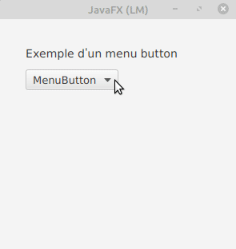
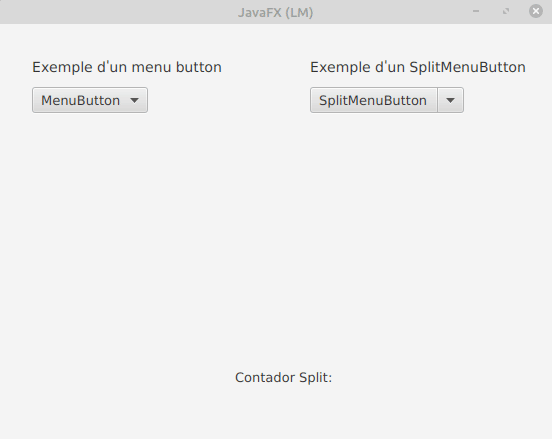

# Menu Button

El botó menuButton quan es pressiona mostra un menú contextual que mostra un conjunt d'elements i l'usuari pot seleccionar qualsevol element. En general, conté diversos elements de menú i l'usuari pot seleccionar com a màxim un element de menú alhora.

Quan els usuaris fan clic en MenuButton, es mostrarà un menú. Els elements del menú poden ser MunuItem, CheckMenuItem, RadioMenuItem o SeparatorMenuItem. I pot manejar esdeveniments quan els usuaris fan clic en els elements

Els constructors de la classe MenuButton són:

- **MenuButton()**: crea un nou botó de menú
- **MenuButton(String t)**: crea un submenú amb un text especificat
- **MenuButton(String t, Node g)**: crea un submenú amb un text especificat
i gràfic
- **MenuButton(String t, Node g, MenuItem ... i)** crea un submenú amb un text, gràfic i elements de menú especificats

Mètodes d'ús comú:

- **getItems()** retorna els elements del botó de menú
- **getPopupSide()** obté el valor de la propietat popupSide
- **hide()** oculta el menú contextual
- **isShowing()** Obté el valor de la propietat que es mostra.
- **setPopupSide(Side v)** Estableix el valor de la propietat popupSide.
- **show()** mostra el menú contextual

Els següents programes il·lustren la classe MenuButton:

Programa per a crear un MenuButton i agregar-li MenuItems: Es crearà un MenuButton amb el nom m i s'afegiran 3 menuitems m1, m2, m3 al menuButton m. La barra de menú es crearà dins d'una escena, que al seu torn s'allotjarà dins d'un escenari. 

 

# Split Menu Button

Un control lliscant és un control en JavaFX que s'utilitza per a mostrar un rang continu o discret d'opcions numèriques vàlides i permet a l'usuari interactuar amb el control. Un control lliscant es representa com una barra vertical o horitzontal amb una perilla que l'usuari pot lliscar per a indicar el valor desitjat. Un control lliscant també pot tindre marques i etiquetes per a indicar els intervals al llarg de la barra.
Les tres variables fonamentals del control lliscant són min, max i value. El valor sempre ha de ser un número dins del rang definit per min i max. min sempre ha de ser menor que max. min per defecte és 0, mentre que max per defecte és 100.

Constructors de la classe:

- **Control lliscant()**: crea una instància de control lliscant predeterminada.
- **Control lliscant(doble mínim, doble màxim, doble valor)**: construeix un control lliscant amb els valors mínims, màxims i actuals del control lliscant especificat.

 

[back](../../javafx.html)

