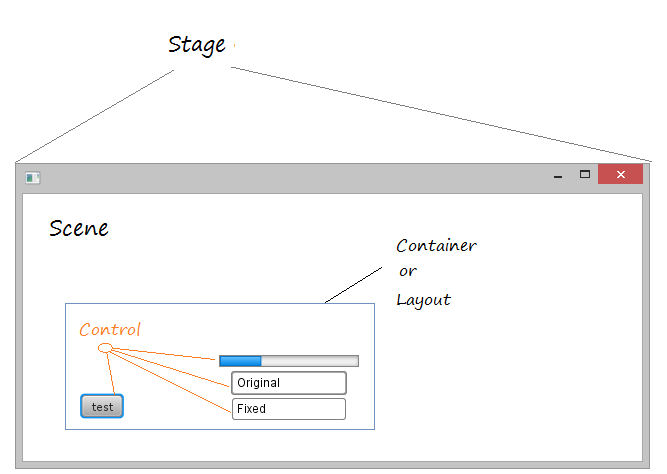
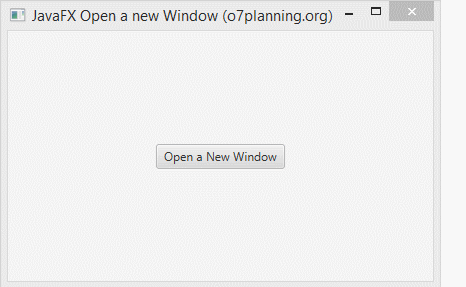
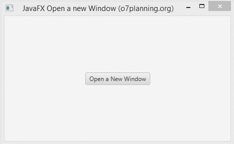

# Obrir una nova finestra

 

Hi ha tres models que pot aplicar a l'escenari a través del mètode stage.initModality (Modelity).

- **Modality.NONE**: Quan obri una nova finestra amb aquest mode, la nova finestra serà independent de la finestra principal. Pot interactuar amb la finestra principal o tancar-la sense afectar la nova finestra.
- **Modality.WINDOW_MODAL**: Quan obri una nova finestra amb aquest mode, bloquejarà la finestra principal. No pot interactuar amb la finestra principal fins que aquesta finestra estiga tancada.
- **Modality.APPLICATION_MODAL**: Quan obri una nova finestra amb aquest mode, bloquejarà qualsevol altra finestra de l'aplicació. No pot interactuar amb cap altra finestra fins que aquesta finestra estiga tancada.

Exemple modality.NONE

~~~
//creem un nou Stage:
Stage newWindow
//li podem introduir nou a la nova finestra
newWindow.setTitle("Second Stage");
//Li afegim la escena dintre del stage.
newWindow.setScene(secondScene);
~~~

 

Example modality.WINDOWS_MODAL

~~~
// li indiquem la modalitat de la finestra
stage.initModality(Modality.WINDOW_MODAL);
// especifiquem el propietari de la finestra  (parent) per la novafinestra
newWindow.initOwner(primaryStage);
~~~

 

[back](../../javafx.html)

