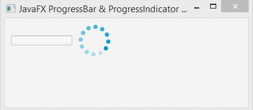
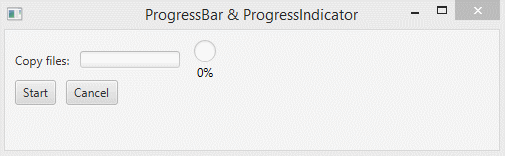

# Progress Bar & Progress Indicator

## Progress Bar

És una especialització del ProgressIndicator que es representa com una barra horitzontal. La barra de progrés generalment mostra la quantitat de finalització d'una tasca.

Els constructors de la classe ProgressBar són:

- **ProgressBar()**: crea una nova barra de progrés intermèdia.
- **ProgressBar(double p)**: crea una barra de progrés amb un progrés especificat.

Mètodes d'ús comú:

- **isIndeterminate()** Obté el valor de la propietat indeterminat.
- **getProgress()** Obté el valor del progrés de la propietat.
- **setProgress(double v)** Estableix el valor del progrés de la propietat

# Progress Indicator

És un control circular que s'utilitza per a indicar el progrés, ja siga infinit o finit. Sovint s'utilitza amb la API de tasques per a representar el progrés de les tasques en segon pla. En general, mostra la quantitat de finalització d'una tasca.

Constructor de la classe són:

- **ProgressIndicator()**: crea un nou indicador de progrés intermedi.
- **ProgressIndicator(doble p)**: crea un indicador de progrés amb un progrés especificat

Mètodes d'ús comú
- **isIndeterminate()** Obté el valor de la propietat indeterminat.
- **getProgress()** Obté el valor del progrés de la propietat.
- **setProgress(double v)** Estableix el valor del progrés de la propietat

El següent programa il·lustra l'ús de l'indicador de progrés i de progress bar sense temps determinat:

 

A continuació s'observa un Progress Bar i un Progress Indicator per una determinada tasca:

 

[back](../../javafx.html)

