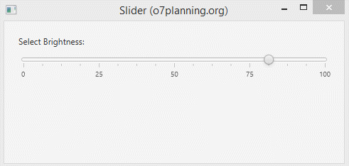

# Slider

Un control lliscant és un control en JavaFX que s'utilitza per a mostrar un rang continu o discret d'opcions numèriques vàlides i permet a l'usuari interactuar amb el control. Un control lliscant es representa com una barra vertical o horitzontal amb una perilla que l'usuari pot lliscar per a indicar el valor desitjat. Un control lliscant també pot tindre marques i etiquetes per a indicar els intervals al llarg de la barra.

 

Les tres variables fonamentals del control lliscant són min, max i value. El valor sempre ha de ser un número dins del rang definit per min i max. min sempre ha de ser menor que max. min per defecte és 0, mentre que max per defecte és 100.

 

Constructors de la classe:

- **Slider()**: crea una instància de control lliscant predeterminada.
- **Slider(doble mínim, doble màxim, doble valor)**: construeix un control lliscant amb els valors mínims, màxims i actuals del control lliscant especificat.

Mètodes d'ús comú:

- **ajustValue(double newValue)**: Ajusta el valor perquè coincidisca amb valor nou.
- **decrement()**: Disminueix el valor per blockIncrement, limitat per max.
- **getBlockIncrement()**: Obté el valor de la propietat blockIncrement.
- **getMax()**: Obté el valor de la propietat max.
- **getMin()**: Obté el valor de la propietat min.
- **getMajorTickUnit(**): Obté el valor de la propietat majorTickUnit.
- **getMinorTickCount()**: Obté el valor de la propietat minorTickCount.
- **getValue()**: Obté el valor del valor de la propietat.
- **increment()**: Incrementa el valor per blockIncrement, limitat per max.
- **setBlockIncrement(double value)**: Estableix el valor de la propietat blockIncrement.
- **setMajorTickUnit(double value)**: Estableix el valor de la propietat majorTickUnit.
- **setMax(double value)**: Estableix el valor de la propietat max.
- **setMin(double value)**: Estableix el valor de la propietat min.
- **setMinorTickCount(int value)**: Estableix el valor de la propietat minorTickCount.
- **setValue(double value)**: Estableix el valor del valor de la propietat.
- **setValueChanging(boolean value)**: Estableix el valor de la propietat valueChanging.
- **setShowTickMarks(boolean value)**: Estableix el valor de la propietat showTickMarks.
- **setShowTickLabels(boolean value)**: Estableix el valor de la propietat showTickLabels.
- **isShowTickLabels()**: Obté el valor de la propietat showTickLabels.
- **isShowTickMarks()**: Obté el valor de la propietat showTickMarks.

 

[back](../../javafx.html)

