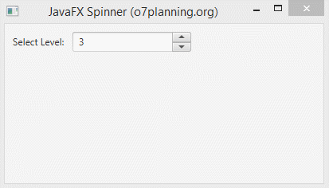

# Spinner

Els spinners són similars als quadres combinats i les llistes, ja que permeten a l'usuari triar entre una varietat de valors. Igual que els quadres combinats editables, els controls giratoris permeten a l'usuari escriure un valor. A diferència dels quadres combinats, els spinners no tenen una llista desplegable que puga cobrir altres components. Pel fet que els spinners no mostren valors possibles, només el valor actual és visible, sovint s'usen en lloc de quadres combinats o llistes quan el conjunt de valors possibles és extremadament gran.

 

 

Lestrictura del spinner és:

 

A continuació es pot veure un exemple amb l'acces a les dades `spinner.getValue()`del spinner.

 

[back](../../javafx.html)

