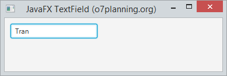
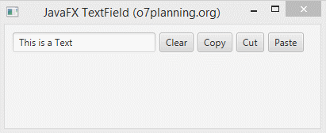
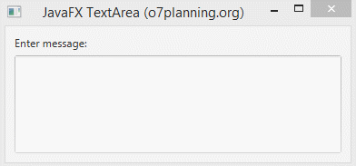

# TextField

La classe TextField implementa un control d'interfície d'usuari que accepta i mostra l'entrada de text. Proporciona capacitats per a rebre entrada de text d'un usuari. Juntament amb un altre control d'entrada de text, PasswordField, aquesta classe estén la classe TextInput.

El contructor de la clase són:

- **TextField()**: Crea un TextView buit.
- **TextField(String s)**: Crea un TextField amb un text inicial.

Alguns mètodes útils que ens podem trobar són:

- **setPrefColumnCount(int v)**: Estableix el valor de la propietat prefColumnCount.
- **setOnAction(EventHandler value)**: 	Estableix el valor de la propietat onAction.
- **setAlignment(Pos v)**: Estableix el valor de l'alineació de la propietat.
- **prefColumnCountProperty()**: El nombre preferit de columnes de text
- **onActionProperty()**: El controlador d'accions associat amb aquest camp de text, o nul si no s'assigna cap controlador d'accions.
- **getPrefColumnCount()**: Obté el valor de la propietat prefColumnCount.
- **getOnAction()**: Obté el valor de la propietat onAction.
- **getAlignment()**: Obté el valor de la propietat alineació.
- **getCharacters()**: Retorna la seqüència de caràcters que recolza el contingut del camp de text.
- **setText()**: escriu en el seu interior una cadena
- **getText()**: agafa text que conté.
- **clear()**: esborra el text de TextField.
- **copy()**: transfereix el rang seleccionat actualment en el text al portapapers, deixant la selecció actual.
- **cut()**: transfereix el rang seleccionat actualment en el text al portapapers, eliminant la selecció actual.
- **paste()**: transfereix el contingut del portapapers a aquest text, reemplaçant la selecció actual.

# Password Field

És un camp de text que emmascara els caràcters ingressats (els caràcters ingressats no es mostren a l'usuari). Permet a l'usuari ingressar **una sola línia de text sense format**.

Constructor de la classe PasswordField:

- **PasswordField()**: crea un nou PasswordField

(PasswordField hereta TextField, per la qual cosa tots els mètodes de TextField es poden usar ací. No hi ha mètodes separats per al camp de contrasenya, tots s'hereten del camp de text).

# Text Area

JavaFX TextArea és un component que permet als usuaris ingressar l'escriptura en diverses línies i l'aplicació pot llegir-lo.

[back](../../javafx.html)

