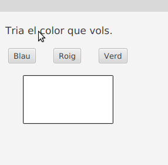

## ToogleButton

Es poden combinar dos o més botons d'alternança en un grup on sol es pot seleccionar un botó alhora, o on no es requereix selecció. La següent figura mostra una captura de pantalla d'una aplicació que combina tres botons d'alternança en un grup. L'aplicació pinta el rectangle amb un color específic segons el botó d'alternança seleccionat.

Al igual que en els Radio Button, s'ha de indicar que els toggleButons pertanyen a un Toggle Group.

[back](../../javafx.html)

