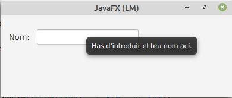

# Tooltip

Tooltip s'utilitza per a mostrar informació addicional a l'usuari quan el mouse es troba sobre el component. Tots els components es poden associar amb una informació sobre eines i també es pot associar amb una part de la pantalla.

Constructors de la classe Tooltip:

- **Tooltip()**: crea una informació sobre eines amb una cadena buida per al seu text.
- **Tooltip(String t)**: crea una informació sobre eines amb el text especificat.

Mètodes d'ús comú:
- getFont() Obté el valor de la font de la propietat.
- **getText()**: Obté el valor del text de propietat.
- **getTextAlignment()**: Obté el valor de la propietat textAlignment.
- **install(Node n, Tooltip t)**: Associa la informació sobre eines donada amb el node donat.
- **isActivated()**: Obté el valor de la propietat activada.
- **setFont(Font v)**: Estableix el valor de la font de la propietat.
- **setText(String v)**: Estableix el valor del text de propietat.
- **setTextAlignment(TextAlignment v)**: Estableix el valor de la propietat textAlignment.

per crear un Tooltip sense SceneBuilder:

TextField field_userName= new TextField();
 
Tooltip tooltip_userName=new Tooltip("Enter user name");
 
~~~
// Set tooltip
field_userName.setTooltip(tooltip_userName);
 
// Or using Tooltip.install
Tooltip.install(field_userName, tooltip_userName);
 
// Uninstall tooltip
Tooltip.uninstall(field_userName, tooltip_userName);
~~~

 

[back](../../javafx.html)

