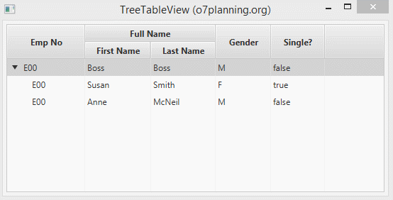

# TreeTableView

JavaFX li proporciona la classe TreeTableView i s'usa juntament amb TreeItem, TreeTableColumn i TreeTableCell que l'ajuda a mostrar dades a Tabular i en arbre. Vegem la següent il·lustració:

 

Igual que TableView, pot crear columnes anidades. Per a crear un TreeTableView, necessita:

1. Afegir TreeItem a TreeTableView per a formar una estructura d'arbre.
2. definir les columnes de la taula.
3. Definir la manera de mostrar dades en cada cel·la mitjançant el mètode TreeTableColumn.setCellValueFactory.

## Creació de TreeTableView

Es defineixen les TreeTableView i les TreeTabletCol

~~~
@FXML
TreeTableView<Empleat> treeTableView;
@FXML
TreeTableColumn<Empleat,String> empCol, fnameCol, lnameCol, positionCol, genderCol;
@FXML
TreeTableColumn<Empleat,Boolean> singleCol;
~~~

Creem els items i afegim les dades:

~~~
Employee empBoss = new Employee("E00", "Abc@gmail.com", "Boss", "Boss", "Manager", "M", false); 
Employee empSmith = new Employee("E01", "Smith@gmail.com", "Susan", "Smith", "Salesman", "F", true); 
Employee empMcNeil = new Employee("E02", "McNeil@gmail.com", "Anne", "McNeil", "Cleck", "M", false);
 
// Root Item
TreeItem<Employee> itemRoot = new TreeItem<Employee>(empBoss);
TreeItem<Employee> itemSmith = new TreeItem<Employee>(empSmith);
TreeItem<Employee> itemMcNeil = new TreeItem<Employee>(empMcNeil);
 
itemRoot.getChildren().addAll(itemSmith, itemMcNeil);
 
// definim l'item arrel.

treeTableView.setRoot(itemRoot);
~~~

Definim com omplir les dades per cada cel·la:

~~~
empNoCol.setCellValueFactory(new TreeItemPropertyValueFactory<Employee, String>("empNo"));
firstNameCol.setCellValueFactory(new TreeItemPropertyValueFactory<Employee, String>("firstName"));
lastNameCol.setCellValueFactory(new TreeItemPropertyValueFactory<Employee, String>("lastName"));
positionCol.setCellValueFactory(new TreeItemPropertyValueFactory<Employee, String>("position"));
genderCol.setCellValueFactory(new TreeItemPropertyValueFactory<Employee, String>("gender"));
singleCol.setCellValueFactory(new TreeItemPropertyValueFactory<Employee, Boolean>("single"));
~~~

### setCellFactory & setCellValueFactory
- **treeTableColumn.setCellValueFactory**: És el mètode que especifica com mostrar les dades en la cel·la de TreeTableView.

- **treeTableColumn.setCellFactory**: És el mètode que especifica com representar un control mentre l'usuari està editant dades en la cel·la.

[back](../../javafx.html)

