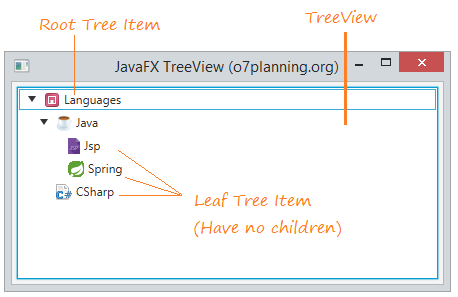
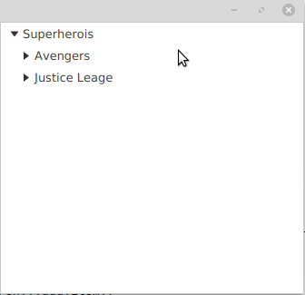

# TreeView

La classe TreeView del paquet javafx.scene.control proporciona una vista de les estructures jeràrquiques. En cada arbre, l'objecte més alt de la jerarquia es denomina "arrel". L'arrel conté diversos elements secundaris, que també poden tindre elements secundaris. Un article sense fills es diu "fulla".

## Creació TreeView

Quan crea una estructura d'arbre en JavaFX, es necessita crear una instància de la classe TreeView, despres es defineixen diversos objectes TreeItem. Fem que un d'aquestos items de l'arbre siga l'arrel. Agreguem l'arrel a la vista d'arbre i altres elements d'arbre a l'arrel.

Pot acompanyar cada element de l'arbre amb una icona gràfica utilitzant el constructor corresponent de la classe TreeItem o cridant al mètode setGraphic. La grandària recomanada per a les icones és 16x16, però de fet, qualsevol objecte Node es pot establir com a icona i serà completament interactiu.

En primer lloc es crea els nodes:

~~~
TreeItem<String> root = new TreeItem<>("Superherois");
//Si volem que aparega expandit al principi, li posem:
root.setExpanded(true);

~~~

Una vegada s'ha creat el node principal, podem afegir els fills:

~~~
TreeItem<String> avengers = new TreeItem<>("Avengers");

root.getChildren().add(avengers);
~~~

Per poder afegir el root principal al TreeView:

~~~
treeView.setRoot(root);
~~~

 

[back](../../javafx.html)

