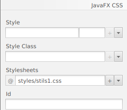

# Java FX - CSS

CSS (Cascading Style Sheets) és un llenguatge de disseny que s'utilitza per a millorar l'aparença de les pàgines web sense canviar la seua funcionalitat. Només s'ocupa de la forma en què es presenta una pàgina web en el navegador web.

Usant CSS, podem definir el color, grandària, estils de font, espaiat entre el paràgraf, alineació i moltes coses més per a una pàgina web perquè es veja millor i més precisa. També podem configurar el fons de l'aplicació, el disseny, el disseny i la varietat de visualització per als dispositius de diferents grandàries.

Per Observar les diferents propietats que se li poden asignar a qualsevol elements que tingam en la nostra aplicació, pot consultar la següent pàgina -> [guia de referencia CSS de JavaFX](https://docs.oracle.com/javafx/2/api/javafx/scene/doc-files/cssref.html)

## CSS en JavaFX

JavaFX proporciona el paquet javafx.css que conté totes les classes per a aplicar CSS a l'aplicació JavaFX.

Aplicar CSS a l'aplicació JavaFX és similar a aplicar CSS a la pàgina HTML. 

## Fulla d'estil predeterminada

JavaFX usa caspian.css com a arxiu CSS predeterminat. Es troba en l'arxiu JAR de temps d'execució de JavaFX, **jfxrt.jar**. Aquesta fulla d'estil defineix les regles d'estil predeterminades per al node arrel i els controls d'IU. Aquest arxiu es troba en la ruta /jre/lib sota el directori d'instal·lació de JDK. El següent comando es pot utilitzar per a extraure la fulla d'estil de l'arxiu JAR.

~~~
# jar xf jfxrt.jar    
# com/sun/javafx/scene/control/skin/caspian/caspian.css
~~~

## Afegir fulles d'estil a l'escena

JavaFX ens brinda la possibilitat d'anul·lar la fulla d'estil predeterminada i definir els nostres propis estils per a cada node de l'aplicació. La fulla d'estil que creguem ha de tindre l'extensió .css i ha d'estar situada en el directori on resideix la classe principal de l'aplicació.

Podem fer-ho des del mateix codi o des de l'scene Builder:

1. En JavaFX, existeix una sintaxi específica per a aplicar CSS a l'escena. La sintaxi es dóna com segueix;
~~~
Scene scene = new Scene(root,500,400);
scene.getStylesheet().add("path/Stylesheet.css");
~~~

2. Podem definir l'estil que anem a aplicar en l'scene Builder. Per acò, cal que creem el full d'estils. A continuació en la opció de propietats del pane li indicarem on es troba:

## Definició d'estils en StyleSheet

Es pot donar una definició d'estil utilitzant el nom de l'estil, que també es coneix com a selector i una sèrie de regles que estableixen les propietats dels estils. Les **regles d'estil es donen entre claus**. Ens basem en el següent exemple anomenat mystyle.css. Defineix la definició d'estil per a cada node de botó utilitzat en la seua aplicació contenidora.

- Example:
~~~
.button {
    -fx-font : 14px "serief";
    -fx-padding : 10;
    -fx-background-color : #CCFF99;
}
~~~

## Selectors

Hi ha diversos tipus d'estils utilitzats en JavaFX. No obstant això, cada tipus considera les seues pròpies convencions respecte als selectors. Les convencions de nomenclatura dels selectors de classes d'estil són,

1. Si el selector de classe d'estil consta de més d'una paraula, utilitze el **guió** entre elles.
2. Els noms dels selectors de classes d'estil estan precedits per un punt (.)

Exemples de selectors són:

~~~
.button
.check-box
.label
~~~

l'estil d'un node en particular es pot definir mitjançant l'ID del node. S'Utilitza el símbol # abans de Node_ID per a crear un nom d'estil per a aqueix node. Per exemple, el node que té id my_label pot tindre el següent tipus de nom de selector.

~~~
#my_label
~~~

## Definició de regles en fulles d'estil

Les regles per a una definició d'estil assignen valors a les propietats. Existeixen algunes convencions per als noms de propietat que es donen a continuació.

1. Si el nom de la propietat consta de més d'una paraula, utilitze un guió (-) per a separar-les.
2. El nom de propietat dels estils està precedit per -fx-.
3. El nom de la propietat i el valor estan separats per dos punts (:).
4. Les regles estan separades per punt i coma (;).

l'exemple de definició de regles per a les propietats és el següent.

~~~
-fx-background-color : #333356;
-fx-font : 16px "serief";
~~~

Existeix una classe d'estil especial denominada .root definida en javafx. S'aplica al node arrel de l'objecte d'escena. Atés que tots els nodes de l'aplicació són fills del node arrel, les regles d'estil aplicades a aquesta classe es poden aplicar a tot l'escenari gràfic de l'aplicació.

~~~
.root
{
    -fx-font-family : "serief";
    -fx-background1 : rgb(225,227,2255);
}
~~~

## Estils de classe

Els estils de classe es poden crear agregant la seua definició a la nostra fulla d'estil. Per exemple;

~~~
.label1{
    -fx-background-color : rgb(123,126,227);
    -fx-padding : 5;
    -fx-text-fill : rgb(245,123,201);
~~~

per afegir la classe d'estil esmentada anteriorment al node apropiat, utilitze el mètode getStyleClass().add().

~~~
Button button = new Button("SUBMIT");
button.getStyleClass().add(button1);
~~~

## Estils d'identificació

JavaFX ens brinda la possibilitat de crear l'estil per al node individual. El nom de l'estil es pot donar com el nom de ID precedit pel símbol de *almohadilla* (#).

~~~
#submit-button{
    -fx-font : bold 18pt "serief";
    -fx-background-color : rgb(120,190,201);
}
~~~

## Establir estils en línia

JavaFX ens facilita definir les regles CSS en el propi codi de l'aplicació JavaFX. No obstant això, les regles definides en el codi de l'aplicació JavaFX tenen prioritat sobre els estils de la fulla d'estil.

~~~
Label label1 = new Label("Name: ");
label1.setStyle("-fx-background-color : blue, -fx-text-fill : white");
~~~

[back](../../javafx.html)