# Java FX - Dialeg

La classe Alert és una subclasse de la classe Dialog, i proporciona suport per a diversos tipus de diàleg preconstruidos que es poden mostrar fàcilment als usuaris per a sol·licitar una resposta.
Per a molts usuaris, la classe Alert és la classe més adequada per a les seues necessitats (en lloc d'usar Dialog directament). 
Alternativament, els usuaris que desitgen sol·licitar a un usuari que ingresse text o que trien d'una llista d'opcions rebrien un millor servei utilitzant TextInputDialog i ChoiceDialog, respectivament.

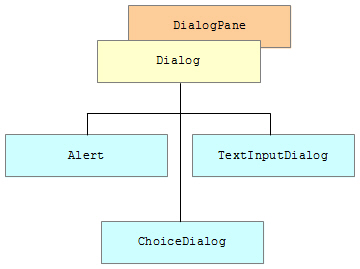

A continuació es mostra la ilustració d'una finestra d'alerta.

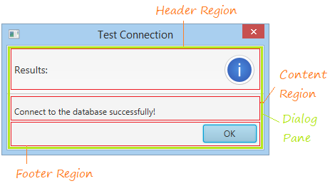

- Header Region
Aquesta regió s'utilitza per a mostrar una breu notificació i icona.

- Content Region

De manera predeterminada, la regió de contingut mostra una etiqueta, pot establir el text per a aquesta etiqueta mitjançant el mètode `alert.setContentText(String)`. També pot mostrar un altre node a la regió de contingut a través de `alert.getDialogPane().SetContent(Node)`.

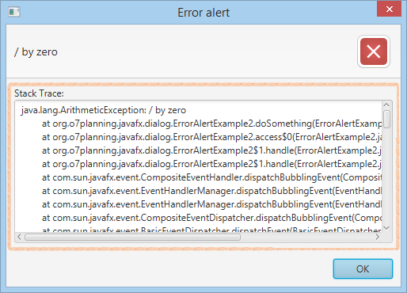

- Footer Regon

Aquesta regió s'usa per a mostrar botons. Pot personalitzar els botons que es mostren.

### Standard Alert

Alert és una finestra de diàleg que mostra informació. A continuació es mostra una imatge d'una Alerta d'informació estàndard:

~~~
Alert alert = new Alert(AlertType.INFORMATION);
alert.setTitle("Information Dialog");
alert.setHeaderText("Results:");
alert.setContentText("Connect to the database successfully!");

alert.showAndWait();
~~~

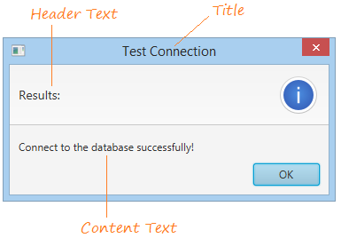

Pot tindre un text en la capcelera, o pot ser un Alert sense text en la capcelera.

~~~
.......
alert.setHeaderText(null);
.......
~~~

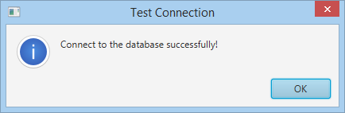

### Warning Alert

La alerta de advertencia es similar a una alerta de información, excepto por su icono y el uso previsto. La alerta de advertencia se utiliza para advertir a un usuario de posibles riesgos o problemas, aunque probablemente no ocurra.

Té les mateixes parts que l'alert standard:

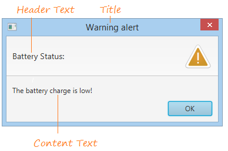

A continuació podem veure exemples de alert, amb: 
- La capcelera de text per defecte

~~~
Alert alert = new Alert(AlertType.WARNING);
alert.setTitle("Warning alert");
 
// alert.setHeaderText("Battery Status:");
alert.setContentText("The battery charge is low!");
 
alert.showAndWait();
~~~

- sense capcelera de text:

~~~
Alert alert = new Alert(AlertType.WARNING);
alert.setTitle("Warning alert");
 
// Header Text: null
alert.setHeaderText(null);
alert.setContentText("The battery charge is low!");
 
alert.showAndWait();
~~~

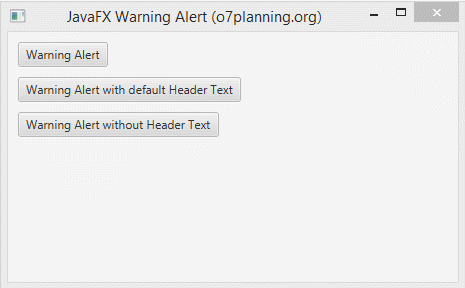

### Error Alert

L'alerta d'error és la mateixa que l'alerta d'informació i l'alerta d'advertiment, excepte per la icona i l'ús previst. L'alerta d'error s'utilitza per a notificar l'ocurrència d'un assumpte greu.
Per a crear una alerta d'error, ha d'usar AlertType.ERROR.

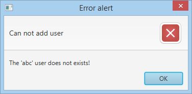

~~~
Alert alert = new Alert(AlertType.ERROR);
 
alert.setTitle("Error alert");
alert.setHeaderText("Can not add user");
alert.setContentText("The 'abc' user does not exists!");
 
alert.showAndWait();
~~~

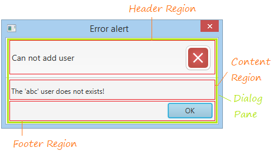

### Confirm Alert

Es mostra l’alerta de confirmació per demanar als usuaris que confirmin que es farà o no una acció. Està predeterminat que l’alerta de confirmació tindrà 2 opcions per a usuaris: OK o Cancel·la.

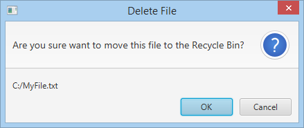

~~~
Alert alert = new Alert(AlertType.CONFIRMATION);
alert.setTitle("Delete File");
alert.setHeaderText("Are you sure want to move this file to the Recycle Bin?");
alert.setContentText("C:/MyFile.txt");
~~~
      
### Custom Buttons

El diàleg d'Alerta permet personalitzar els botons que es visualitzen en el peu del Alert. 

~~~
Alert alert = new Alert(AlertType.CONFIRMATION);
alert.setTitle("Select");
alert.setHeaderText("Choose the sport you like:");
 
ButtonType football = new ButtonType("Football");
ButtonType badminton = new ButtonType("Badminton");
ButtonType volleyball = new ButtonType("Volleyball");
 
// Remove default ButtonTypes
alert.getButtonTypes().clear();
 
alert.getButtonTypes().addAll(football, badminton, volleyball);
 
// option != null.
Optional<ButtonType> option = alert.showAndWait();
 
if (option.get() == null) {
    this.label.setText("No selection!");
} else if (option.get() == football) {
    this.label.setText("You like Football");
} else if (option.get() == badminton) {
    this.label.setText("You like Badminton");
} else if (option.get() == volleyball) {
    this.label.setText("You like Volleyball");
} else {
    this.label.setText("-");
}
~~~

### Text Input Dialog

Aquet dialog, li permet al usuari interactuar d'alguna forma amb el programa. Lo més usual és que l'usuari puga donar informació a l'aplicació a través d'un textField.

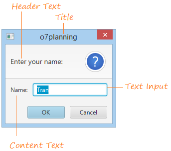

~~~
TextInputDialog dialog = new TextInputDialog("Tran");
dialog.setTitle("o7Planning");
dialog.setHeaderText("Enter your name");
dialog.setContentText("Name:");

// Traditional way to get the response value.
Optional<String> result = dialog.showAndWait();
~~~

El resultat de result.isPresent() serà false si clickem en cancelled o true si clickem en OK.

### Choice Dialog

Aquest és un dialeg molt semblant al anterior, però en aquest cas ens comunicarem amb l'aplicació amb un choice button.

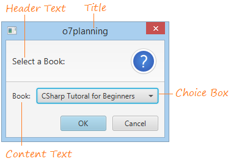

~~~
List<String> choices = new ArrayList<>();
choices.add("cSharp Tutorial for Begginers");
choices.add("b");
choices.add("c");

ChoiceDialog<String> dialog = new ChoiceDialog<>("cSharp Tutorial for Begginers", choices);
dialog.setTitle("o7Planning");
dialog.setHeaderText("Select a Book:");
dialog.setContentText("Book:");
~~~

El resultat de result.isPresent(), al igual que en el dialeg anterior, serà false si clickem en cancelled o true si clickem en OK.

[back](../../javafx.html)
