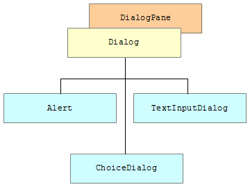
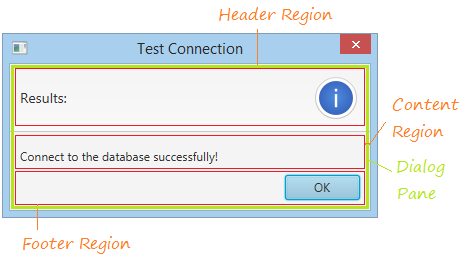

# Java FX - Dialeg

La classe Alert és una subclasse de la classe Dialog, i proporciona suport per a diversos tipus de diàleg preconstruidos que es poden mostrar fàcilment als usuaris per a sol·licitar una resposta.
Per a molts usuaris, la classe Alert és la classe més adequada per a les seues necessitats (en lloc d'usar Dialog directament). 
Alternativament, els usuaris que desitgen sol·licitar a un usuari que ingresse text o que trien d'una llista d'opcions rebrien un millor servei utilitzant TextInputDialog i ChoiceDialog, respectivament.

A continuació es mostra la ilustració d'una finestra d'alerta.

- Header Region
Aquesta regió s'utilitza per a mostrar una breu notificació i icona.

- Content Region

https://o7planning.org/en/11529/javafx-alert-dialogs-tutorial

https://code.makery.ch/blog/javafx-dialogs-official/

