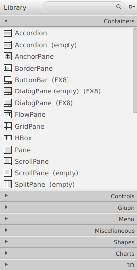
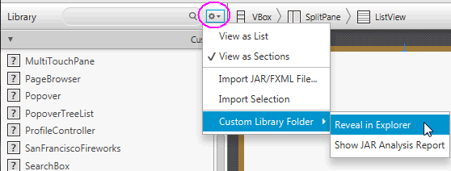

# Java FX -Scene Builder
# Disseny GUI amb el panel de Biblioteca.

**Anem a descriure el panell Biblioteca de JavaFX Scene Builder i els objectes de la GUI de JavaFX als quals es pot accedir des d'ell. Definirem com treballar amb alguns dels elements de contenidor disponibles. També es tracta en aquest capítol com importar objectes GUI personalitzats en JavaFX Scene Builder.**

El panell Biblioteca es troba en el costat esquerre de la finestra principal. El panell Biblioteca es compon de seccions plegables per a:
- Contenidors
- Controls
- Menús
- Elements Gluon
- Formes 
- Gràfics
- 3D
- Elements diversos que estan disponibles per al seu ús per a construir el seu disseny FXML.

Quan s'inicia un nou disseny FXML en Scene Builder, és un arxiu buit. Comença a construir el seu disseny seleccionant el contenidor arrel superior de la secció Contenidors i agregant-lo al panell Contingut o Jerarquia. Després pot agregar a aquest contenidor arrel tants contenidors o elements GUI que siguen necessaris per al seu disseny FXML.

Per a agregar un dels elements de la GUI des del panell Biblioteca, realitze una de les següents accions:

- Arrossegar des del panell Biblioteca fins el panell contingut o Hierarchy.

- Seleccionar un element del panell Biblioteca i pressione la tecla Intro.

- Fer doble clic en un element seleccionat en el panell Biblioteca i s'agregarà al panell Contingut.

- Faça clic en el comando Inserir en la barra de menú i seleccione un dels elements de GUI disponibles en la llista desplegable. 

Es pot filtrar la llista d'elements de GUI disponibles a la Biblioteca utilitzant l'eina de cerca. 

A la dreta del camp de text Buscar del panell Biblioteca hi ha un botó de menú que, mostra un menú de comandos que l'ajuden a administrar:
- **Com es mostraran** els continguts de la Biblioteca: 
    - **Llista**: Com una llista llarga 
    - Grups d'elements **llistats en seccions** separades (predeterminat).
- **Importar components** de GUI personalitzats a la Biblioteca. 

- **Carpeta de biblioteca personalitzada**, 
    - **Revelar in Explorer**: s'obri l'administrador d'arxius del sistema en la ubicació de la carpeta que conté el component personalitzat JAR i / o arxius FXML.
    - **Mostrar informe d'anàlisi JAR**: permet veure un informe d'anàlisi per als arxius JAR situats en la Carpeta de la biblioteca personalitzada. Aquest informe enumerarà totes les classes de Java que es van inspeccionar i van determinar com a components personalitzats que no es poden agregar a la Biblioteca. També es proporciona una indicació dels criteris fallits, com el fet que la classe no és un node JavaFX o que Scene Builder no va poder crear una instància de la classe.

Ara es procedeix a mostrar els components més destacats que podem trobar:

- Contenidors
    - [BorderPane](./contenidors/borderPane.html)
    - [GridPane](./contenidors/gridPane.html)
    - [AnchorPane](./contenidors/anchorPane.html)
    - [FlowPane](./contenidors/flowPane.html)
    - [HBox i VBox](./contenidors/HBox.html)
    - [TilePane](./contenidors/tilePane.html)
    - [Accordion](./contenidors/Accordion.html)
    - [StackPane](./contenidors/stackPane.html)
    - [ScrollPane](./contenidors/scrollPane.html)
    - [TitledPane](./contenidors/titledPane.html)
- Controls
    
[back](../javafx.html)

