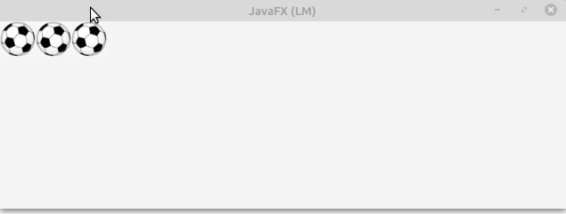

# Java FX - Drag And Drop

# Exemple 

En aquest exemple anem a veure com podem pasar una imatge d'un contenidor a un altre. per aquest cas, utilitzem dos contenidors hbox, que actuaran com a Orige i destí del gest Drag & Drop.

En la següent imatge podem veure el seu funcionament.

Ara s'explica el codi per parts. Al final de la pàgina es pot veure el codi del controlador sencer. 

## inserció imatges. 

introduim les imatges que volem que tinguen la funció d'arrosegar. en aquet cas li indiquem que les introduixca en el hbox1:

~~~
insertImage(new Image("icons/balo.jpg"), hb1);
~~~

s'ha creat una funció en la que introdueix les imatges al hbox:

~~~
void insertImage(Image i,HBox hb){
        imageView1 = new ImageView();
        imageView1.setImage(i);

        //cridem als metodes Drag
        setupGestureSource(imageView1);

        hb.getChildren().add(imageView1);

    }
~~~

Per cada imatge que afegim, es crida als metodes Drag. en aquest cas els hem creat en una funció anomenada `setupGestureSource(imageView)`. Dintre d'aquest mètode podem trobar el codi següent:

~~~
source.setOnDragDetected(new EventHandler<MouseEvent>() {
            @Override
            public void handle(MouseEvent mouseEvent) {
                Dragboard dragboard = source.startDragAndDrop(TransferMode.MOVE);

                //posem la imatge en el clipboard
                ClipboardContent content = new ClipboardContent();
                Image sourceImage = source.getImage();
                content.putImage(sourceImage);
                dragboard.setContent(content);

                imageView1 = source;

                mouseEvent.consume();

            }
        });

        source.setOnMouseEntered(new EventHandler<MouseEvent>() {
            @Override
            public void handle(MouseEvent mouseEvent) {
                source.setCursor(Cursor.HAND);
            }
        });
~~~

En ell definim les accións que ocorreran en el node Orige:

- OnDragDetected: quan detecta que s'ha fet clic i comença a menejar-se. Crea el portapapers (dragboard) i se li indica el metode de transferencia que volem.
despres li introduim la imatge en el ClipboardContent i utilitzem el content per parsar-li-la al portapapers.
- OnMouseEntered: s'utilitza per fer que canvie la forma del cursor quan comença l'arrosegament.

Al iniciar el programa, cridem a la funció que gestiona els metodes Drag&Drop en el destí: `setupGestureTarget(hb2);`.

~~~
private void setupGestureTarget(HBox hb) {

        hb.setOnDragOver(new EventHandler<DragEvent>() {
            @Override
            public void handle(DragEvent event) {
                Dragboard dragboard = event.getDragboard();
                if(dragboard.hasImage()){
                    event.acceptTransferModes(TransferMode.MOVE);
                }
                event.consume();
            }

        });

        hb.setOnDragDropped(new EventHandler<DragEvent>() {
            @Override
            public void handle(DragEvent event) {
                Dragboard dragboard = event.getDragboard();

                if(dragboard.hasImage()){
                    imageView1.setImage(dragboard.getImage());
                    hb.getChildren().add(imageView1);
                    event.setDropCompleted(true);
                }else{
                    event.setDropCompleted(false);
                }
                event.consume();
            }
        });
    }
~~~

Els mètodes que li posem al destí són:

- OnDragOver: Per indicar-li que s'accepta el mode de transferencia indicat.
- OnDragDropped: Quan soltem el botó, comprova si el portapapers té una imatge. Si la resposta es afirmativa, la inserta en el hbox2.

~~~
import javafx.event.EventHandler;
import javafx.fxml.FXML;
import javafx.fxml.Initializable;
import javafx.scene.Cursor;
import javafx.scene.image.Image;
import javafx.scene.image.ImageView;
import javafx.scene.input.*;
import javafx.scene.layout.HBox;
import javafx.scene.input.ClipboardContent;
import java.net.URL;
import java.util.ResourceBundle;

public class DragImageController implements Initializable {

    @FXML
    ImageView imageView1;

    @FXML
    HBox hb1, hb2;

    @Override
    public void initialize(URL url, ResourceBundle resourceBundle) {
        insertImage(new Image("icons/balo.jpg"), hb1);
        insertImage(new Image("icons/balo.jpg"), hb1);
        insertImage(new Image("icons/balo.jpg"), hb1);

        setupGestureTarget(hb1);
        setupGestureTarget(hb2);

    }

    void insertImage(Image i,HBox hb){
        imageView1 = new ImageView();
        imageView1.setFitWidth(40);
        imageView1.setFitHeight(40);
        imageView1.setImage(i);

        //cridem als metodes Drag
        setupGestureSource(imageView1);

        hb.getChildren().add(imageView1);

    }

    private void setupGestureSource(ImageView source) {
        source.setOnDragDetected(new EventHandler<MouseEvent>() {
            @Override
            public void handle(MouseEvent mouseEvent) {
                Dragboard dragboard = source.startDragAndDrop(TransferMode.MOVE);

                //posem la imatge en el clipboard
                ClipboardContent content = new ClipboardContent();
                Image sourceImage = source.getImage();
                content.putImage(sourceImage);
                dragboard.setContent(content);

                imageView1 = source;

                mouseEvent.consume();

            }
        });

        source.setOnMouseEntered(new EventHandler<MouseEvent>() {
            @Override
            public void handle(MouseEvent mouseEvent) {
                source.setCursor(Cursor.HAND);
            }
        });

    }

    private void setupGestureTarget(HBox hb) {

        hb.setOnDragOver(new EventHandler<DragEvent>() {
            @Override
            public void handle(DragEvent event) {
                Dragboard dragboard = event.getDragboard();
                if(dragboard.hasImage()){
                    event.acceptTransferModes(TransferMode.MOVE);
                }
                event.consume();
            }

        });

        hb.setOnDragDropped(new EventHandler<DragEvent>() {
            @Override
            public void handle(DragEvent event) {
                Dragboard dragboard = event.getDragboard();

                if(dragboard.hasImage()){
                    imageView1.setImage(dragboard.getImage());
                     hb.getChildren().add(imageView1);
                    event.setDropCompleted(true);
                }else{
                    event.setDropCompleted(false);
                }
                event.consume();
            }
        });
    }
}
~~~

[back](../../javafx.html)