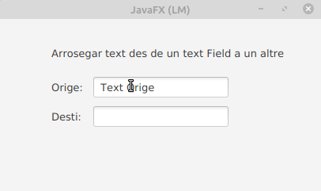

# Java FX - Drag And Drop

# Exemple 

Un gest de pressionar, arrossegar i soltar

Existeixen diferents tipus de gestos de pressionar, arrossegar i soltar. Al principi discutirem el **gest simple de pressionar-arrossegar-soltar** i el** gest complet de pressionar-arrossegar-soltar**.

Anem a basar-nos amb el exemple que podem observar en la següen imatge:

## Un simple gest de pressionar, arrossegar i soltar

El simple gest de pressionar, arrossegar i soltar és el gest d'arrossegar predeterminat. S'utilitza quan el gest d'arrossegar implica només un node (el node en el qual es va iniciar el gest). Durant el gest d'arrossegament, tots els tipus de MouseDragEvent (arrossegar amb el mouse ingressat, arrossegar el mouse sobre, arrossegar el mouse per a eixir, i soltar l'acció d'arrossegar el mouse) s'envien només al node d'origen del gest. 

Quan es pressiona el botó del mouse, se selecciona el Node superior i **tots els esdeveniments posteriors del mouse s'envien a aqueix node fins que se solta el botó del mouse**.

**Quan s'arrossega el mouse a un altre Node, el Node en el qual es va iniciar el gest encara està davall del cursor** i, per tant, cap altre node rep els esdeveniments fins que se solta el botó del mouse.

L'explicació anterior demostra un cas del simple gest de pressionar, arrossegar i soltar. 

Afegeim dos nodes diferents de la classe TextField a una escena. Un es diu node d'origen (source) i l'altre node de destinació (target). El node de destí afegeix controladors `MouseDragEvent` per a detectar qualsevol esdeveniment d'arrossegament del mouse en ell.

Tinga en compte que l'esdeveniment de detecció d'arrossegament es genera una vegada després d'arrossegar el mouse. L'objecte `MouseEvent` té un indicador `dragDetect`, que es pot configurar en els esdeveniments `mouse-pressed` i `mouse-dragged`. Si s'estableix en vertader, l'esdeveniment subsegüent que es genera és l'esdeveniment de `drag-detect`. El valor predeterminat és generar-lo després de l'esdeveniment `mouse-dragged`. Si desitja generar-ho després de l'esdeveniment `mouse-pressed`, i no depres de l'esdeveniment `mouse-dragged`, ha de modificar els controladors d'esdeveniments:

Els mètodes que es poden utilitzar per crear un event com aquest son els següents. En la següent llista es poden veure més métodes dels esencialment necessaris:

- **setOnMousePressed**: Defineix una funció que es crida quan es pressiona un botó del mouse en aquest Node.
- **setOnMouseReleased**: Defineix una funció que es crida quan es solta un botó del mouse en aquest Node.
- **setOnMouseDragged**: Defineix una funció que es crida quan es **pressiona un botó** del mouse en aquest Node **i despres s'arrosega**.
- **setOnDragDetected**: Defineix una funció que es crida quan es **detecta** un gest d'arrossegament.
- **setOnMouseDragEntered**: Defineix una funció que es cridarà quan un gest complet de *pressionar, arrossegar i soltar* **ingresa** a aquest node.
- **setOnMouseDragOver**: Defineix una funció que es cridarà quan un gest d'arrosegament **progresa** dintre d'aquest node.
- **setOnMouseDragReleased**: Defineix una funció que es cridarà quan finalitza un gest complet de *pressionar, arrossegar i soltar* (soltar el botó del mouse) dintre d'aquest node.
- **setOnMouseDragExited**: Defineix una funció que es cridarà quan un gest complet de *pressionar, arrossegar i soltar* **abandona** aquest node.

A continuació es pot observar la part del codi on es defineixen les funcions activades per un event del mouse. (No està la resta del codi).

~~~
//quan fem click en el botó del ratolí.
        textSource.setOnMousePressed(new EventHandler <MouseEvent>()
        {
            public void handle(MouseEvent event)
            {
                textSource.setMouseTransparent(true);
                System.out.println("Event en Orige: mouse pressed");
                event.setDragDetect(true);
            }
        });

        //QWuan soltem botó del ratolí.
        textSource.setOnMouseReleased(new EventHandler <MouseEvent>()
        {
            public void handle(MouseEvent event)
            {
                textSource.setMouseTransparent(false);
                System.out.println("Event en Orige: mouse released");
            }
        });

        //funció que es crida una vegada cada vegada que el mouse es mou mentres es té el bot´o apretat.
        textSource.setOnMouseDragged(new EventHandler <MouseEvent>()
        {
            public void handle(MouseEvent event)
            {
                System.out.println("Event en Orige: mouse dragged");
                event.setDragDetect(false);
            }
        });

        // detecta inici d'arrosegament.
        textSource.setOnDragDetected(new EventHandler <MouseEvent>()
        {
            public void handle(MouseEvent event)
            {
                System.out.println("Event en Orige: drag detected");
                textSource.startFullDrag();
            }
        });

        //es cridat quan un event que està sent arrosegat, entra en el node. s'utilitza en el node detí.
        textTarget.setOnMouseDragEntered(new EventHandler <MouseDragEvent>()
        {
            public void handle(MouseDragEvent event)
            {
                System.out.println("Event en destí: mouse dragged");
            }
        });

        //defineix la funció quan el gest d'arrosegament progresa en el node.
        textTarget.setOnMouseDragOver(new EventHandler <MouseDragEvent>()
        {
            public void handle(MouseDragEvent event)
            {
                System.out.println("Event en destí: mouse drag over");
            }
        });

        //Aquesta funció s'activa quan es solta el botó despres del gest del event drag and drop
        textTarget.setOnMouseDragReleased(new EventHandler <MouseDragEvent>()
        {
            public void handle(MouseDragEvent event)
            {
                textTarget.setText(textSource.getSelectedText());
                System.out.println("Event en destí: mouse drag released");
            }
        });

        //Defineix una funció que es cridará quan un gest complet de Drag&Drop ha abandonat aquest node.
        textSource.setOnMouseDragExited(new EventHandler <MouseDragEvent>()
        {
            public void handle(MouseDragEvent event)
            {
                System.out.println("Event en destí: mouse drag exited");
            }
        });
~~~

Examples:

- Text: https://examples.javacodegeeks.com/desktop-java/javafx/event-javafx/javafx-drag-drop-example/

- images: https://www.youtube.com/watch?v=Ulp1Kimblg0
    El tinc fet en el intellij idea
    

[back](../../javafx.html)