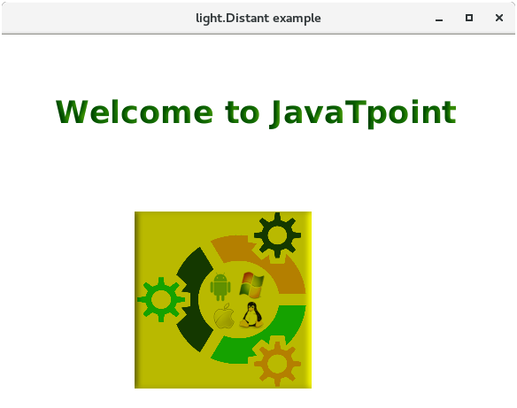
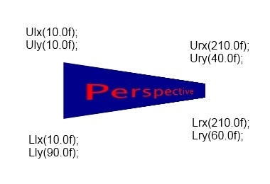

# Java FX - Effects

Un efecte és qualsevol acció en una imatge gràfica per a crear una altra imatge gràfica. Un dels efectes que sol trobar és l'efecte de desenfocament de moviment, efecte d'ombra paral·lela, etc.

Exemple d'efecte Motion Blur (desenfocament de moviment):

Efecte d'ombra paralel·la:

En JavaFX, es pot usar un efecte per a un objecte de tipus Node a través del mètode Node.setEffect (efecte).

JavaFX ha creat algunes classes d'efectes, per a diferents efectes, tots els quals estan en el paquet javafx.scene.effect. A continuació hi ha algunes classes en aquest paquet.

- Blend
- Bloom
- BoxBlur
- ColorAdjust
- ColorInput
- DropShadow
- GaussianBlur
- Glow
- ImageInput
- InnerShadow
- Lighting
- MotionBlur
- PerspectiveTransform
- Reflection
- SepiaTone
- Shadow

JavaFX proporciona un mètode anomenat setEffect() que ha de dir-se a través d'un objecte de node. Necessitem passar l'objecte de classe d'efecte a aquest mètode. Per a aplicar qualsevol efecte al node, hem de seguir els següents passos.

- Crea el node
- Crea l'objecte de la classe d'efecte respectiva que s'aplicarà en el node.
- Estableix les propietats de l'efecte.
- Cridea al mètode setEffect() a través de l'objecte de node i passa l'objecte de classe d'efecte en ell.

A continuació es mostra un efecte exemple amb cadascún dels efectes:

## Blend

En general, el blend effect produeix l'eixida que es genera com a resultat de la mescla de dues o més nodes d'entrada diferents. Presa els píxels de dos o més nodes, els mescla segons la manera de fusió aplicat i produeix el node d'eixida en la mateixa ubicació.

Si les dues imatges se superposen, la manera de fusió s'aplica en l'àrea superposada de totes dues imatges.

- Propietats

    - **setBottomInput(Effect value)**:  L'entrada inferior per a l'operació de mescla. Aquesta és una propietat de tipus d'objecte. 
    - **setMode(BlendMode value)**: La manera segons el qual, les entrades es mesclen.
    - **setOpacity(double value)**: opacitat Aquest és el valor d'opacitat de tipus doble. 
    -  **setTopInput(Effect Value)**: L'entrada superior per a l'operació de mescla. setTopInput 

- Constructors

Hi ha tres constructors en aquesta classe.

- **Blend ()**: crea una instància de la classe Blend amb els valors predeterminats.
- **Blend(BlendMode mode)**: instanciar la classe Blend amb la manera especificada
- **Blend(BlendMode mode, Effect BottomInput, Effect TopInput)**: crea una instància de la classe Blend amb la manera de fusió especificat, l'efecte d'entrada inferior i l'efecte d'entrada superior

### Blendmodes

- **Add**:  Els components de color de l'entrada superior s'agreguen als de l'entrada inferior. 

- **Blue**: Els components blaus de l'entrada inferior es reemplacen pel component blau de l'entrada superior. 

- **COLOR_BURN**: El color d'entrada inferior s'inverteix i es divideix pels components de color d'entrada superior. El resultat s'inverteix novament per a obtindre el color d'eixida

- **COLOR_DODGE**: Els components de color superior s'inverteixen i divideixen els components de color inferior per a produir el color d'eixida.

- **DARKEN**: El color més fosc dels dos colors del component d'entrada se selecciona per a produir el color resultant.

- **DIFFERENCE**: El més fosc dels dos colors d'entrada es resta del color més clar per a produir el color resultant.

- **EXCLUSION**: Els dos components de color d'entrada es multipliquen i dupliquen i després es resten de la suma dels components de color de fons per a produir el color desitjat.

- **GREEN**: El component verd de l'entrada inferior es reemplaça per l'entrada verda del component superior.

- **HARD_LIGHT**: Els components de color d'entrada es multipliquen o se seleccionen segons el color de fons. 

- **LIGHTEN**: El color més clar dels dos components de color es produeix com a eixida.

- **MULTIPLY**: Tots dos components de color es multipliquen per a produir el color d'eixida.

- **OVERLAY**: Els components de color d'entrada es filtren o multipliquen segons el color de fons. 

- **RED**: Els components rojos de l'entrada inferior es reemplacen amb els components rojos de l'entrada superior. 

- **SCREEN**: Tots dos components de color s'inverteixen, multipliquen i tornen a invertir per a produir el resultat desitjat. 

- **SOFT_LIGHT**: Els components de color d'entrada s'aclareixen o enfosqueixen. 

- **SRC_ATOP**: La part de l'entrada superior que es troba sobre l'entrada inferior es combina.

- **SRC_OVER**: L'entrada superior es combina amb l'entrada inferior.

## Bloom

L'efecte Bloom s'usa per a il·luminar píxels d'algunes de les parts de l'escena. Està representat per la classe javafx.scene.effect.Bloom. Aquesta classe conté diverses propietats que es poden establir en uns certs valors per a aplicar els efectes apropiats.

- Propietats

    - **setInput(Effect value)**: Aquesta propietat és de tipus efecte. S'utilitza per a proporcionar una entrada a aquest efecte de lluentor. 
    - **setThresholf(Double value)**: Aquesta propietat és del tipus doble. És un valor mínim per a la lluminositat dels píxels. 

- Constructors

    - **Bloom()**: crea una nova instància de la classe Bloom amb els paràmetres predeterminats.
    - **Bloom(Double Threshold_Value)**: crea una nova instància de la classe Bloom amb els paràmetres especificats.

La imatge mostra l'efecte bloom en el llindar predeterminat i en un llindar d'1.0.

## Blur Effects

El desenfocament són efectes comuns que es poden usar per a proporcionar més enfocament als objectes seleccionats. Amb JavaFX pot aplicar un quadre borrós, un desenfocament de moviment o un desenfocament gaussià.

### BoxBlur

JavaFX ens permet fer que els nodes es difuminen utilitzant els efectes de desenfocament de JavaFX. En general, el desenfocament fa que la imatge siga poc clara. JavaFX proporciona la classe javafx.scene.effect.BoxBlur que deu instanciarse per a aplicar l'efecte de desenfocament als nodes. El filtre Box s'utilitza en el cas de l'efecte BoxBlur en JavaFX.

- Propietats:

    - **setHeight(double value)**: Aquesta és una propietat de tipus doble. Representa l'altura de l'efecte de desenfocament. 
    - **setWidth(double value)**: Aquesta és una propietat de tipus doble. Representa l'ample de l'efecte de desenfocament. 
    - **setInput(Effect value)**: Aquesta propietat és de tipus Effect. Això representa l'entrada de l'efecte. 
    - **setIterations(int value)**: Representa el nombre de repeticions de l'efecte de desenfocament. Aquest és de tipus sencer.

- Constructors

- **BoxBlur()**: crea la nova instància amb el valor predeterminat de propietats.
- **BoxBlur(Double width, Double height, int iterations)**: crea la nova instància amb els valors especificats.

La Figura mostra dues mostres de text borrós.

### Motion Blur

MotionBlur és similar a aquest efecte de desenfocament gaussià. L'efecte de desenfocament de moviment també s'usa per a desenfocar els nodes. L'única diferència entre l'efecte Desenfocament gaussià i l'efecte Desenfocament de moviment és que l'efecte de desenfocament de moviment utilitza l'angle especificat amb el qual es desenfocaran els nodes.

Com suggereix el seu nom, en aplicar aquest efecte, es veu que el node està en moviment. La classe javafx.scene.effect.MotionBlur representa l'efecte motionblur. S'ha de crear una instància d'aquesta classe per a generar l'efecte apropiat.

- Propietats

    - **setAngle(Double value)**: Representa l'angle de l'efecte de moviment. És una propietat de tipus doble. 
    - **setInput(Effect value)**: Representa l'entrada de l'efecte. És una propietat de tipus d'objecte Effect. 
    - **setRadius(Double radius)**: Representa el radi del kernel de desenfocament. És una propietat de tipus doble. 

- Constructors

    - **MotionBlur()**: crea una instància de la classe motionblur amb els paràmetres predeterminats.
    - **MotionBlur(double angle, double radius)**: crea una instància de la classe MotionBlur amb l'angle i el radi especificats.

### Gausian Blur

L'efecte GaussianBlur és molt similar a aquest efecte BoxBlur. L'única diferència entre tots dos és que l'efecte GaussianBlur usa un kernel de convolució gaussià per a desenfocar els nodes. No obstant això, JavaFX proporciona la classe javafx.scene.effect.GaussianBlur per a implementar GaussianBlur en els nodes. S'ha de crear una instància d'aquesta classe per a aplicar un efecte apropiat en el node.
Propietats

- Propietat:

    - **setInput(Effect value)**: Aquesta propietat és de tipus efecte. Representa l'entrada de l'efecte. 
    - **setRadius(Double value)**: Aquesta propietat és de tipus doble. Representa el radi del kernel de desenfocament.

- Constructors

    - **GaussianBlur()**: crea la nova instància amb el valor predeterminat dels paràmetres.
    - **GaussianBlur(double radius)**: crea una nova instància amb el valor especificat dels paràmetres.

## ColorAdjust

JavaFX ens permet ajustar el color d'una imatge ajustant les propietats com el to, la saturació, la lluentor i el contrast del color de la imatge. La classe javafx.scene.effect.ColorAdjust conté diverses propietats i mètodes que es poden usar per a aplicar l'efecte ColorAdjust en el node.

- Propietats

    - **setBrightness(double value)**: realitzada en la lluentor del color. És una propietat de doble tipus. 
    - **setContrast(double value)** Ajust realitzat en contrast del color.
    - **setHue(double value)**: Ajust de matís realitzat en tinte del color. 
    - **setInput(double value)**: Valor d'entrada per a l'efecte. 
    - **setSaturation(double value)**:  Ajust realitzat en la saturació del color. 

- Constructors

    - **ColorAdjust()**: crea la nova instància de ColorAdjust amb els paràmetres predeterminats.
    - **ColorAdjust(double hue, double saturation, double brightness, double contrast)**: crea la nova instància de ColorAdjust amb els paràmetres especificats.

## ColorInput

ColorInput produeix una eixida similar a un rectangle acolorit. No mostra el node sinó el quadre rectangular. Es passa principalment als altres efectes com a entrada. La classe javafx.scene.effect.ColorInput representa l'efecte ColorInput. L'objecte d'aquesta classe es passa com a entrada per als altres efectes.

- Propietats

    -  **setHeight(double value)**: És de doble tipus. Representa l'altura de la regió que s'omplirà. 
    - **setPaint(Paint value)**: Representa la pintura amb la qual s'emplenarà la regió.
    - **setWidth(double value)**: És de doble tipus. Representa l'ample de la regió que s'omplirà.
    - **setX(double value)**: Representa la coordenada X de la cantonada superior esquerra de la regió.
    - **setY(double value)**: Representa la coordenada Y de la cantonada superior esquerra de la regió.

- Constructors

    - **ColorInput()**: crea una nova instància de ColorInput amb els paràmetres predeterminats.
    - **ColorInput(double x, double y, double width, double height, Paint paint)**: crea una nova instància de ColorInput amb els paràmetres especificats.

## Glow

Igual que l'efecte Bloom, l'efecte Glow també s'usa per a il·luminar els píxels de la imatge. No obstant això, fa que la imatge siga molt més brillant. La classe javafx.scene.effect.Glow representa l'efecte Glow. La classe conté diverses propietats que es poden establir en uns certs valors per a aplicar l'efecte apropiat.

- Propietats

    - **setInput(Effect value)**: Això representa l'entrada per a l'efecte. Aquesta és una propietat de tipus d'objecte de classe effect.
    - **setLevel(double value)**: Representa un valor que controla la intensitat de l'efecte de lluentor en el node. 

- Constructors

    - **Glow()**: és el constructor predeterminat. Instància la classe amb els paràmetres predeterminats.
    - **Glow(double level)**: crea la instància amb el valor de nivell especificat.

## ImageInput

Aquest efecte s'utilitza principalment per a passar la imatge no modificada com a entrada per als altres efectes. La classe javafx.scene.effect.ImageInput representa l'efecte ImageInput. Aquesta classe conté diverses propietats que es poden establir en un determinat valor per a representar una imatge adequada.

- Propietats
    - **setSource(Image image)**: URL d'origen de la imatge d'origen. 
    -  **setX(Double value)**: La coordenada X del conjunt d'imatges
    - **setY(Double value)**: La coordenada Y del conjunt d'imatges Y

- Constructors

    - **ImageInput()**: instància la classe ImageInput amb els paràmetres predeterminats.
    - **ImageInput(Image source)**: crea una instància de ImageInput amb la font d'imatge especificada.
    - **ImageInput(Image source, Double X, Double Y)**: crea una instància de ImageInput amb la font d'imatge predeterminada i les coordenades especificades

## Shadow

Com suggereix el seu nom, aquest efecte crea l'ombra del node duplicant el node i fent que les seues vores es tornen borrosos. La classe denominada javafx.scene.effect.Shadow representa l'efecte d'ombra. Només necessitem crear una instància d'aquesta classe per a generar un efecte d'ombra apropiat.

- Propietats

    - **setBlurType(BlurType value)**: Aquesta és una propietat de tipus de desenfocament. Això representa l'algorisme que s'utilitza per a difuminar l'ombra. 
    - **setColor(Color value)**: Aquesta és la propietat de tipus de color. Representa el color de l'ombra. 
    - **setHeight(double value)**: Representa la grandària vertical de l'ombra borrosa. 
    - **setInput(Effect value)**: Representa l'entrada per a aquest efecte. 
    - **setRadius(double value)**: Representa el radi de l'ombra. 
    - **setWidth(double value)**: Representa la grandària horitzontal de l'ombra borrosa. 

- Constructors

    - **Shadow()**: crea una nova instància amb els paràmetres predeterminats
    - **Shadow(double radius, Color color)**: crea una nova instància amb el radi i el color especificats.
    - **Shadow(BlurType blurtype, Color color, double radius)**: crea una nova instància amb el radi, color i tipus de desenfocament especificats.

### DropShadow

Aquest efecte és similar a aquest efecte d'ombra. No obstant això, en DropShadow, el duplicat del node es mostra darrere del node original amb la grandària i color especificats. La classe javafx.scene.effect.DropShadow representa l'efecte DropShadow. Només necessitem crear una instància d'aquesta classe per a generar un efecte apropiat.

- Propietats

    - **setBlurType(BlurType value)**: Això representa l'algorisme utilitzat per a difuminar l'ombra. 
    - **setColor(Color value)**: El color del kernel de desenfocament d'ombra. Aquesta propietat és de tipus de color. 
    - **setHeight(Double value)**: Representa l'altura del kernel de difuminat d'ombres. Aquesta propietat és de tipus doble. 
    - **setInput(Effect value)**: Això representa l'entrada per a l'efecte. 
    - **setOffsetX(Double value)**: Això representa la coordenada X del desplaçament d'ombra. Això pròpiament és de tipus doble. 
    - **setOffsetY(Double value)**: Això representa la coordenada I del desplaçament d'ombra. Aquesta propietat és de tipus doble. 
    - **setRadius(Double value)**: Representa el radi del kernel de difuminat d'ombres. 
    - **setSpread(Double value)**: Representa l'extensió del kernel de difuminat d'ombres. És de tipus doble. 
    - **setWidth(double value)**: Representa l'ample del kernel de difuminat d'ombres. 

- Constructors

    - **DropShadow()**: Crea la instància amb els paràmetres predeterminats.
    - **DropShadow(double radius, Color color)**: Crea la instància amb els valors de radi i color especificats.
    - **DropShadow(double radius, double offsetX, double offsetY, Color color)**: Crea la instància amb els valors de radi, offset i color especificats.
    - **DropShadow(BlurType blurtype, Color color, double radius, double spread, double offsetX, double offsetY)**: Crea la instància amb els valors de BlurType, color, ràdio, extensió i compensació especificats.

> Fer que l'ombra paral·lela siga massa ampla li dóna a l'element l'aparença de pesadesa. El color de l'ombra ha de ser realista, generalment uns tons més clars que el color de fons.
Si té diversos objectes amb ombres paral·leles, oriente l'ombra paral·lela de la mateixa manera per a tots els objectes. Una ombra paral·lela dóna l'aparença d'una llum que prové d'una direcció i projecta una ombra sobre els objectes.

### InnerShadow

En aplicar aquest efecte al node, l'ombra es mostra dins de les vores del node. La classe javafx.scene.effect.InnerShadow representa l'efecte InnerShadow. Només necessitem crear una instància d'aquesta classe per a generar un efecte apropiat.

Propietats

    - **setBlurType(BlurType value)**: Això representa l'algorisme utilitzat per a difuminar l'ombra.
    - **setChoke(Double value)**: Aquesta propietat és de tipus doble. Això representa l'escanyament de l'ombra.
    - **setColor(Color value)**: El color del kernel de desenfocament d'ombra. Aquesta propietat és de tipus de color. 
    - **setHeight(Double value)**: Representa l'altura del kernel de difuminat d'ombres. Aquesta propietat és de tipus doble. 
    - **setInput(Effect value)**: Això representa l'entrada per a l'efecte.
    - **setOffsetX(Double value)**: Això representa la coordenada X del desplaçament d'ombra. Això pròpiament és de tipus doble.
    - **setOffsetY(Double value)**: Això representa la coordenada I del desplaçament d'ombra. Aquesta propietat és de tipus doble.
    - **setRadius(Double value)**: Representa el radi del kernel de difuminat d'ombres.
    - **setWidth(double value)**: Representa l'ample del kernel de difuminat d'ombres.

- Constructors

    - **InnerShadow()**: crea la instància amb els paràmetres predeterminats.
    - **InnerShadow(double radius, Color color)**: crea la instància amb el radi i el valor de color especificats.
    - **InnerShadow(double radius, double offsetX, double offsetY, Color color)**: crea la instància amb els valors de radi, offset i color especificats.
    - **InnerShadow(BlurType blurtype, Color color, double radius, double choke, double offsetX, double offsetY)**: crea la instància amb el BlurType especificat. Valors de color, ràdio, escanyament i desplaçament.

## Light Effects

Aquest efecte s'utilitza per a il·luminar un node des d'una font de llum. Hi ha diversos tipus de fonts de llum, és a dir, puntuals, distants i puntuals. La classe javafx.scene.effect.Lighting representa l'efecte d'il·luminació. Necessitem crear una instància d'aquesta classe per a generar un efecte apropiat en el node.

Propietats

    - **setBumpInput(Effect value)**: És una propietat de tipus d'objecte d'efecte. Representa l'entrada del mapa de relleu per a l'efecte. 
    - **setContentInput(Effect value)**: És una propietat de tipus d'objecte Effect. Representa l'entrada de contingut per a l'efecte. 
    - **setDiffuseConstant(Double value)**: És una propietat de tipus Double. Representa la constant difusa. 
    - **setLight(Light value)**: És una propietat de tipus d'objecte Light. Representa la font de llum de l'efecte. 
    - **setSpecularConstant(double value)**: És una propietat de tipus doble. Representa la constant especular. 
    - **setSpecularExponent(double value)**: És una propietat de tipus doble. Representa l'exponent especular. 
    - **setSurfaceScale(double value)**: És una propietat de tipus doble. Representa l'escala de superfície de la llum. 

- Constructors

    - **Lighting()**: crea una nova instància d'Il·luminació amb el valor predeterminat de font de llum.
    - **Lighting(Light light)**: crea una nova instància d'Il·luminació amb el valor especificat de font de llum.

### Light.Distant Effect

En aquest efecte, el node s'il·lumina des d'una font de llum distant. La font de llum distant és la que es manté a una distància considerable de l'objecte i la llum s'atenua en una direcció des de la font fins a l'objecte. En JavaFX, la classe javafx.scene.effect.Light.Distant representa la font de llum distant. Necessitem crear una instància d'aquesta classe per a generar la llum adequada en el node.

- Propietats

    - **setAzimuth(double value)**: Aquesta propietat és del tipus double i representa l'azimut de la llum. 
    - **setAlivation(double value)**: Aquesta propietat és de tipus doble i representa l'elevació de la llum. 

- Constructors

    - Light.Distant(): crea la nova instància de la classe amb els paràmetres predeterminats.
    - Light.Distant(double azimuth, double elevation, Color color): crea la nova instància de la classe amb els paràmetres especificats.

### Light.Spot Effect

Aquest efecte il·lumina el node mitjançant una font de llum puntual. La font de llum puntual és aquella la llum de la qual s'atenua en totes les direccions. La intensitat de la font de llum depén de la distància entre la font de llum i el node. La classe javafx.scene.effect.Light.Espot representa aquest efecte. Només necessitem crear una instància d'aquesta classe per a generar la llum adequada en el node.

Propietats

    - **setPointsAtX(double value)**: Aquesta és una propietat de tipus doble. Representa la coordenada X del vector de direcció de la llum 
    - **setPointsAtY(double value)**: Aquesta és una propietat de tipus doble. Representa la coordenada I del vector de direcció de la llum 
    - **setPointsAtZ(double value)**: Aquesta és una propietat de tipus doble. Representa la coordenada Z del vector de direcció de la llum. 
    - **setSpecularExponent(double value)**: Aquesta és una propietat de tipus doble. Representa el component especulatiu. S'utilitza per a alterar l'enfocament de la font de llum. 

- Constructors

    - **Light.Espot()**: crea una nova instància amb els paràmetres predeterminats.
    - **Light.Spot(double x, double y, double z, double specularexponent, color color)**: crea una nova instància amb els paràmetres especificats.

### Light.Point Effect

En aquest efecte d'il·luminació, la font de llum rep una determinada posició en l'espai 3D. Com suggereix el nom, la font de llum està situada en un punt determinat i els nodes estan units per a il·luminar-se des d'aqueixa font en particular. La classe javafx.scene.effect.Light.Point representa aquesta font de llum. Necessitem crear una instància d'aquesta classe per a generar la il·luminació adequada en el node.

- Propietats

    - **setX(Double value)**: És una propietat de tipus doble. Representa la coordenada X de la font de llum.
    - **setY(Double value)**: És una propietat de tipus doble. Representa la coordenada I de la font de llum.
    - **setZ(Double value)**: És una propietat de tipus doble. Representa la coordenada Z de la font de llum. 

- Constructors

    - **Light.Point()**: crea la nova instància amb els paràmetres predeterminats.
    - **Light.Point(double x, double y, double z, Color color)**: crea la nova instància amb les coordenades 3D i el color de llum especificats

## PerspectiveTransform

L'efecte de perspectiva crea un efecte tridimensional d'un altre objecte bidimensional.

Una transformació de perspectiva pot assignar qualsevol quadrat a un altre quadrat, al mateix temps que conserva la rectitud de les línies. A diferència de les transformacions afins, el paral·lelisme de les línies en la font no es conserva necessàriament en l'eixida.

>Aquest efecte no ajusta les coordenades dels esdeveniments d'entrada ni cap mètode que mesure la contenció en un node. El clic del mouse i els mètodes de contenció no estan definits si s'aplica un efecte de perspectiva a un node.

Les coodenades per al effecte de perspectiva, són:

## Reflection

En general, la Reflexió es pot definir com el canvi de direcció. JavaFX ens permet generar l'efecte de reflexió en qualsevol node. L'efecte de reflexió bàsicament agrega la reflexió del node a la seua part inferior. Està representat per la classe javafx.scene.effect.Reflection. Només necessitem crear una instància d'aquesta classe per a aplicar l'efecte apropiat a un node.

- Propietats

    - **setBottomOpacity(double value)**: És una propietat de tipus doble. Representa l'opacitat del reflex en l'extrem inferior. 
    - **setFraction(double value)**: És una propietat de tipus doble. Representa la fracció de l'entrada que es mostrarà en la reflexió. 
    - **setInput(Effect value)**: És una propietat de tipus d'objecte. Representa l'entrada de l'efecte. 
    - **setTopOffset(Double value)**: És una propietat de tipus doble. Representa la distància entre la part superior i inferior del reflex. 
    - **setTopOpacity(Double value)**: Representa l'opacitat del reflex en la part superior de l'entrada. 

- Constructors

    - **Reflection():** crea una nova instància de Reflection amb els paràmetres predeterminats
    - **Reflection(double topOffset, double fraction, double topOpacity, double bottomOpacity)**: Crea una nova instància de Reflection amb els paràmetres especificats

> La reflexió d'un node amb un efecte de reflexió no respondrà als esdeveniments del mouse ni als mètodes de contenció en el node.

## Tó Sepia

L'efecte SepiaTone bàsicament canvia el to de la imatge al color marró vermellós. En JavaFX, la classe javafx.scene.effect.SepiaTone representa l'efecte SepiaTone. Només necessitem crear una instància d'aquesta classe per a generar un efecte apropiat.

- Propietats

    - **setInput(Effect value)**: Aquesta és una propietat de tipus Efecte (Objecte). Representa l'entrada per a aquest efecte.
    - **setLevel(Double value)**: Aquesta és una propietat de tipus doble. Representa el valor de nivell que controla la intensitat de l'efecte sépia.

- Constructors

    - **Sepiatone()**: crea una nova instància amb paràmetres predeterminats
    - **Sepiatone(double level)**: crea una nova instància amb un valor de nivell especificat.

## Crear una cadena d'efectes

Alguns dels efectes tenen una propietat d'entrada que pot usar per a crear una cadena d'efectes. La cadena d'efectes pot ser una estructura en forma d'arbre, perquè alguns efectes tenen dues entrades i altres no.

En la Figura, l'efecte de reflexió s'usa com una entrada per a l'efecte d'ombra paral·lela, la qual cosa significa que primer el rectangle es reflecteix per l'efecte de reflexió i després l'efecte d'ombra paral·lela s'aplica al resultat.

[back](../../javafx.html)
