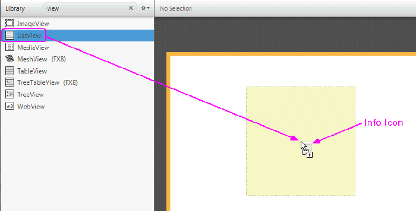
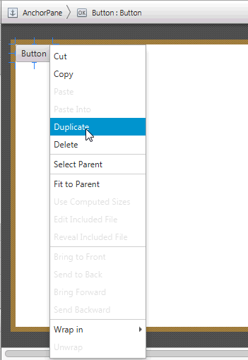

# Java FX -Scene Builder
# Panell de continguts

El panell Contingut és l'àrea rectangular que ocupa el centre de la finestra de JavaFX Scene Builder. Està buit per defecte quan crea un nou arxiu FXML. És el seu llenç de disseny i li dóna una visió del que està dissenyant. Li permet manipular directament els elements gràfics utilitzats en el seu disseny FXML. Una manera d'agregar un element GUI al seu disseny és arrossegar-lo des del panell Biblioteca i col·locar-lo en una ubicació triada en el panell Contingut. 

Els elements seleccionats tenen controladors especials que permeten escalar o canviar la grandària dels elements. Es pot moure l'element seleccionat utilitzant el ratolí per a arrossegar-lo a una ubicació diferent. 
Si fem clic amb el botó dret en qualsevol part del panell Contingut, es mostra un menú contextual de comandos per utilitzar-lo amb l'element seleccionat.

Al fer doble clic a un element GUI en el panell Contingut, aqueix element es troba en una manera d'edició en línia. Si es selecciona un element GUI amb una propietat Text, en pressionar Intro també es col·loca l'element en una manera d'edició en línia.

Els elements de la GUI en els contenidors FlowPane, TextFlow, TilePane, ToolBar, HBox i VBox es poden reordenar. Una línia grisa ho guia amb la ubicació d'ubicació o ordre de l'objecte seleccionat.

[back](../javafx.html)

