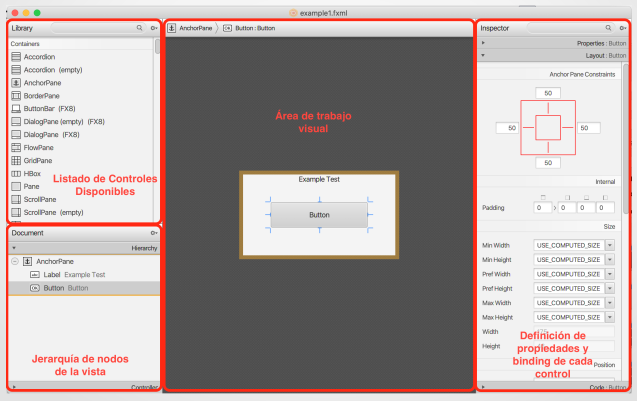
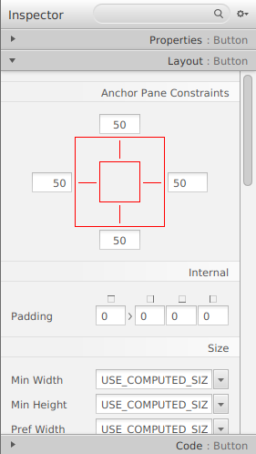
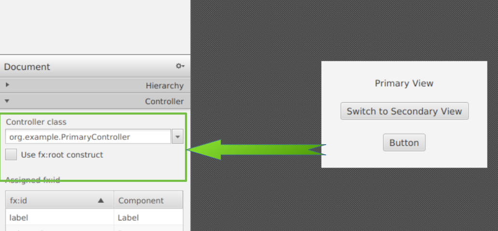
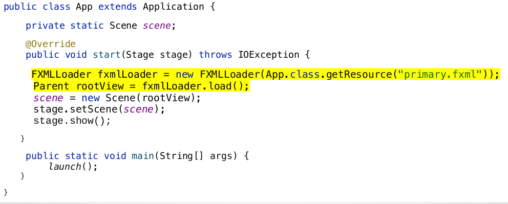
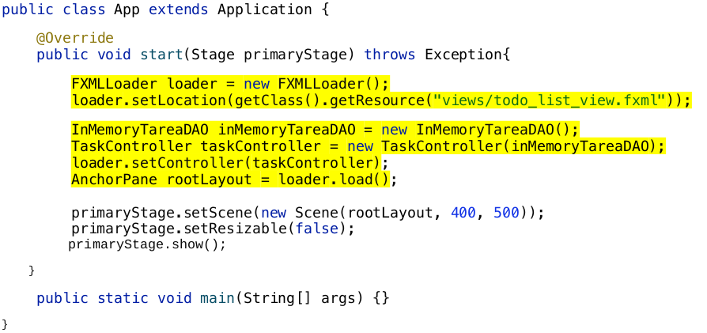
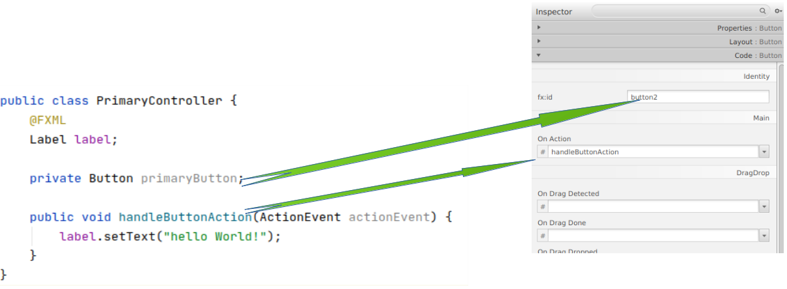

# Java FX -Scene Builder

JavaFX Scene Builder (Scene Builder) és una eina de disseny per a la plataforma JavaFX. Arrossega i solta els components de la interfície d'usuari en un panell de Contingut, i el codi FXML per al disseny que està creant es genera automàticament en segon pla. FXML és un llenguatge de marcat declaratiu basat en XML per a definir la interfície d'usuari en una aplicació JavaFX. Es tracta d'una eina WYSIWYG (What You See Is What You Get).

El disseny d'un programa JavaFX, també podria ferse completament sense una eina gràfica com Scene Builder, però és comprensible que el disseny visual del disseny siga més sencill i més ràpit.

L'interficie gràfica d'usuari es desenvolupa combinant el treball visual i de programació. Per exemple, el disseny bàsic es realitza amb una eina visual i despres s'afegeixen components clarament repetituius en temps d'execució amb codi de programa.

Els arxius amb l'extensió .fxml també es poden obrir i escriure amb qualsevol editor de text, com NotePad ++, i la seua estructura és bastant comprensible. És a dir, bàsicament SceneBuilder és només una opció per a editar un arxiu xml d'un cert format.

### Descarregar

Des de la versió 2.0, oracle va anunciar que no proporcionaria executables. Per lo que la organització GLUON s'encarrega de fer-ho. Pots baixar el SceneBuilder per al nostre Sistema Operatiu des de la seva pàgina de descarregues.

[Descarregues de Scene Builder](https://gluonhq.com/products/scene-builder/#download)

> Es pot trobar el Scene Buildeer incorporat en e IDE, però té menys funcionalitats. 

### Utilitzar
Es pot obrir el Scenen Builder clicant amb botó dret del ratolí en el fitxer fxml i seleccionar obrir amb Scene Builder.
 

  
Per afegir un element dintre de la nostra finestra, sols tenim que triar el control que necesitem i arrosegar fins la zona de treball o també es pot arrosegar al panell de jerarquia de controls.

 
Si es té algun dels elements seleccionats, es pot modificar qualsevol de les seves propietats a través del inspector que trobem a la dreta. 

### Elements

#### Inspector

En el inspector podem diferenciar 3 seccions:

- **Propietats**: Ens permet definir l'estil dels components seleccionats.
- **Layouts**: Comportament del element respecte al layout que el inclou.
- **Code**: Ens permet definir els enllaços entre la interficie gràfica i el controlador de cada element: *listener*, identificador, ...

  
#### Asociar la vista al controlador. 
  
Es pot realitzar de dos formes diferents:
- Des de la vista fxml: s'instancia al controlador des del objecte de forma automàtica (presenta alguna restricció).

- No es necessari especificar el controlador al carregar la vista:

- Definició del controlador al carregar la vista: ens permet pasar qualsevol dependencia que necessite el controlador a partir dels parametres formals del constructor.

per associar els nodes utilitzats en el nostre disseny i els gestor d'events, podem definir-los des de la part de **code** del menu **inspector**:

En els seguents apartats es definirà en més deteniment els elements que tenen en el seu interior els apartats definits anteriorment.

[back](../javafx.html)

