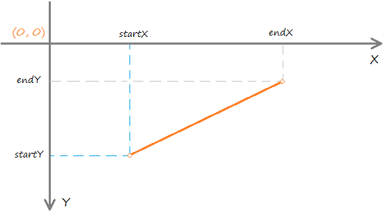
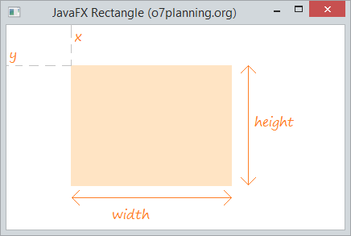
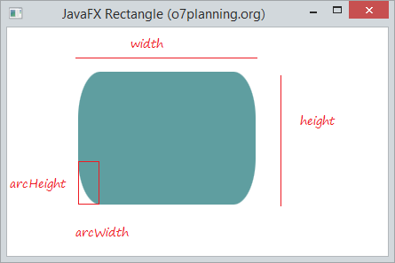

# Java FX - Shape

## Line

Line és part de JavaFX. La classe Line representa una línia en un espai 2D.

Constructor per a la classe:

- **Line()**: crea una nova instància per a la línia
- **Line(double startX, double startY, double endX, double endY)**: crea una nova línia amb punt fix i final especificat

En JavaFX, la classe Line s'usa per a dibuixar una línia recta. Igual que la classe Rectangle, Cercle, ... tots s'estenen des de la classe Shape.

Els métodes més utilitzats són:

- **getEndX()**: retorna la coordenada x per al punt final
- **getEndY()**: retorna la coordenada y per al punt final
- **getStartX()**: retorna la coordenada x per al punt d'inici
- **getStartY()**: retorna la coordenada y per al punt d'inici
- **setEndX(double value)**: estableix la coordenada x per al punt final
- **setEndY(double value)**: estableix la coordenada i per al punt final
- **setStartX(double value)**: estableix la coordenada x per al punt d'inici
- **setStartY(double value)**: estableix la coordenada i per al punt d'inici

## Rectangle

La classe Rectangle crea un rectangle amb ample, altura i posició especificats.
De manera predeterminada, Rectangle té cantonades afilades, però les vores es poden arredonir aplicant una altura i ample d'arc.

Constructor:

- **Rectangle()**: crea una instància buida de rectangle
- **Rectangle(doble w, doble h)**: crea un rectangle amb un ample i alt especificats
- **Rectangle(doble x, doble i, doble w, doble h)**: crea un rectangle amb un ample, altura i posició especificats
- **Rectangle(doble w, doble h, Pintura f)**: crea un rectangle amb un ample i alt especificats i farcit

Mètodes més comuns:

- **getArcHeight()**: retorna l'altura de l'arc del rectangle
- **getArcWidth()**: retorna l'ample d'arc del rectangle
- **getHeight()**: retorna l'altura del rectangle
- **getWidth()**: torna a executar l'ample del rectangle
- **getX()**: Obté el valor de la propietat x.
- **getY()**: Obté el valor de la propietat i.
- **setArcHeight(double v)**: estableix l'altura de l'arc del rectangle
- **setArcWidth(double v)**: estableix l'ample de l'arc del rectangle
- **setHeight(double value)**: estableix l'altura del rectangle
- **setWidth(double value)**: estableix l'ample del rectangle
- **setX(double value)**: estableix la coordenada x de la posició del rectangle
- **setY(double value)**: estableix la coordenada i de la posició del rectangle

Acontinuació podem veure un rectangle amb les vores arredonides.

## El·lipse

La classe el·lipse crea una el·lipse en proporcionar el centre i el radi X e Y. La classe El·lipse estén la classe Shape.

Els constructors de la classe són:

- **Ellipse()**: crea una instància buida de ellipse
- **Ellipse(doble X, doble I)**: crea una el·lipse amb el radi x e i donat
- **Ellipse(doble x, doble i, doble X, doble I)**: crea una el·lipse amb centre i radie daus

**getCenterX()**: retorna la coordenada X del centre de l'el·lipse
**getCenterY()**: retorna la coordenada I del centre de l'el·lipse
**getRadiusX()**: retorna el valor de X Ràdio (al llarg de l'eix major)
**getRadiusY()**: retorna el valor de Radi I (al llarg de l'eix menor)
**setCenterX(double v)**: estableix la coordenada X del centre de l'el·lipse
**setCenterY(double v)**: estableix la coordenada I del centre de l'el·lipse
**setRadiusX(double v)**: retorna el valor de X Ràdio (al llarg de l'eix major)
**setRadiusY(double v)**: retorna el valor de Radi I (al llarg de l'eix menor)
**setFill(Color c)**: estableix el farciment de l'el·lipse

[back](../../javafx.html)