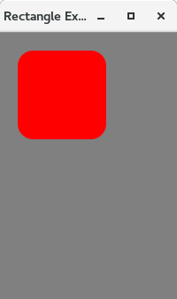
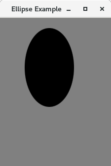
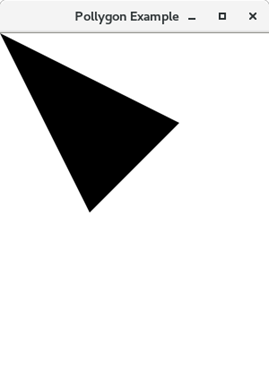
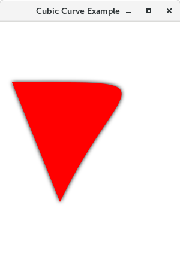

# Java FX - Formes 2D

En algunes de les aplicacions, necessitem mostrar formes bidimensionals a l'usuari. No obstant això, JavaFX ofereix la flexibilitat de crear les nostres pròpies formes 2D en la pantalla.

Hi ha diverses classes que es poden utilitzar per a implementar formes 2D en la nostra aplicació. Totes aquestes classes resideixen en el paquet javafx.scene.shape.

Aquest paquet conté les classes que representen diferents tipus de maneres 2D. Hi ha diversos mètodes en les classes que s'ocupen de les coordenades relacionades amb la creació de maneres 2D.

### Què són les formes 2D?

En general, una forma bidimensional es pot definir com la figura geomètrica que es pot dibuixar en el sistema de coordenades que consta de plans X e Y. Tanmateix, això és diferent de les formes 3D en el sentit que cada punt de la forma 2D sempre consta de dues coordenades (X, Y).

Usant JavaFX, podem crear formes 2D com a Línia, Rectangle, Cercle, El·lipse, Polígon, Corba cúbica, corba quàdruple, Arc, etc. La classe javafx.scene.shape.Shape és la classe base per a totes les classes de formes.

### Com crear formes 2D?

Com esmentem anteriorment, cada forma està representada per una classe específica del paquet javafx.scene.shape. Per a crear una forma bidimensional, s'han de seguir les següents instruccions.

1. Creu una instància de la classe respectiva: per
 exemple, `Rectangle rect = new Rectangle()`

2. Estableix les propietats necessàries per a la classe utilitzant mètodes d'establiment d'instàncies: per exemple,

~~~
rect.setX (10);
rect.setY (20);
rect.setWidth (100);
rect.setHeight (100);
~~~

3. Afegeix un objecte de classe al disseny de grup: per exemple,

~~~
Group root = new Group();
     root.getChildren().add(rect);
~~~

Seguidament es mostren de les classes de formes JavaFX juntament amb les seues descripcions.

- **Línia** En general, Línia és la figura geomètrica que uneix dos punts (X, Y) en un sistema de coordenades 2D. En JavaFX, és necessari crear una instància de la classe javafx.scene.shape.Line per a crear línies.
- **Rectangle** En general, Rectangle és la figura geomètrica amb dos parells de dos costats iguals i quatre angles rectes en la seua unió. En JavaFX, és necessari crear una instància de la classe javafx.scene.shape.Rectangle per a crear Rectangles.
- **El·lipse** En general, l'el·lipse es pot definir com una corba amb dos punts focals. La suma de les distàncies als punts focals és constant des de cada punt de l'el·lipse. En JavaFX. S'ha de crear una instància de la classe javafx.scene.shape.Ellipse per a crear Ellipse.
- **Arc** es pot definir com la part de la circumferència del cercle de l'el·lipse. En JavaFX, s'ha de crear una instància de la classe javafx.scene.shape.Arc per a poder crear Arcs.
- **Cercle** Un cercle és el tipus especial d'El·lipse que té tots dos punts focals en la mateixa ubicació. En JavaFX, Circle es pot crear instanciando la classe javafx.scene.shape.Circle.
- **Polígon** Polígon és una figura geomètrica que es pot crear unint els múltiples segments de línia del Co-planificador. En JavaFX, javafx.scene.shape. És necessari crear una instància de la classe Pollygon per a crear un polígon.
- **Corba cúbica** Una corba cúbica és una corba de grau 3 en el pla XY. En Javafx, s'ha de crear una instància de la classe javafx.scene.shape.CubicCurve per a crear corbes cúbiques.
- **Corba quadrada** Una Quad Corbe és una corba de grau 2 en el pla XY. En JavaFX, és necessari crear una instància de la classe javafx.scene.shape.QuadCurve per a crear QuadCurve.

## Propietats de la forma

Totes les classes de formes JavaFX 2D adquireixen les propietats comunes definides per la classe JavaFX.scene.shape.Shape. En la següent taula, hem descrit les propietats de forma comunes.

- **setFill(Paint)**: S'utilitza per a emplenar la forma amb una pintura definida. Aquesta és una propietat de tipus objecte <paint>. 
- **setSmooth(boolean)**: Aquesta és una propietat de tipus booleà. Si passa vertader, les vores de la forma es tornaran suaus. 
- **setStrokeDashOffset(Double)**: Defineix les distàncies en el sistema de coordenades que mostra les formes en els patrons de guions. Aquesta és una propietat de tipus doble.
- **setStrokeLineCap(StrokeLineCap)**: Representa l'estil de la tapa final de la línia. És una propietat de tipus strokeLineCap.
- **setStrokeLineJoin(StrokeLineJoin)**: Representa l'estil de l'articulació dels dos camins.
- **setStrokeMiterLimit(Double)**: Aplica la limitació de la distància entre els punts interior i exterior d'una articulació. És una propietat de tipus doble. 
- **setStroke(paint)**: És una propietat de tipus de color que representa el color de la línia de límit de la forma. 
- **setStrokeType(StrokeType)**: Representa el tipus de traç (on s'imposarà la línia de límit a la forma) ja siga interior, exterior o centrat.
- **setStrokeWidth(Double)**: Representa l'ample del traç. 

## Línia

En general, Línia es pot definir com l'estructura geomètrica que uneix dos punts (X1, Y1) i (X2, Y2) en un pla de coordenades X-Y. JavaFX permet als desenvolupadors crear la línia en la GUI d'una aplicació JavaFX. 

- Passos per crear una linea.

1. Crea una instància de la classe javafx.scene.shape.Line.
2. estableix les propietats necessàries de l'objecte de classe.
3. Afegeix objecte de classe al grup

- Propietats

    - **setEndX(Double)**: La coordenada X del punt final de la línia.
    - **setEndY(Double)**: La coordenada y del punt final de la línia.
    - **setStartX(Double)**: La coordenada x del punt inicial de la línia.
    - **setStartY(Double)**: La coordenada y del punt d'inici de la línia.

## Rectangle

En general, els rectangles es poden definir com una figura geomètrica que consta de quatre costats, dels quals, els costats oposats són sempre iguals i l'angle entre els dos costats adjacents és de 90 graus. Un rectangle amb quatre costats iguals es diu quadrat.

- Propietats

    - **setArcHeight(Double height)**: Diàmetre vertical de l'arc en les quatre cantonades del rectangle setArcHeight (altura doble)
    - **setArcWidth(Double Width)**: Diàmetre horitzontal de l'arc en les quatre cantonades del rectangle.
    - **setHeight(Double height)**: Defineix l'altura del rectangle.
    - **setWidth(Double width)**: Defineix l'ample del rectangle.
    - **setX(Double X-value)**: Coordenada X del conjunt de la cantonada superior esquerra.
    - **setY(Double Y-value)**: Coordenada Y del conjunt de la cantonada superior esquerra.

### Rectangle amb els cantons arredonits

Podem arredonir les cantonades del rectangle simplement cridant als mètodes d'establiment d'instàncies **setArcHeight()** i **setArcWidth()**. Estableix l'altura i l'ample de l'arc a les cantonades de Rectangle. El següent exemple implementa un rectangle de cantonada arredonit.

## Ellipse

En general, l'el·lipse es pot definir com l'estructura geomètrica amb els dos punts focals. Els punts focals en l'el·lipse es trien de manera que la suma de la distància als punts focals siga constant des de cada punt de l'el·lipse.

En JavaFX, la classe javafx.scene.shape.Ellipse representa Ellipse. És necessari crear una instància d'aquesta classe per a crear el·lipse. Aquesta classe conté diverses propietats que han d'establir-se per a representar una el·lipse en un lloc XY.

- **setCenterX(Double X-value)**: Posició horitzontal del centre de l'el·lipse
- **setCenterY(Double Y-value)**: Posició vertical del centre del conjunt de l'el·lipse
- **setRadiusX(Double X-Radious Vaue)**: Ample d'el·lipse.
- **setRadiusY(Double Y-Radious Value)**: Altura d'el·lipse.
    
### Com crear el·lipse?

Hi ha tres passos principals que han de seguir-se per a crear una el·lipse.

1. Instància de la classe Ellipse.
2. Estableix les propietats necessàries per a la classe.
3. Afegeix l'objecte de classe al grup.

## Arc

En general, Arc és la part de la circumferència d'un cercle o el·lipse. Ha de crear-se en algunes de les aplicacions JavaFX on siga necessari. JavaFX ens permet crear Arc en GUI simplement instanciando la classe javafx.scene.shape.Arc. Simplement configura les propietats de la classe en els valors apropiats per a mostrar l'arc segons ho requerisca l'aplicació.

- Propietats

    - **setCenterX(Double value)**: Coordenada X del punt central.
    - **setCenterY(Double value)**: Coordenada Y del punt central.
    - **setLength(Double value)**: Extensió angular de l'arc en graus establida.
    - **setRadiusX(Double value)**: Ample complet de l'el·lipse de la qual Arc forma part.
    - **setRadiusY(Double value)**: Altura total de l'el·lipse de la qual Arc és un conjunt parcial.
    - **setStartAngle(Double value)**: Angle de l'arc en graus.
    - **setType(Double value)**: Tipus d'arc: OPEN, CHORD, ROUND setType (valor doble)

## Cirlce

Un cercle és un tipus especial d'el·lipse amb tots dos punts focals en la mateixa posició. El seu radi horitzontal és igual al seu radi vertical. JavaFX ens permet crear Circle en la GUI de qualsevol aplicació simplement instanciando la classe javafx.scene.shape.Circle. Simplement establisca les propietats de la classe utilitzant els mètodes d'establiment d'instàncies i afegeix l'objecte de classe al Grup.

- Propietats

    - **setCenterX(Double value)**: Coordenada X del centre del cercle setCenterX (valor doble)
    - **setCenterY(Double value)**: Coordenada I del centre del cercle setCenterY (valor doble)
    - **setRadius(Double value)**: Radi del cercle setRadius (valor doble)

## Polygons

El polígon es pot definir com una figura simple amb almenys tres costats rectes que formen un bucle. En el cas dels polígons, considerem principalment la longitud dels seus costats i els angles interiors. 

En JavaFX, Polygon es pot crear instanciando la classe javafx.scene.shape.Polygon. Necessitem passar una matriu Double al constructor de classes que representa les coordenades X-Y de tots els punts del polígon. La sintaxi es dóna a continuació.

Polygon poly = new Polygon(DoubleArray);

També podem crear un polígon cridant de manera anònima al mètode addAll() en la referència retornada en cridar al mètode getPoints(), que és un mètode d'instància de la classe Polygon. No obstant això, necessitem passar la matriu doble a aquest mètode, que representa les coordenades X-Y del polígon. La sintaxi es dóna a continuació.

~~~
Pollygon polygon_object = new Pollygon(); 
Pollygon_Object.getPoints().addAll(Double_Array); 
~~~

## Corba cúbica

En general, la corba cúbica és una corba d'ordre 3. En JavaFX, podem crear una corba cúbica simplement instanciando la classe javafx.scene.shape.CubicCurve. Les propietats mostrades a continuació han d'establir-se per a crear la corba cúbica segons siga necessari.

- Propietats

    - **setControlX1(Double)**: Coordenada X del primer punt de control de la corba cúbica.
    - **setControlX2(Double)**: Coordenada X del segon punt de control de la corba cúbica.
    - **setControlY1(Double)**: Coordenada Y del primer punt de control de la corba cúbica establida.
    - **setControlY2(Double)**: Coordenada Y del segon punt de control de la corba cúbica.
    - **setEndX(Double)**: Coordenada X del punt final de la corba cúbica.
    - **setEndY(Double)**: Coordenada Y del punt final de la corba cúbica.
    - **setStartX(Double)**: Coordenada X del punt inicial de la corba cúbica
    - **setStartY(Double)**: Coordenada Y del punt inicial de la corba cúbica.

## Quad Curve

La corba quàdruple és una corba simple d'ordre dos. Això és diferent de la Corba cúbica en el sentit que no té dos punts de control com la corba cúbica. Més aviat té un sol punt de control (X, Y).

En JavaFX, podem instanciar la classe javafx.scene.shape.QuadCurve per a crear una corba Quad. La classe conté diverses propietats que es defineixen en la taula següent. La classe també conté els mètodes d'establiment que es poden usar per a establir les propietats per a obtindre la corba quàdruple d'acord amb els nostres requisits.

- Propietats

    - **setControlX(Double)**: Coordenada X del punt de control de la corba quàdruple
    - **setControlY(Double)**: Coordenada Y del punt de control de la corba quàdruple.
    - **setEndX(Double)**: Coordenada X del punt final de la corba quàdruple.
    - **setEndY(Double)**: Coordenada Y del punt final de la corba quàdruple.
    - **setStartX(Double)**: Coordenada X del punt inicial de la corba quàdruple.
    - **setStartY(Double)**: Coordenada Y del punt d'inici de la corba quàdruple.

[back](../../javafx.html)