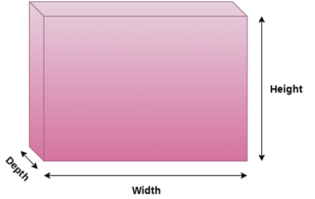
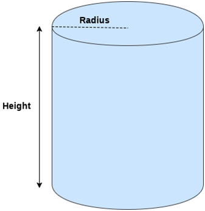

# Java FX - Formes 3D

JavaFX ens permet crear formes tridimensionals. Existeixen les classes definides en el paquet javafx.scene.shape que proporciona tots els mètodes per a tractar amb les formes 3D. Aquestes classes són Box, Cylinder and sphere. La classe Shape3D del paquet javafx.scene.shape és la classe base de totes les classes de formes 3D en javafx.

## Què és la forma 3D?

Una forma tridimensional es pot definir com un objecte geomètric sòlid que es dibuixarà en el sistema de coordenades XYZ. Les formes 3D són diferents de les formes 2D en el sentit que les formes 3D sempre necessiten tindre un valor extra de coordenades Z per a poder ser dibuixades en un sistema de coordenades.

Exemples de maneres 3D són cilindres, esferes, caixes, cubs, piràmides, etc. No obstant això, JavaFX proporciona classes per a crear esferes, cilindres i caixes.

## Tipus de formes 3D en JavaFX

1. Formes 3D predefinides

    Hi ha algunes classes de formes 3D predefinides proporcionades per JavaFX que són Cylinder, Sphere i Box. Només necessitem crear una instància d'aquestes classes per a crear aquestes formes en la pantalla. Les classes contenen diverses propietats i mètodes que s'han d'utilitzar per a crear les formes adequades.

2. Formes 3D definides per l'usuari

    JavaFX proporciona la classe javafx.scene.shape.TriangleMesh que estén la classe abstracta javafx.scene.shape.Mesh. Aquesta classe facilita a l'usuari definir els seus propis punts, coordenades de textura i cares com a propietats de la classe.

## Passos per a crear formes 3D en JavaFX

Com esmentem anteriorment, existeixen diferents classes per a les diferents formes 3D en JavaFX. Només necessitem instanciar aqueixes classes per a crear les formes 3D adequades. Utilitza els següents passos per a la creació de formes 3D en JavaFX.

1. Creu una instància de la classe de formes 3D respectiva que volem crear, per exemple,

~~~
Box box = new Box();
~~~

2. Establisca les propietats de la classe. Per exemple;
~~~

box.setHeight(100.0);
box.setDepth(50.0);
box.setWidth(70.0);
~~~
    
3. Configure la cambra per a l'escena. Encara que, no és necessari configurar la càmera per a crear l'efecte 3D, però proporciona una determinada posició per a la vista de la càmera. Això pot fer-se de la següent manera.

~~~
PerspectiveCamera camera = new PerspectiveCamera();
camera.setTranslateX(100.0);
camera.setTranslateY(50.0);
camera.setTranslateZ(-90);
scene.setCamera(camera)
~~~

4. Agregue el quadre al gràfic d'escena i establisca les propietats adequades per a l'escena i l'escenari.

~~~
Group root = new Group();
root.getChildren().add(box);
Scene scene = new Scene(root,500,400);
primaryStage.setScene(scene);
primaryStage.setTitle("Box Example");
primaryStage.show();
~~~

Les classes de formes 3D proporcionades pel paquet javafx.scene.shape es descriuen a continuació.

1 **Box**: En general, una caixa es pot definir com una forma tridimensional que té totes les cares en forma rectangular. Les tres dimensions de Box són altura, ample i profunditat. En JavaFX, el classjavafx.scene.shape.Box representa Box.
2 **Cylinder**: Un cilindre es pot definir com un sòlid tridimensional que té dues bases circulars paral·leles connectades per una superfície corba. Té les dues propietats principals com a ràdio i altura. En JavaFX, la classe javafx.scene.shape.Cylinder representa el cilindre.
3 **Sphere**: Una esfera es pot definir com un objecte 3D sòlid perfectament redó. En JavaFX, l'esfera està representada per la classe javafx.scene.shape.Sphere.

## 3D Object Properties

JavaFX ens permet configurar les diferents propietats dels objectes 3D. Hi ha classes especials definides per a cada propietat en JavaFX. 

### Cull Face

La selecció es pot definir simplement com el procés d'eliminar la part dels objectes 3D que no són visibles en l'àrea de visualització. En JavaFX, les formes 3D contenen la propietat del tipus CullFace. Aquesta propietat es pot establir en un valor apropiat utilitzant el següent mètode d'instància que es dirà en l'objecte de classe de manera 3D.

`setCullFace(CullFace value)`

Hi ha tres tipus de traços definits en la classe CullFace que són:

1. None: no es realitza el l'eliminació
2. Front: tots els polígons que miren al capdavant s'eliminen
3. Back: tots els polígons que miren cap endarrere s'eliminen

### Material d'objecte 3D

JavaFX proporciona diferents tipus de material que es poden aplicar a la superfície d'una forma 3D. La classe Material del paquet javafx.scene.paint proporciona totes les classes per a tractar amb el material d'una forma 3D. La classe **PhongMaterial** és la subclasse de la classe Material. Només necessitem crear una instància d'aquesta classe per a crear el material desitjat.

Aquesta classe proporciona diversos tipus de materials com a propietats d'aquesta classe que es poden establir en un cert valor utilitzant els mètodes setter. No obstant això, el material es pot aplicar a una forma utilitzant el següent mètode.

~~~
shape.setMaterial(<material-type>)
~~~

- Propietats

    - **setBumpMap(Image URL)**: Aquesta propietat és del tipus Image. Això representa el mapa de relleu del material.
    - **setDiffuseColor(Color color)** Aquesta és una propietat de tipus de color. Això representa el color difús del material.
    - **setDiffuseMap(Image URL)** Aquesta és una propietat de tipus d'imatge. Això representa el DiffuseMap del material.
    - **setSelfIlluminationMap(Image URL)** Aquesta és una propietat de tipus Image. Això representa el mapa de autoiluminación del conjunt de materials. 
    - **setSpecularColor(Color value)** Aquesta és una propietat de tipus de color. Això representa el color especular del material.
    - **setSpecularPower(Double value)** Aquesta és una propietat de tipus doble. Això representa el poder especular del Material.

### Modes de dibuix (Draw Mode)

JavaFX proporciona diverses maneres de dibuix per a dibuixar les formes 3D. Aquesta propietat és del tipus DrawMode. Els següents tipus de DrawMode es defineixen en la classe.

- **Fill**: aquesta manera dibuixa i emplena la forma 3D. Està representat per DrawMode.Fill
- **Line**: aquesta manera dibuixa la forma 3D usant només línies. Està representat per DrawMode.Line

Utilitza el següent mètode d'establiment per a establir una manera de dibuix per a la forma 3D.

~~~
Shape3D.setDrawMode (<valor de DrawMode>)
~~~

### Càmera JavaFX

En JavaFX, la càmera es tracta com un objecte que es pot moure al voltant d'un disseny 3D i canviar la vista de l'escena en conseqüència. La classe javafx.scene.Camera representa camera. No obstant això, és diferent d'un espai 2D on no necessitem moure la càmera per la pantalla.

En JavaFX, el sistema de coordenades de la cambra, la coordenada X apunta a la dreta, la coordenada Y apunta cap avall i la coordenada Z apunta cap a fora de l'espectador o cap a la pantalla.

Per a crear una càmera i agregar-la a l'escena, hem d'usar les següents línies de codi.

// creant la instància de javafx.scene.Camera

~~~
Camera  camera = new Camera();
~~~

// configurar la càmera a 50 en la direcció X correcta

~~~
camera.setTranslateX(50);
~~~

// configurar la càmera a 50 en la direcció Y correcta

~~~
camera.setTranslateY(100);
~~~

// configurar la càmera a 20 en la pantalla

~~~
camera.setTranslateZ(20);
~~~

// Afegint la càmera a l'escena

~~~
scene.setCamera(càmera);
~~~

### Subescena de JavaFX

Un node de subescena es pot definir com un contenidor que pot contindre algun node de l'escena per al qual es necessita especificar l'angle de la càmera. S'utilitza per a la separació d'escenes. Podem usar el node de la subescena si necessitem configurar una cambra diferent per a una part de l'escena. La subescena es pot utilitzar en un dels següents casos.

1. Si necessitem una cambra estàtica (superposició) per als controls de la interfície d'usuari que estem usant en la nostra escena.
2. Y-up per als objectes 3D i Y-down per a la interfície d'usuari 2D.
3. Material de base per al fons

Utilitza la següent sintaxi per a crear una instància d'una subescena.

~~~
SubScene <reference> = new SubScene(Parent root, double width, double height, boolean depthbuffer, boolean antiAliasing)
~~~

## Box

En general, una caixa es pot definir com la forma tridimensional que té totes les cares en forma rectangular. Les caixes són generalment el cuboide que té tres dimensions d'altura, profunditat i amplària. En JavaFX, box està representat per la classe javafx.scene.shape.Box. Només necessitem crear una instància d'aquesta classe per a crear la caixa.

L'altura, l'ample i la profunditat d'un poal (caixa) es mostren en la següent imatge.

- Propietats

    - **setDepth(double value)**: És una propietat de tipus doble. Representa la dimensió z de la caixa. 
    - **setHeight(double value)**: És una propietat de tipus doble. Representa la dimensió Y de la caixa. 
    - **setWidth(double value)**: És una propietat de tipus doble. Representa la dimensió X de la caixa. 

- Constructors

La classe conté dos constructors que es descriuen a continuació.

    - **Box()**: crea la instància de la classe Box amb els paràmetres predeterminats.
    - **Box(double width, double height, double depth)**: crea la instància de la classe Box amb les dimensions especificades

## Cylinder

En general, un cilindre es pot definir com un objecte sòlid tridimensional que té dues bases circulars paral·leles connectades per una superfície corba. Existeixen dos paràmetres principals que descriuen un cilindre, a saber, l'altura de la superfície corba i el radi de la base circular.

El radi i l'altura d'un cilindre es mostren en la següent imatge.

En JavaFX, la classe javafx.scene.shape.Cylinder representa un cilindre. Només necessitem crear una instància d'aquesta classe per a crear un cilindre.

- Propietats

    - **setHeight(double value)**: És una propietat de tipus doble. Representa la dimensió Z del cilindre. 
    - **setRadius(double value)**: És una propietat de tipus doble. Representa el radi del cilindre.

- Constructors

Hi ha tres constructors en la classe.

    - **Cylinder()**: crea la nova instància amb els paràmetres predeterminats.
    - **Cylinder(double radius, double height)**: crea la nova instància amb el radi i l'altura especificats.
    - **Cylinder(double radius, double height, int divisions)**: crea la nova instància amb el radi, l'altura i les divisions especificades.

## Sphere

En general, l'esfera es pot definir com un objecte 3D redó amb tots els punts de la seua superfície equidistants del seu centre. Una esfera pot veure's com un Cercle creat en un pla tridimensional on cada coordenada conté una dimensió Z addicional.

Els exemples de Sphere en el món real són globus, bola, etc. En JavaFX, Sphere està representat per la classe javafx.scene.shape.Sphere. Només necessitem crear una instància d'aquesta classe per a crear l'esfera. Una esfera es mostra en la següent imatge.

- Propietats

    - **SetRadius(double radius)**: És una propietat de tipus doble. Representa el radi de l'esfera.

- Constructors

    - **Sphere()**: crea una nova instància d'esfera de radi 1.0
    - **Sphere(double radius)**: crea una nova instància d'esfera amb el radi especificat.
    - **Sphere(double radius, int divisions)**: crea una nova instància d'esfera amb el radi i les divisions especificats.

[back](../../javafx.html)