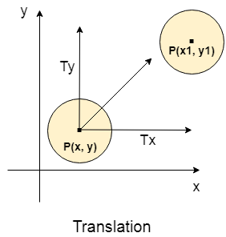
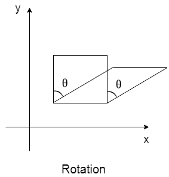
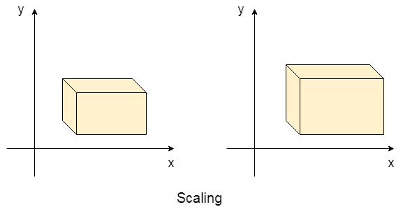
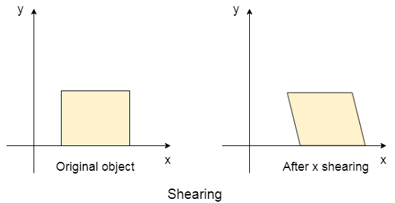

# Java FX - Transformacions

La transformació es pot definir com el canvi de forma, naturalesa o aparença dels gràfics. En JavaFX, el paquet anomenat javafx.scene.transform representa totes les transformacions.

Conté les classes per a diversos tipus de transformacions que es donen en la taula. La classe denominada javafx.scene.transform.Transform és la classe pare per a totes les classes de transformació.

1. Translation: Lsa translació s'utilitza per a canviar la posició del node. La classe javafx.scene.transform.Translate representa la translació.
2. Rotation: La rotació s'utilitza per a girar l'objecte des del seu origen en un cert angle. La classe javafx.scene.transform.Rotate representa la rotació.
3. Scaling: L'escala s'utilitza per a modificar la grandària del node. La classe javafx.scene.transform.Scale representa l'escalament.
4. Shearing: El retallar s'utilitza per a alterar el pendent de l'objecte en una direcció particular. La classe javafx.scene.transform.Shear representa Shearing.

### Passos per a aplicar la transformació en el node

En JavaFX, aplicar la transformació a un node és bastant fàcil. Només necessitem seguir els passos que es detallen a continuació per a aplicar la transformació.

- Crea una instància de la classe respectiva. Per exemple; per a crear l'escala 2D, utilitzem:

~~~
Scale scale = new Scale();
~~~

    on scale és l'objecte de la classe Scale.

- Estableix les propietats adequades de l'objecte de classe d'escala. Per exemple, per a establir les propietats de l'objecte d'escala, use els mètodes d'establiment com els següents:

~~~
scale.setX(<double value); 
scale.setY(<double value); 
scale.setPivotX(<double value); 
scale.setPivotY(<double value); 
~~~

- Aplica la transformació al node respectiu. Utilitza la següent sintaxi per aquest propósit.

~~~
<node-object>.getTransforms().add(<Transform-object>)
~~~

## Translation

La translació es pot definir com un canvi en la posició d'un objecte en la pantalla. La posició d'un objecte canvia movent-lo al llarg de la direcció X-Y. En JavaFX, la classe javafx.scene.transform.Translate representa la transformació Translate. Necessitem crear una instància d'aquesta classe per a poder traduir l'objecte.

La següent imatge trasllada el cercle d'una posició a una altra. La coordenada central del cercle P (x, i) es converteix en P (x1, y1). La coordenada X es canvia pel factor Tx mentre que la coordenada I es canvia pel factor Ty.

- Propietats

    - **setX(double value)**: És una propietat de tipus doble. Representa la distància a la qual es trasllada l'objecte en direcció X. 
    - **setY(double value)** És una propietat de tipus doble. Representa la distància per la qual l'objecte es trasllada en la direcció Y. 
    - **setZ(double value)** És una propietat de tipus doble. Representa la distància per la qual l'objecte es trasllada en la direcció Z. 

- Constructors

    - Translate(): crea la nova instància de la classe Translate amb els paràmetres predeterminats.
    - Translate(double X, double Y): crea la nova instància amb la coordenada especificada (X, Y).
    - Translate(double X, double Y, double Z)e: crea la nova instància amb la coordenada especificada (x, y, z).

## Rotation

La rotació es pot definir com el procés de girar un objecte en un cert angle θ (theta). En JavaFX, la classe javafx.scene.transform.Rotate representa la transformació de rotació.

La imatge il·lustra la transformació de rotació. el rectangle que es mostra en la imatge es gira al llarg de l'eix Y en l'angle θ. Les coordenades del rectangle es canvien a causa de la rotació, mentre que les vores romanen de la mateixa longitud.

- Propietats

    - **setAngle(double value)**: És una propietat de tipus doble. Representa l'angle de rotació en graus.
    - **setAxis(Point3D value)**: És una propietat de tipus d'objecte. Representa l'eix de rotació. 
    - **setPivotX(double value)**: És una propietat de tipus doble. Representa la coordenada X del punt de pivot de rotació.
    - **setPivotY(double value)**: És una propietat de tipus doble. Representa la coordenada Y del punt de pivot de rotació.
    - **setPivotZ(double value)**: És una propietat de tipus doble. Representa la coordenada Z del punt de pivot de rotació.

- Constructors

    - **Rotate(double angle)**: crea la transformació de rotació amb l'angle especificat mesurat en graus. Els punts de pivot s'estableixen en (0,0).
    - **Rotate(double angle, double pivotX)**: crea la transformació de rotació 3D amb la transformació especificada. Els punts de pivot s'estableixen en (0,0,0).
    - **Rotate(double angle, double pivotX, double pivotY)**: crea la transformació de rotació amb l'angle especificat i la coordenada de pivot (x, y).
    - **Rotate(double angle, double pivotX, double pivotY, double pivotZ)**: crea la transformació de rotació amb l'angle especificat i la coordenada de pivot 3D (x, y, z).
    - **Rotate(double angle, double pivotX, double pivotY, double pivotZ,Point3D Axis)**: crea una transformació de rotació 3D amb l'angle especificat i la coordenada de pivot (x, y, z).

## Escalament

L'escala és un tipus de transformació que s'utilitza per a canviar la grandària de l'objecte. Pot expandir la grandària o comprimir la grandària de l'objecte. La grandària es pot modificar multiplicant les coordenades de l'objecte per un factor que es diu factor d'escala. En JavaFX, la classe javafx.scene.transform.Scale representa la transformació d'escala.

En la següent imatge, la transformació d'escala s'aplica al poal per a gastar la seua grandària.

- Propietats

    - **setPivotX(double value)**: És una propietat de tipus doble. Representa la coordenada x del punt de pivot al voltant del qual es realitza l'escala. 
    - **setPivotY(double value)**: És una propietat de tipus doble. Representa la coordenada y del punt de pivot al voltant del qual es realitza l'escala. 
    - **setPivotZ(double value)**: És una propietat de tipus doble. Representa la coordenada z del punt de pivot al voltant del qual es realitza l'escala.
    - **setX(double value)**: És una propietat de tipus doble. Representa el factor pel qual s'escala l'objecte al llarg de l'eix X. 
    
    - **setY(double value)**: És una propietat de tipus doble. Representa el factor pel qual l'objecte s'escala al llarg de l'eix Y. 
    
    - **setZ(double value)**: És una propietat de tipus doble. Representa el factor pel qual s'escala l'objecte al llarg de l'eix Z. 
    
- Constructors

    - **Scale()**: crea la nova instància amb els paràmetres predeterminats.
    - **Scale(double X, double Y)**: crea la nova instància d'Escala 2D.
    - **Scale(double X, double Y, double Z)**: crea la nova instància d'escala 3D.
    - **Scale(double X, double Y, double Z, double pivotX, double pivotY)**: crea la nova instància de l'escala 2D amb les coordenades de pivot especificades.
    - **Scale(double X, double Y, double Z, double pivotX, double pivotY, double pivotZ)**: crea la nova instància de l'Escala 3D amb les coordenades de pivot especificades.

## Shearing

El cisallament és un tipus de transformació que canvia el pendent de l'objecte respecte a qualsevol dels eixos. Hi ha dues transformacions de tall que són tall en X i tall en Y. La transformació de tall X canvia els valors de la coordenada X mentre que el tall Y canvia els valors de la coordenada Y.

En tots dos tipus de tall, només una coordenada canvia el valor mentre que l'altra roman igual. La següent imatge mostra l'objecte després d'aplicar-li la transformació X-shear. La coordenada i del rectangle roman sense canvis mentre que la coordenada X canvia en algun factor.

En JavaFX, la classe javafx.scene.transform.Shear representa la transformació Shear.

- Propietats

    - **setPivotX(double value)**: És una propietat de tipus doble. Representa la coordenada X del punt de pivot de tall. 
    - **setPivotY(double value)**: És una propietat de tipus doble. Representa la coordenada Y del punt de pivot de tall. 
    - **setX(double value)**: És una propietat de tipus doble. Representa el multiplicador pel qual les coordenades es desvien en la direcció X positiva com el factor de la seua coordenada Y. 
    - **setY(double value)**: És una propietat de tipus doble. Representa el multiplicador pel qual les coordenades es desvien en la direcció Y positiva com el factor de la seua coordenada X. 

- Constructors

    - **Shear()**: crea una nova instància de Shear amb els paràmetres predeterminats.
    - **Shear(double x, double y)**: crea una nova instància amb les coordenades de desplaçament especificades. Les coordenades de pivot s'estableixen en (0,0).
    - **Shear(double x, double y, double pivotX, double pivotY)**: crea una nova instància amb les coordenades de desplaçament i les coordenades de pivot especificades.

## Transformació múltiple

Podem fer ús de l'efecte combinat de totes les transformacions en un node. Per a aquest propòsit, JavaFX proporciona el mètode addAll (Transform obj1, Transform obj2 ....) que es pot cridar de manera anònima en la referència retornada pel mètode <node-obj> .getTransforms ().

El següent exemple implementa totes les transformacions en un rectangle.

[back](../../javafx.html)
