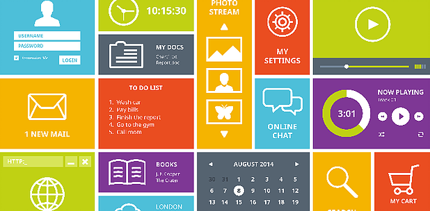

# Disseny Centrat en l'usuari - Interfície d'usuari (UI).

El disseny de l'interficie d'usuari s'encarrega de l'experiencia visual e interactiva de l'usuari amb una interficie de producte, ja siga una aplicació, un videojoc o un lloc web.

Pel que respecta a l'experiencia visual, el disseny de la interficie es centra en com un usuari interactua amb la seua interficie, analitzant com l'usuari navega de A a B a través de diferents punts de contacte visual (tocant un botó, pasant a traves de les imàtges, etc). Com a consequencia serà necessari dissenyar totes les pantalles per les que es mourà un usuari  i crear els elements visuals amb les propietats interactives necessàries que faciliten aquest moviment.
Pel contrari, l'experiencia interactiva fa referència al comportament de l'usuari "en ment". Es a dir, que el disseny d'una bona interficie no requereix d'un aprenentatge complet per poder utilitzar-la, si no que el seu ús és simplement obvi. Com a consequencia, el disseny de l'interficie es basarà en el que l'usuari espera en cada moment, creant elements visuals e interactius que responen de manera natural pel usuari. Per això, s'utilitzarà eines com patrons, espais i colors amb el fí de guiar a l'usuari a través de l'interficie.

## Principis pel disseny de l'interficie d'usuari

- **Mantín l'interficie simple**: les millors interficies són casi invisibles per al usuari, eviten els elements innecessaris i son clares en el llenguatge que itilitzen en les etiquetes i en els missatges.
- **Mantenir la interficie Responsive**: l'interficie ha de ser independent del dispositiu que s'utilitze, així la transició de l'usuari al accedir al contingut de l'aplicació en un ordinador, mòbil o tablet ha de ser perfecta. Així els elements de disseny han de reflectar-se mutuament.
- **Crea coherencia i utilitza elements comuns de l'interficie**: A l'utilitzar elements comuns en l'interficie, els usuaris es senten més còmodes i poden fer les coses més ràpidament. També és important crear patrons de llenguatge, disposició i disseny en tota l'aplicació per ajudar a facilitar l'eficiencia. Una vegada que l'usuari apren a fer algo, deu ser capaç de transferir eixa habilitat a altres parts de l'aplicació.
- **Sigues decidit en el disseny de la pàgina**. Considera les relacions espacials entre els elements de la pàgina i, estructura la pàgina en funció de l'importancia. La colocació cuidadosa dls elements pot ajudar a cridar l'atencio sobre les peses d'informació més importants i pot ajudar a l'exploració i la legibilitat.
 - **Utilitza estrategicament el color i la textura**: Es pot dirigir l'atenció cap als elements (o fora d'ells) utilitzant el color, la llum, el contraste i la textura.
- **Utilitza la tipografia per crear jerarquia i claretat**. Considera cuidadosament com utilitzes la tipografia: diferents tamanys, fonts i disposició del text per ajudar a augmentar la ccapacitat de l'escaneig, legitibilitat i lectura.
- **Asegurat que el sistema comunique el que està succedint**. Informa en tot moment a l'usuari de l'ubicació, accions, canvis d'estat o errors. Pot ser necessites varis elements per comunicar l'estat o les següents pases a seguir, de forma que reduix la possibe fustració de l'usuari. 
- **Pensa en els valors predeterminats**. Al pensar cuidadosament i anticipar els objectius que atrau l'usuari, pot crear valors predeterminats que reduixen la carrega de l'usuari. Açó es pot tornar particularment important quan es tracta del disseny de formularis, en el que es poden tenir l'oportunitat de tenir alguns camps preelegits o emplenats.

Per realitzar un bon disseny d'interfici d'usuari, s'ha de crear una bona jerarquia visual. Per lo qual ens pot ajudar un bon coneixement del treball amb les paletes de colors. Seguidament teniu els enllaços a aquests dos apartats.
- [Jerarquia visual](./jerarquiaVisual.html)
- [El color en la interfaz d'usuari](./colors.html)

[back](../metiprot.html)