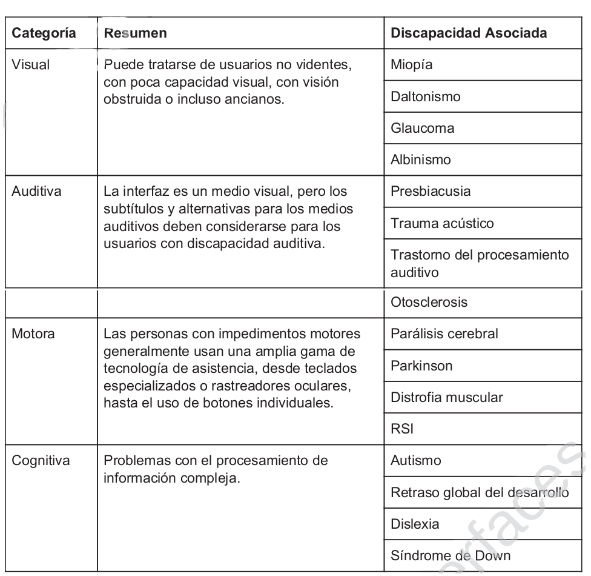

# Disseny Centrat en l'usuari - Disseny d'interfície d'usuari.

# Accessibilitat

La deifitalització de la informació és una forma de accedir simple i ràpidament a informació sobre una associació, empresa, producte, etc. En una generació connectada, els resultats de una búsqueda han de proporcionar dades verdaderes o informatives.Retindre als visitants és un factor clau per transmetre la informació dessitjada i que la nostra aplicació tinga éxit. No obstant, tenir una interficie visualment atractiva, exitosa i transformativa no garanteix que totes les persones la puguen utilitzar  per exemple, sols en europa s'estima que hi ha més de 30 millons de persones cegues o amb discapacitat visual (dades de la comisió europea). És imperatiu que en un mon cada vegada més progresista e inclus on totes les persones tenen els mateixos drets i, per tant, han de tenir el mateix acces a les dades.

Hi ha varis aspectes que han de tenirse en conter al oimplementar aplicacions e interfaces accessibles. Degut al aspecte interactiu d'aquestes, s'han d'implementar varis procediments per que, sense importar quina persona accedeixca, l'experiencia ha de ser la mateixa. aquest tipusde linealitat és dificil de aconseguir. Si, per exemple, una interficie està construida principalment per imátges o videos, és molt dificil brindar una experiencia completa a una persona cega. Si tens podcast, una persona sorda no pot beneficiar-se d'ells. si té molts ellaços és dificil per una persona amb discapacitat motora interactuar. Altres exemples de barreres digitals, són fàcils de trobar, pero dificils de resoldre.

## Inclusivitat digital.

Significa que totes les persones siguen capaç d'accedir i comprendre la informació que sel's brinda en les possibles aplicacions. No obstant, és necessari entendre a quins tipus de problemes s'enfronten les persones amb discapacitat. Amb tal fí, la següent taula presenta de una forma simplificada ( i no exaustiva ) el mode d'abordar les distintes discapacitats:

Per estudiar amb més deteniment aquest aspecte, podem accedir a la pàgina: [https://www.w3.org/WAI/standards-guidelines/wcag/es](https://www.w3.org/WAI/standards-guidelines/wcag/es)

[back](../metiprot.html)